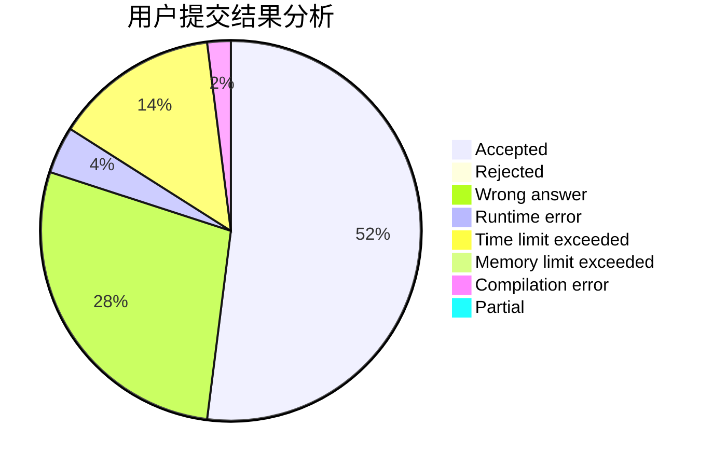
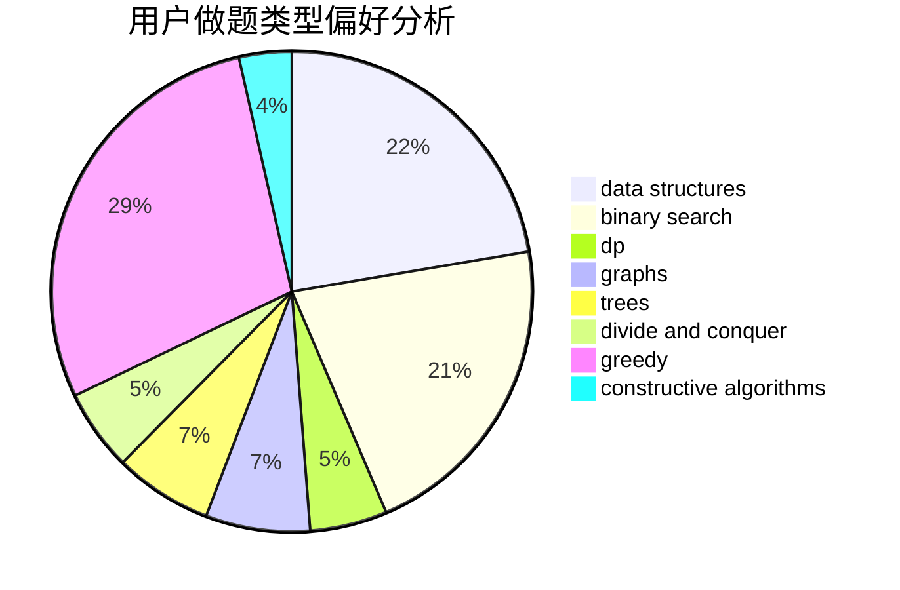

# Daniel_Jiang

<!-- tabs:start -->

#### **用户提交结果分析**

#### **用户做题类型偏好分析**

#### **用户错题知识点分析**

<!-- tabs:end -->
# 推荐题目
[1453C](https://codeforces.com/contest/1453/problem/C)		greedy,
                        implementation		  
[792C](https://codeforces.com/contest/792/problem/C)		dp,
                        greedy,
                        math,
                        number theory		  
[1424G](https://codeforces.com/contest/1424/problem/G)		data structures,
                        sortings		  
[792B](https://codeforces.com/contest/792/problem/B)		implementation		  
[1288F](https://codeforces.com/contest/1288/problem/F)		constructive algorithms,
                        flows		  
[1081D](https://codeforces.com/contest/1081/problem/D)		dsu,
                        graphs,
                        shortest paths,
                        sortings		  
[1008A](https://codeforces.com/contest/1008/problem/A)		implementation,
                        strings		  
[665D](https://codeforces.com/contest/665/problem/D)		constructive algorithms,
                        greedy,
                        number theory		  
[791E](https://codeforces.com/contest/791/problem/E)		dsu,graphs,sortings,trees		  
[1272F](https://codeforces.com/contest/1272/problem/F)		dp,
                        strings,
                        two pointers		  
