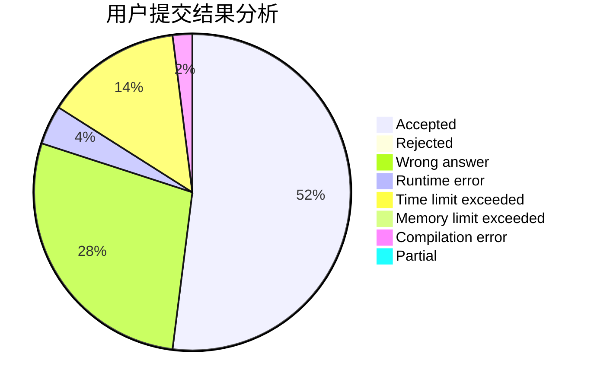
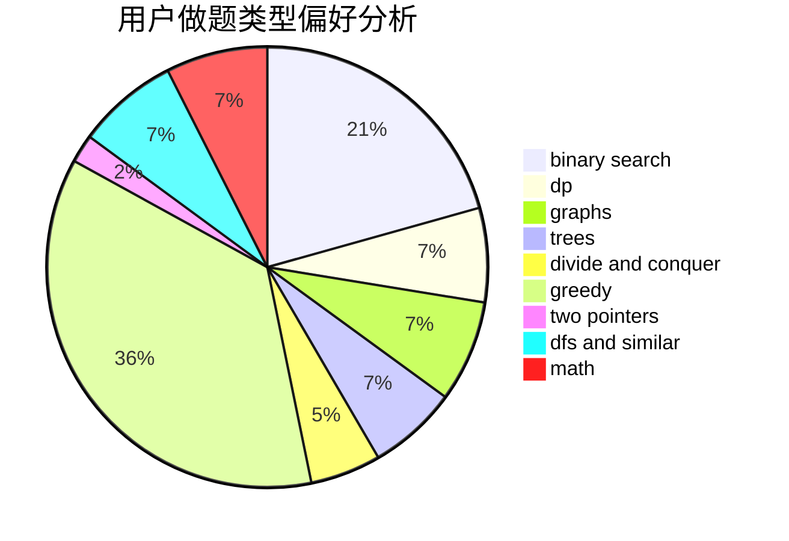

# Daniel_Jiang

<!-- tabs:start -->

#### **用户提交结果分析**

#### **用户做题类型偏好分析**

<!-- tabs:end -->
# 推荐题目
[1453C](https://codeforces.com/contest/1453/problem/C)
[792C](https://codeforces.com/contest/792/problem/C)
[1424G](https://codeforces.com/contest/1424/problem/G)
[792B](https://codeforces.com/contest/792/problem/B)
[1288F](https://codeforces.com/contest/1288/problem/F)
[1081D](https://codeforces.com/contest/1081/problem/D)
[1008A](https://codeforces.com/contest/1008/problem/A)
[665D](https://codeforces.com/contest/665/problem/D)
[791E](https://codeforces.com/contest/791/problem/E)
[1272F](https://codeforces.com/contest/1272/problem/F)
