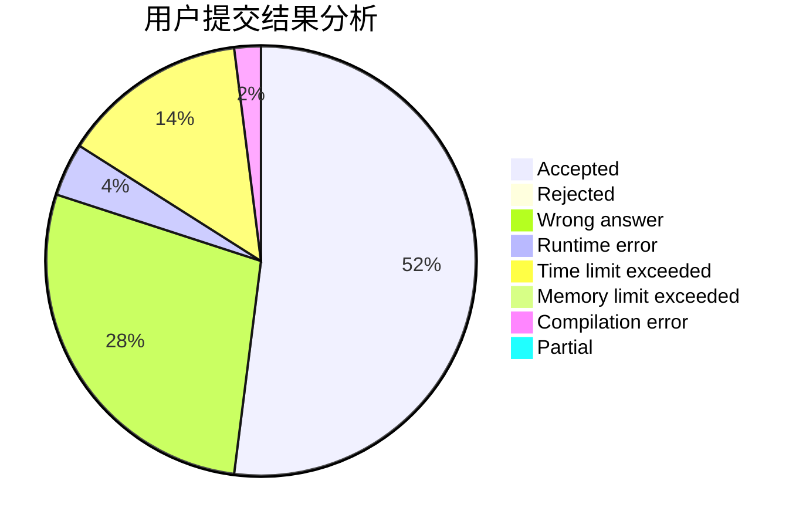
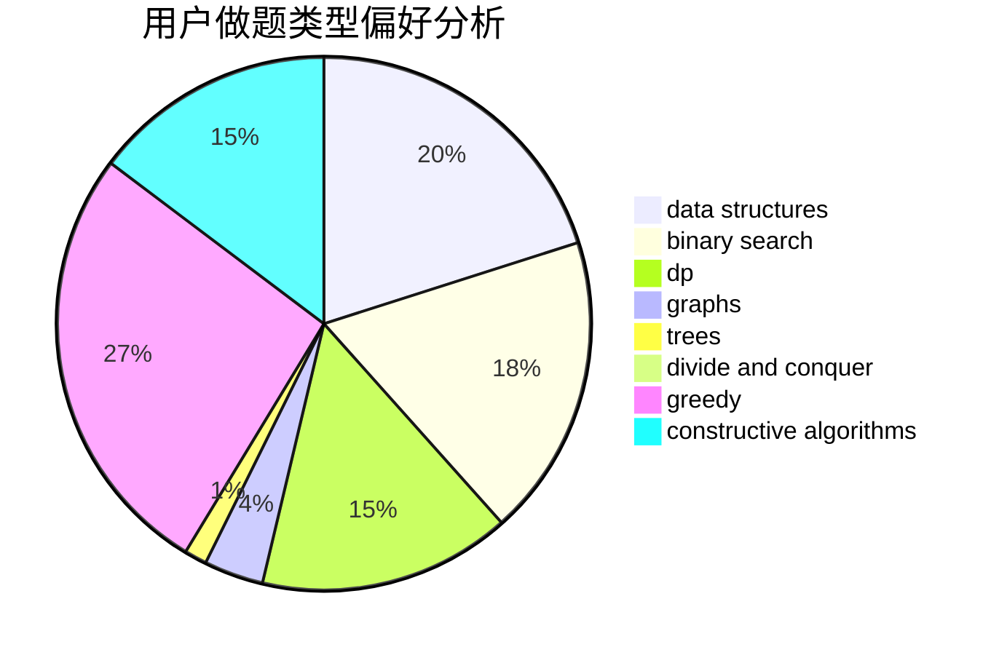

# Daniel_Jiang

<!-- tabs:start -->

#### **用户提交结果分析**

#### **用户做题类型偏好分析**

#### **用户错题知识点分析**

<!-- tabs:end -->
# 推荐题目
[1443E](https://codeforces.com/contest/1443/problem/E)		brute force,
                        math,
                        two pointers		  
[772E](https://codeforces.com/contest/772/problem/E)		binary search,
                        divide and conquer,
                        interactive,
                        trees		  
[1416F](https://codeforces.com/contest/1416/problem/F)		flows,
                        graph matchings,
                        greedy,
                        implementation		  
[772D](https://codeforces.com/contest/772/problem/D)		bitmasks,
                        dp		  
[1282C](https://codeforces.com/contest/1282/problem/C)		greedy,
                        sortings,
                        two pointers		  
[1081A](https://codeforces.com/contest/1081/problem/A)		constructive algorithms,
                        math		  
[1007C](https://codeforces.com/contest/1007/problem/C)		binary search,
                        interactive		  
[633B](https://codeforces.com/contest/633/problem/B)		brute force,
                        constructive algorithms,
                        math,
                        number theory		  
[772A](https://codeforces.com/contest/772/problem/A)		binary search,
                        math		  
[1267C](https://codeforces.com/contest/1267/problem/C)		constructive algorithms		  
