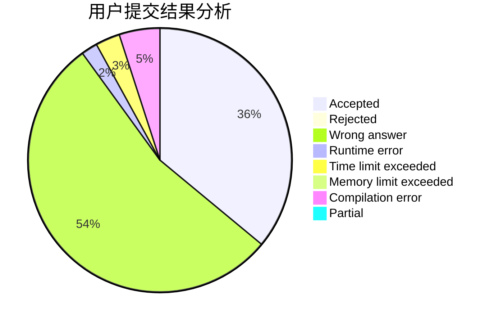
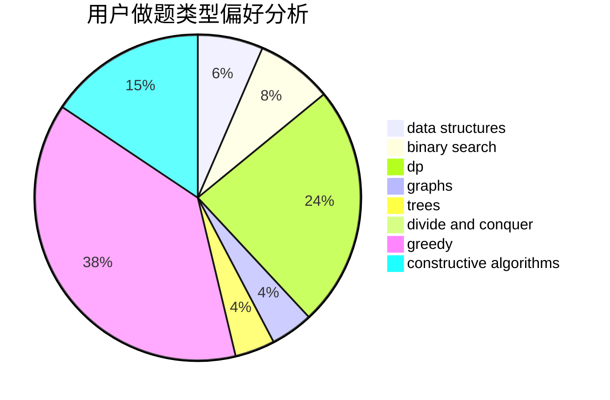

# Daniel_lele
<!-- tabs:start -->
#### **用户提交结果分析**

#### **用户做题类型偏好分析**

#### **用户错题知识点分析**

<!-- tabs:end -->
# 推荐题目
[The Sports Festival](http://codeforces.com/problemset/problem/1509/C)		dp,
                        greedy		  
[LRU](http://codeforces.com/problemset/problem/698/C)		bitmasks,
                        dp,
                        math,
                        probabilities		  
[Blog Post Rating](http://codeforces.com/problemset/problem/773/E)		data structures,
                        sortings		  
[Two Bracket Sequences](http://codeforces.com/problemset/problem/1272/F)		dp,
                        strings,
                        two pointers		  
[Delivering Carcinogen](https://codeforces.com/contest/199/problem/E)		binary search,
                        geometry		  
[Timofey and cubes](http://codeforces.com/problemset/problem/764/B)		constructive algorithms,
                        implementation		  
[Rational Resistance](http://codeforces.com/problemset/problem/343/A)		math,
                        number theory		  
[A Convex Game](http://codeforces.com/problemset/problem/1434/E)		dsu,
                        games		  
[A Serial Killer](http://codeforces.com/problemset/problem/776/A)		brute force,
                        implementation,
                        strings		  
[Subway Pursuit](https://codeforces.com/contest/1040/problem/D)		binary search,
                        interactive,
                        probabilities		  
<!-- tabs:start -->
#### **data structures**
[Blog Post Rating](http://codeforces.com/problemset/problem/773/E)		data structures,
                        sortings		  
[Ant colony](http://codeforces.com/problemset/problem/474/F)		data structures,
                        math,
                        number theory		  
[Train Tracks](http://codeforces.com/problemset/problem/1344/E)		data structures,
                        trees		  
[Vasya and a Tree](http://codeforces.com/problemset/problem/1076/E)		data structures,
                        trees		  
[Pastoral Oddities](http://codeforces.com/problemset/problem/603/E)		data structures,
                        divide and conquer,
                        dsu,
                        math,
                        trees		  
[Molly's Chemicals](http://codeforces.com/problemset/problem/776/C)		binary search,
                        brute force,
                        data structures,
                        implementation,
                        math		  
[Graph and Queries](http://codeforces.com/problemset/problem/1416/D)		data structures,
                        dsu,
                        graphs,
                        implementation,
                        trees		  
[Maximum width](http://codeforces.com/problemset/problem/1492/C)		binary search,
                        data structures,
                        dp,
                        greedy,
                        two pointers		  
[Old Floppy Drive](http://codeforces.com/problemset/problem/1490/G)		binary search,
                        data structures,
                        math		  
[Odd Mineral Resource](http://codeforces.com/problemset/problem/1479/D)		binary search,
                        bitmasks,
                        brute force,
                        data structures,
                        probabilities,
                        trees		  
#### **binary search**
[Delivering Carcinogen](https://codeforces.com/contest/199/problem/E)		binary search,
                        geometry		  
[Subway Pursuit](https://codeforces.com/contest/1040/problem/D)		binary search,
                        interactive,
                        probabilities		  
[Image Preview](https://codeforces.com/contest/651/problem/D)		binary search,
                        brute force,
                        dp,
                        two pointers		  
[Yurii Can Do Everything](http://codeforces.com/problemset/problem/1438/E)		binary search,
                        bitmasks,
                        brute force,
                        constructive algorithms,
                        divide and conquer,
                        two pointers		  
[Sage's Birthday (hard version)](http://codeforces.com/problemset/problem/1419/D2)		binary search,
                        brute force,
                        constructive algorithms,
                        greedy,
                        sortings,
                        two pointers		  
[Kyoya and Permutation](http://codeforces.com/problemset/problem/553/B)		binary search,
                        combinatorics,
                        constructive algorithms,
                        greedy,
                        implementation,
                        math		  
[The hat](https://codeforces.com/contest/1020/problem/D)		binary search,
                        interactive		  
[Molly's Chemicals](http://codeforces.com/problemset/problem/776/C)		binary search,
                        brute force,
                        data structures,
                        implementation,
                        math		  
[The Doctor Meets Vader (Easy)](http://codeforces.com/problemset/problem/1184/B1)		binary search,
                        sortings		  
[Cheap Robot](http://codeforces.com/problemset/problem/1253/F)		binary search,
                        dsu,
                        graphs,
                        shortest paths,
                        trees		  
#### **dp**
[The Sports Festival](http://codeforces.com/problemset/problem/1509/C)		dp,
                        greedy		  
[LRU](http://codeforces.com/problemset/problem/698/C)		bitmasks,
                        dp,
                        math,
                        probabilities		  
[Two Bracket Sequences](http://codeforces.com/problemset/problem/1272/F)		dp,
                        strings,
                        two pointers		  
[Relay Race](http://codeforces.com/problemset/problem/213/C)		dp		  
[Image Preview](https://codeforces.com/contest/651/problem/D)		binary search,
                        brute force,
                        dp,
                        two pointers		  
[String Transformation 2](https://codeforces.com/contest/1384/problem/E)		bitmasks,
                        dp,
                        graphs,
                        trees		  
[Test Data Generation](http://codeforces.com/problemset/problem/773/F)		combinatorics,
                        divide and conquer,
                        dp,
                        fft,
                        math,
                        number theory		  
[Koa and the Beach (Easy Version)](http://codeforces.com/problemset/problem/1384/B1)		brute force,
                        dp,
                        greedy		  
[Array Without Local Maximums](https://codeforces.com/contest/1068/problem/D)		dp		  
[Two Paths](http://codeforces.com/problemset/problem/14/D)		dfs and similar,
                        dp,
                        graphs,
                        shortest paths,
                        trees,
                        two pointers		  
#### **graph**
[New Year Permutation](http://codeforces.com/problemset/problem/500/B)		dfs and similar,
                        dsu,
                        graphs,
                        greedy,
                        math,
                        sortings		  
[The Door Problem](http://codeforces.com/problemset/problem/776/D)		2-sat,
                        dfs and similar,
                        dsu,
                        graphs		  
[Block Tower](http://codeforces.com/problemset/problem/327/D)		constructive algorithms,
                        dfs and similar,
                        graphs		  
[String Transformation 2](https://codeforces.com/contest/1384/problem/E)		bitmasks,
                        dp,
                        graphs,
                        trees		  
[Subset with Zero Sum](http://codeforces.com/problemset/problem/1270/G)		constructive algorithms,
                        dfs and similar,
                        graphs,
                        math		  
[Two Paths](http://codeforces.com/problemset/problem/14/D)		dfs and similar,
                        dp,
                        graphs,
                        shortest paths,
                        trees,
                        two pointers		  
[Pairs of Pairs](http://codeforces.com/problemset/problem/1391/E)		constructive algorithms,
                        dfs and similar,
                        graphs,
                        greedy,
                        trees		  
[Perishable Roads](http://codeforces.com/problemset/problem/773/D)		dp,
                        graphs,
                        shortest paths		  
[Cheap Robot](http://codeforces.com/problemset/problem/1253/F)		binary search,
                        dsu,
                        graphs,
                        shortest paths,
                        trees		  
[Graph and Queries](http://codeforces.com/problemset/problem/1416/D)		data structures,
                        dsu,
                        graphs,
                        implementation,
                        trees		  
#### **trees**
[String Transformation 2](https://codeforces.com/contest/1384/problem/E)		bitmasks,
                        dp,
                        graphs,
                        trees		  
[Regular Forestation](http://codeforces.com/problemset/problem/1252/F)		hashing,
                        trees		  
[Train Tracks](http://codeforces.com/problemset/problem/1344/E)		data structures,
                        trees		  
[Vasya and a Tree](http://codeforces.com/problemset/problem/1076/E)		data structures,
                        trees		  
[Pastoral Oddities](http://codeforces.com/problemset/problem/603/E)		data structures,
                        divide and conquer,
                        dsu,
                        math,
                        trees		  
[Two Paths](http://codeforces.com/problemset/problem/14/D)		dfs and similar,
                        dp,
                        graphs,
                        shortest paths,
                        trees,
                        two pointers		  
[Pairs of Pairs](http://codeforces.com/problemset/problem/1391/E)		constructive algorithms,
                        dfs and similar,
                        graphs,
                        greedy,
                        trees		  
[Tests for problem D](http://codeforces.com/problemset/problem/1278/E)		constructive algorithms,
                        dfs and similar,
                        divide and conquer,
                        trees		  
[Cheap Robot](http://codeforces.com/problemset/problem/1253/F)		binary search,
                        dsu,
                        graphs,
                        shortest paths,
                        trees		  
[Graph and Queries](http://codeforces.com/problemset/problem/1416/D)		data structures,
                        dsu,
                        graphs,
                        implementation,
                        trees		  
#### **divide and conquer**
[Test Data Generation](http://codeforces.com/problemset/problem/773/F)		combinatorics,
                        divide and conquer,
                        dp,
                        fft,
                        math,
                        number theory		  
[Yurii Can Do Everything](http://codeforces.com/problemset/problem/1438/E)		binary search,
                        bitmasks,
                        brute force,
                        constructive algorithms,
                        divide and conquer,
                        two pointers		  
[Pastoral Oddities](http://codeforces.com/problemset/problem/603/E)		data structures,
                        divide and conquer,
                        dsu,
                        math,
                        trees		  
[Tests for problem D](http://codeforces.com/problemset/problem/1278/E)		constructive algorithms,
                        dfs and similar,
                        divide and conquer,
                        trees		  
[Divide and Summarize](http://codeforces.com/problemset/problem/1461/D)		binary search,
                        brute force,
                        data structures,
                        divide and conquer,
                        implementation,
                        sortings		  
[Song of the Sirens](http://codeforces.com/problemset/problem/1466/G)		combinatorics,
                        divide and conquer,
                        hashing,
                        math,
                        string suffix structures,
                        strings		  
[Permutation Transformation](http://codeforces.com/problemset/problem/1490/D)		dfs and similar,
                        divide and conquer,
                        implementation		  
[Skyline Photo](https://codeforces.com/contest/1483/problem/C)		data structures,
                        divide and conquer,
                        dp		  
[Fib-tree](http://codeforces.com/problemset/problem/1491/E)		brute force,
                        dfs and similar,
                        divide and conquer,
                        number theory,
                        trees		  
[Sum of Prefix Sums](http://codeforces.com/problemset/problem/1303/G)		data structures,
                        divide and conquer,
                        geometry,
                        trees		  
#### **greedy**
[The Sports Festival](http://codeforces.com/problemset/problem/1509/C)		dp,
                        greedy		  
[New Year Permutation](http://codeforces.com/problemset/problem/500/B)		dfs and similar,
                        dsu,
                        graphs,
                        greedy,
                        math,
                        sortings		  
[Slightly Decreasing Permutations](http://codeforces.com/problemset/problem/285/A)		greedy,
                        implementation		  
[Poman Numbers](https://codeforces.com/contest/1464/problem/C)		bitmasks,
                        greedy,
                        math,
                        strings		  
[Koa and the Beach (Easy Version)](http://codeforces.com/problemset/problem/1384/B1)		brute force,
                        dp,
                        greedy		  
[Maximum Number](http://codeforces.com/problemset/problem/774/C)		*special problem,
                        constructive algorithms,
                        greedy,
                        implementation		  
[Rock, Paper, Scissors](http://codeforces.com/problemset/problem/1426/E)		brute force,
                        constructive algorithms,
                        flows,
                        greedy,
                        math		  
[Sage's Birthday (hard version)](http://codeforces.com/problemset/problem/1419/D2)		binary search,
                        brute force,
                        constructive algorithms,
                        greedy,
                        sortings,
                        two pointers		  
[Zero Array](http://codeforces.com/problemset/problem/1201/B)		greedy,
                        math		  
[Kyoya and Permutation](http://codeforces.com/problemset/problem/553/B)		binary search,
                        combinatorics,
                        constructive algorithms,
                        greedy,
                        implementation,
                        math		  
#### **constructive algorithms**
[Timofey and cubes](http://codeforces.com/problemset/problem/764/B)		constructive algorithms,
                        implementation		  
[Block Tower](http://codeforces.com/problemset/problem/327/D)		constructive algorithms,
                        dfs and similar,
                        graphs		  
[Maximum Number](http://codeforces.com/problemset/problem/774/C)		*special problem,
                        constructive algorithms,
                        greedy,
                        implementation		  
[Yurii Can Do Everything](http://codeforces.com/problemset/problem/1438/E)		binary search,
                        bitmasks,
                        brute force,
                        constructive algorithms,
                        divide and conquer,
                        two pointers		  
[Tile Painting](https://codeforces.com/contest/1243/problem/C)		constructive algorithms,
                        math,
                        number theory		  
[Madhouse (Easy version)](https://codeforces.com/contest/1287/problem/E1)		brute force,
                        constructive algorithms,
                        interactive,
                        math		  
[Subset with Zero Sum](http://codeforces.com/problemset/problem/1270/G)		constructive algorithms,
                        dfs and similar,
                        graphs,
                        math		  
[Rock, Paper, Scissors](http://codeforces.com/problemset/problem/1426/E)		brute force,
                        constructive algorithms,
                        flows,
                        greedy,
                        math		  
[Errich-Tac-Toe (Hard Version)](http://codeforces.com/problemset/problem/1450/C2)		constructive algorithms,
                        math		  
[Sage's Birthday (hard version)](http://codeforces.com/problemset/problem/1419/D2)		binary search,
                        brute force,
                        constructive algorithms,
                        greedy,
                        sortings,
                        two pointers		  
#### **sortings**
[Blog Post Rating](http://codeforces.com/problemset/problem/773/E)		data structures,
                        sortings		  
[New Year Permutation](http://codeforces.com/problemset/problem/500/B)		dfs and similar,
                        dsu,
                        graphs,
                        greedy,
                        math,
                        sortings		  
[Cottage Village](http://codeforces.com/problemset/problem/15/A)		implementation,
                        sortings		  
[Sage's Birthday (hard version)](http://codeforces.com/problemset/problem/1419/D2)		binary search,
                        brute force,
                        constructive algorithms,
                        greedy,
                        sortings,
                        two pointers		  
[Kuroni and the Gifts](http://codeforces.com/problemset/problem/1305/A)		brute force,
                        constructive algorithms,
                        greedy,
                        sortings		  
[Exam in BerSU (easy version)](http://codeforces.com/problemset/problem/1185/C1)		greedy,
                        sortings		  
[The Doctor Meets Vader (Easy)](http://codeforces.com/problemset/problem/1184/B1)		binary search,
                        sortings		  
[Diamond Miner](https://codeforces.com/contest/1496/problem/C)		geometry,
                        greedy,
                        math,
                        sortings		  
[Meximization](http://codeforces.com/problemset/problem/1497/A)		brute force,
                        data structures,
                        greedy,
                        sortings		  
[Avoiding Zero](http://codeforces.com/problemset/problem/1427/A)		math,
                        sortings		  
<!-- tabs:end -->
