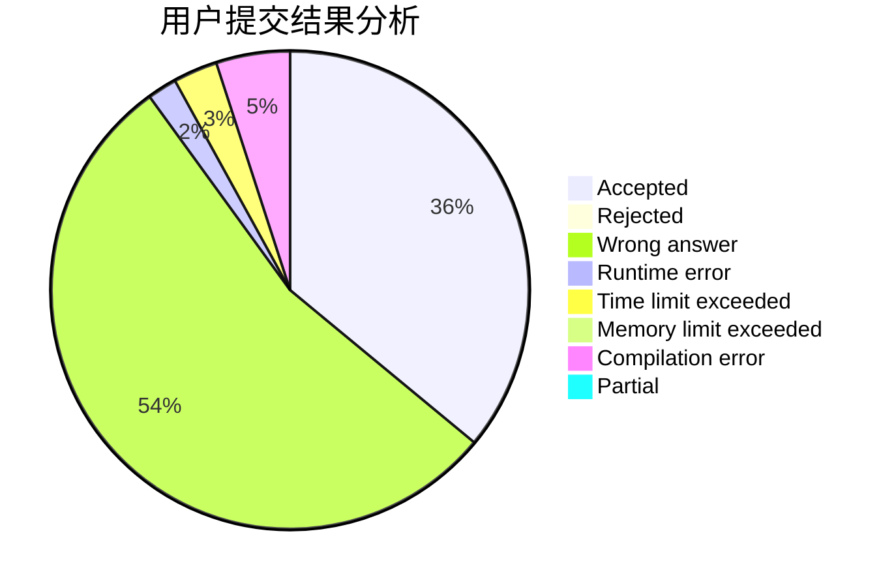
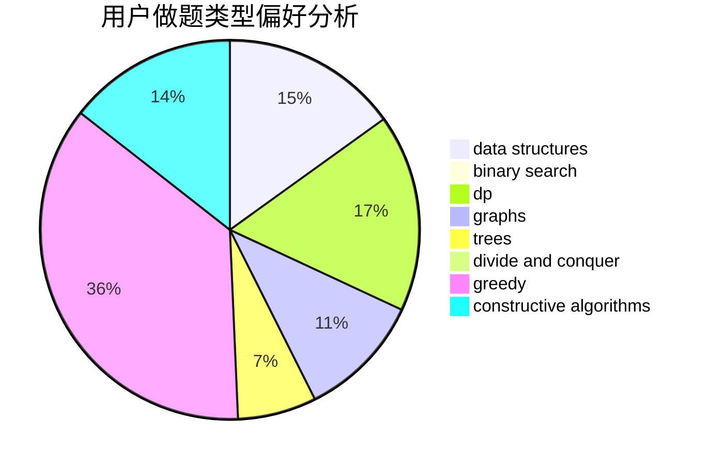

# Daniel_lele

<!-- tabs:start -->

#### **用户提交结果分析**

#### **用户做题类型偏好分析**

#### **用户错题知识点分析**

<!-- tabs:end -->
# 推荐题目
[10772](https://codeforces.com/contest/1077/problem/2)		dsu,graphs,sortings,trees		  
[1189A](https://codeforces.com/contest/1189/problem/A)		strings		  
[160A](https://codeforces.com/contest/160/problem/A)		greedy,
                        sortings		  
[1458F](https://codeforces.com/contest/1458/problem/F)		data structures,
                        trees		  
[1041C](https://codeforces.com/contest/1041/problem/C)		binary search,
                        data structures,
                        greedy,
                        two pointers		  
[782E](https://codeforces.com/contest/782/problem/E)		dsu,graphs,sortings,trees		  
[127A](https://codeforces.com/contest/127/problem/A)		geometry		  
[675D](https://codeforces.com/contest/675/problem/D)		data structures,
                        trees		  
[220E](https://codeforces.com/contest/220/problem/E)		data structures,
                        two pointers		  
[2C](https://codeforces.com/contest/2/problem/C)		geometry		  
