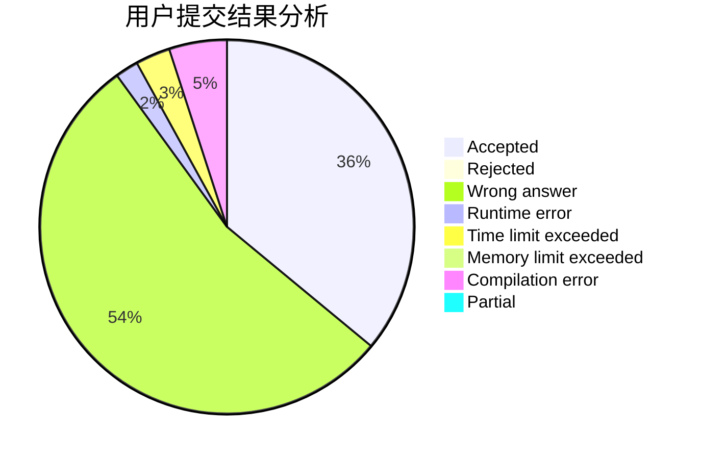
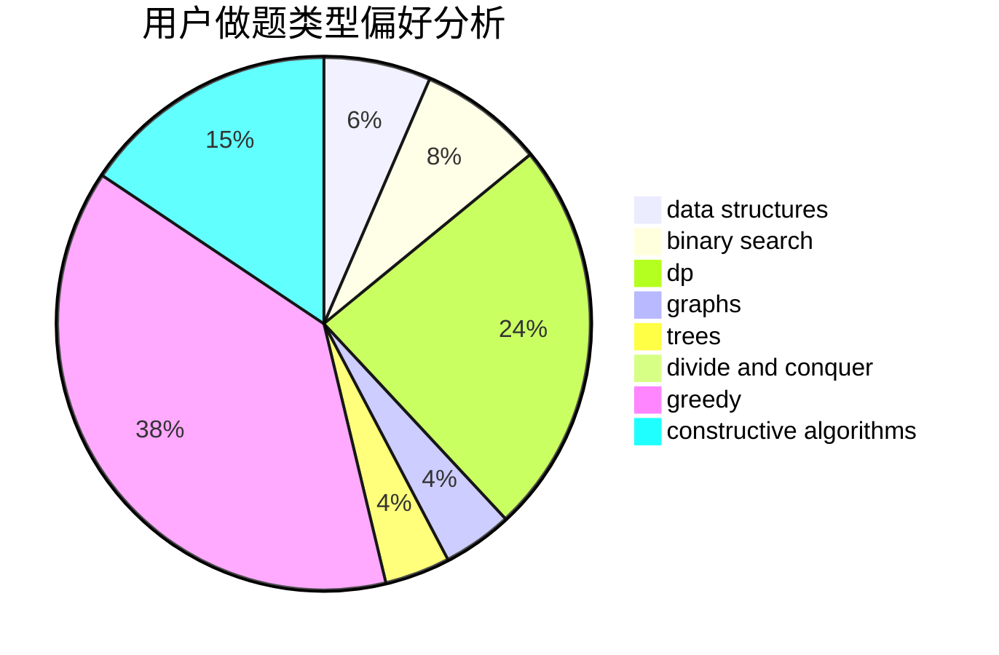

# Daniel_lele

<!-- tabs:start -->

#### **用户提交结果分析**

#### **用户做题类型偏好分析**

#### **用户错题知识点分析**

<!-- tabs:end -->
# 推荐题目
[1076E](https://codeforces.com/contest/1076/problem/E)		data structures,
                        trees		  
[1185C1](https://codeforces.com/contest/1185C/problem/1)		greedy,
                        sortings		  
[1509C](https://codeforces.com/contest/1509/problem/C)		dp,
                        greedy		  
[1450C2](https://codeforces.com/contest/1450C/problem/2)		constructive algorithms,
                        math		  
[1040D](https://codeforces.com/contest/1040/problem/D)		dsu,graphs,sortings,trees		  
[764B](https://codeforces.com/contest/764/problem/B)		constructive algorithms,
                        implementation		  
[1270G](https://codeforces.com/contest/1270/problem/G)		constructive algorithms,
                        dfs and similar,
                        graphs,
                        math		  
[651D](https://codeforces.com/contest/651/problem/D)		dsu,graphs,sortings,trees		  
[199E](https://codeforces.com/contest/199/problem/E)		dsu,graphs,sortings,trees		  
[285A](https://codeforces.com/contest/285/problem/A)		greedy,
                        implementation		  
