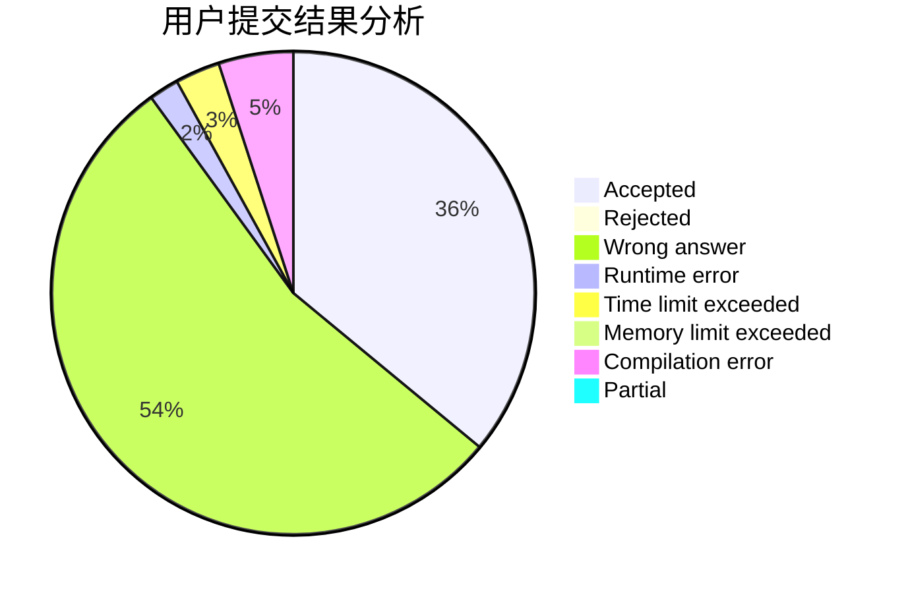
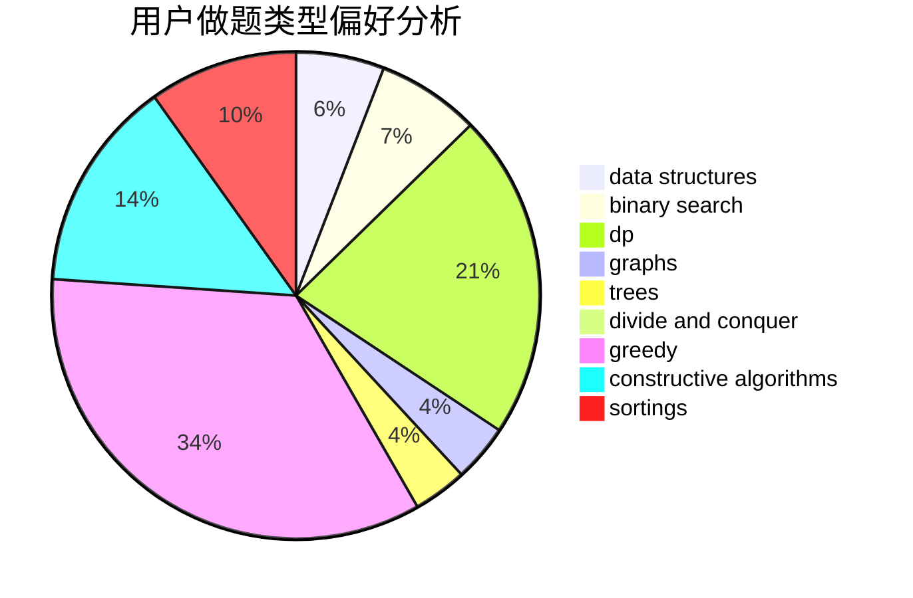

# Daniel_lele
<!-- tabs:start -->
#### **用户提交结果分析**

#### **用户做题类型偏好分析**

#### **用户错题知识点分析**

<!-- tabs:end -->
# 推荐题目
[1509C](http://codeforces.com/problemset/problem/1509/C)		dp,
                        greedy		  
[698C](http://codeforces.com/problemset/problem/698/C)		bitmasks,
                        dp,
                        math,
                        probabilities		  
[773E](http://codeforces.com/problemset/problem/773/E)		data structures,
                        sortings		  
[1272F](http://codeforces.com/problemset/problem/1272/F)		dp,
                        strings,
                        two pointers		  
[199E](https://codeforces.com/contest/199/problem/E)		binary search,
                        geometry		  
[764B](http://codeforces.com/problemset/problem/764/B)		constructive algorithms,
                        implementation		  
[343A](http://codeforces.com/problemset/problem/343/A)		math,
                        number theory		  
[1434E](http://codeforces.com/problemset/problem/1434/E)		dsu,
                        games		  
[776A](http://codeforces.com/problemset/problem/776/A)		brute force,
                        implementation,
                        strings		  
[1040D](https://codeforces.com/contest/1040/problem/D)		binary search,
                        interactive,
                        probabilities		  
<!-- tabs:start -->
#### **data structures**
[773E](http://codeforces.com/problemset/problem/773/E)		data structures,
                        sortings		  
[474F](http://codeforces.com/problemset/problem/474/F)		data structures,
                        math,
                        number theory		  
[1344E](http://codeforces.com/problemset/problem/1344/E)		data structures,
                        trees		  
[1076E](http://codeforces.com/problemset/problem/1076/E)		data structures,
                        trees		  
[603E](http://codeforces.com/problemset/problem/603/E)		data structures,
                        divide and conquer,
                        dsu,
                        math,
                        trees		  
[776C](http://codeforces.com/problemset/problem/776/C)		binary search,
                        brute force,
                        data structures,
                        implementation,
                        math		  
[1416D](http://codeforces.com/problemset/problem/1416/D)		data structures,
                        dsu,
                        graphs,
                        implementation,
                        trees		  
[1492C](http://codeforces.com/problemset/problem/1492/C)		binary search,
                        data structures,
                        dp,
                        greedy,
                        two pointers		  
[1490G](http://codeforces.com/problemset/problem/1490/G)		binary search,
                        data structures,
                        math		  
[1479D](http://codeforces.com/problemset/problem/1479/D)		binary search,
                        bitmasks,
                        brute force,
                        data structures,
                        probabilities,
                        trees		  
#### **binary search**
[199E](https://codeforces.com/contest/199/problem/E)		binary search,
                        geometry		  
[1040D](https://codeforces.com/contest/1040/problem/D)		binary search,
                        interactive,
                        probabilities		  
[651D](https://codeforces.com/contest/651/problem/D)		binary search,
                        brute force,
                        dp,
                        two pointers		  
[1438E](http://codeforces.com/problemset/problem/1438/E)		binary search,
                        bitmasks,
                        brute force,
                        constructive algorithms,
                        divide and conquer,
                        two pointers		  
[1419D2](http://codeforces.com/problemset/problem/1419/D2)		binary search,
                        brute force,
                        constructive algorithms,
                        greedy,
                        sortings,
                        two pointers		  
[553B](http://codeforces.com/problemset/problem/553/B)		binary search,
                        combinatorics,
                        constructive algorithms,
                        greedy,
                        implementation,
                        math		  
[1020D](https://codeforces.com/contest/1020/problem/D)		binary search,
                        interactive		  
[776C](http://codeforces.com/problemset/problem/776/C)		binary search,
                        brute force,
                        data structures,
                        implementation,
                        math		  
[1184B1](http://codeforces.com/problemset/problem/1184/B1)		binary search,
                        sortings		  
[1253F](http://codeforces.com/problemset/problem/1253/F)		binary search,
                        dsu,
                        graphs,
                        shortest paths,
                        trees		  
#### **dp**
[1509C](http://codeforces.com/problemset/problem/1509/C)		dp,
                        greedy		  
[698C](http://codeforces.com/problemset/problem/698/C)		bitmasks,
                        dp,
                        math,
                        probabilities		  
[1272F](http://codeforces.com/problemset/problem/1272/F)		dp,
                        strings,
                        two pointers		  
[213C](http://codeforces.com/problemset/problem/213/C)		dp		  
[651D](https://codeforces.com/contest/651/problem/D)		binary search,
                        brute force,
                        dp,
                        two pointers		  
[1384E](https://codeforces.com/contest/1384/problem/E)		bitmasks,
                        dp,
                        graphs,
                        trees		  
[773F](http://codeforces.com/problemset/problem/773/F)		combinatorics,
                        divide and conquer,
                        dp,
                        fft,
                        math,
                        number theory		  
[1384B1](http://codeforces.com/problemset/problem/1384/B1)		brute force,
                        dp,
                        greedy		  
[1068D](https://codeforces.com/contest/1068/problem/D)		dp		  
[14D](http://codeforces.com/problemset/problem/14/D)		dfs and similar,
                        dp,
                        graphs,
                        shortest paths,
                        trees,
                        two pointers		  
#### **graph**
[500B](http://codeforces.com/problemset/problem/500/B)		dfs and similar,
                        dsu,
                        graphs,
                        greedy,
                        math,
                        sortings		  
[776D](http://codeforces.com/problemset/problem/776/D)		2-sat,
                        dfs and similar,
                        dsu,
                        graphs		  
[327D](http://codeforces.com/problemset/problem/327/D)		constructive algorithms,
                        dfs and similar,
                        graphs		  
[1384E](https://codeforces.com/contest/1384/problem/E)		bitmasks,
                        dp,
                        graphs,
                        trees		  
[1270G](http://codeforces.com/problemset/problem/1270/G)		constructive algorithms,
                        dfs and similar,
                        graphs,
                        math		  
[14D](http://codeforces.com/problemset/problem/14/D)		dfs and similar,
                        dp,
                        graphs,
                        shortest paths,
                        trees,
                        two pointers		  
[1391E](http://codeforces.com/problemset/problem/1391/E)		constructive algorithms,
                        dfs and similar,
                        graphs,
                        greedy,
                        trees		  
[773D](http://codeforces.com/problemset/problem/773/D)		dp,
                        graphs,
                        shortest paths		  
[1253F](http://codeforces.com/problemset/problem/1253/F)		binary search,
                        dsu,
                        graphs,
                        shortest paths,
                        trees		  
[1416D](http://codeforces.com/problemset/problem/1416/D)		data structures,
                        dsu,
                        graphs,
                        implementation,
                        trees		  
#### **trees**
[1384E](https://codeforces.com/contest/1384/problem/E)		bitmasks,
                        dp,
                        graphs,
                        trees		  
[1252F](http://codeforces.com/problemset/problem/1252/F)		hashing,
                        trees		  
[1344E](http://codeforces.com/problemset/problem/1344/E)		data structures,
                        trees		  
[1076E](http://codeforces.com/problemset/problem/1076/E)		data structures,
                        trees		  
[603E](http://codeforces.com/problemset/problem/603/E)		data structures,
                        divide and conquer,
                        dsu,
                        math,
                        trees		  
[14D](http://codeforces.com/problemset/problem/14/D)		dfs and similar,
                        dp,
                        graphs,
                        shortest paths,
                        trees,
                        two pointers		  
[1391E](http://codeforces.com/problemset/problem/1391/E)		constructive algorithms,
                        dfs and similar,
                        graphs,
                        greedy,
                        trees		  
[1278E](http://codeforces.com/problemset/problem/1278/E)		constructive algorithms,
                        dfs and similar,
                        divide and conquer,
                        trees		  
[1253F](http://codeforces.com/problemset/problem/1253/F)		binary search,
                        dsu,
                        graphs,
                        shortest paths,
                        trees		  
[1416D](http://codeforces.com/problemset/problem/1416/D)		data structures,
                        dsu,
                        graphs,
                        implementation,
                        trees		  
#### **divide and conquer**
[773F](http://codeforces.com/problemset/problem/773/F)		combinatorics,
                        divide and conquer,
                        dp,
                        fft,
                        math,
                        number theory		  
[1438E](http://codeforces.com/problemset/problem/1438/E)		binary search,
                        bitmasks,
                        brute force,
                        constructive algorithms,
                        divide and conquer,
                        two pointers		  
[603E](http://codeforces.com/problemset/problem/603/E)		data structures,
                        divide and conquer,
                        dsu,
                        math,
                        trees		  
[1278E](http://codeforces.com/problemset/problem/1278/E)		constructive algorithms,
                        dfs and similar,
                        divide and conquer,
                        trees		  
[1461D](http://codeforces.com/problemset/problem/1461/D)		binary search,
                        brute force,
                        data structures,
                        divide and conquer,
                        implementation,
                        sortings		  
[1466G](http://codeforces.com/problemset/problem/1466/G)		combinatorics,
                        divide and conquer,
                        hashing,
                        math,
                        string suffix structures,
                        strings		  
[1490D](http://codeforces.com/problemset/problem/1490/D)		dfs and similar,
                        divide and conquer,
                        implementation		  
[1483C](https://codeforces.com/contest/1483/problem/C)		data structures,
                        divide and conquer,
                        dp		  
[1491E](http://codeforces.com/problemset/problem/1491/E)		brute force,
                        dfs and similar,
                        divide and conquer,
                        number theory,
                        trees		  
[1303G](http://codeforces.com/problemset/problem/1303/G)		data structures,
                        divide and conquer,
                        geometry,
                        trees		  
#### **greedy**
[1509C](http://codeforces.com/problemset/problem/1509/C)		dp,
                        greedy		  
[500B](http://codeforces.com/problemset/problem/500/B)		dfs and similar,
                        dsu,
                        graphs,
                        greedy,
                        math,
                        sortings		  
[285A](http://codeforces.com/problemset/problem/285/A)		greedy,
                        implementation		  
[1464C](https://codeforces.com/contest/1464/problem/C)		bitmasks,
                        greedy,
                        math,
                        strings		  
[1384B1](http://codeforces.com/problemset/problem/1384/B1)		brute force,
                        dp,
                        greedy		  
[774C](http://codeforces.com/problemset/problem/774/C)		*special problem,
                        constructive algorithms,
                        greedy,
                        implementation		  
[1426E](http://codeforces.com/problemset/problem/1426/E)		brute force,
                        constructive algorithms,
                        flows,
                        greedy,
                        math		  
[1419D2](http://codeforces.com/problemset/problem/1419/D2)		binary search,
                        brute force,
                        constructive algorithms,
                        greedy,
                        sortings,
                        two pointers		  
[1201B](http://codeforces.com/problemset/problem/1201/B)		greedy,
                        math		  
[553B](http://codeforces.com/problemset/problem/553/B)		binary search,
                        combinatorics,
                        constructive algorithms,
                        greedy,
                        implementation,
                        math		  
#### **constructive algorithms**
[764B](http://codeforces.com/problemset/problem/764/B)		constructive algorithms,
                        implementation		  
[327D](http://codeforces.com/problemset/problem/327/D)		constructive algorithms,
                        dfs and similar,
                        graphs		  
[774C](http://codeforces.com/problemset/problem/774/C)		*special problem,
                        constructive algorithms,
                        greedy,
                        implementation		  
[1438E](http://codeforces.com/problemset/problem/1438/E)		binary search,
                        bitmasks,
                        brute force,
                        constructive algorithms,
                        divide and conquer,
                        two pointers		  
[1243C](https://codeforces.com/contest/1243/problem/C)		constructive algorithms,
                        math,
                        number theory		  
[1287E1](https://codeforces.com/contest/1287/problem/E1)		brute force,
                        constructive algorithms,
                        interactive,
                        math		  
[1270G](http://codeforces.com/problemset/problem/1270/G)		constructive algorithms,
                        dfs and similar,
                        graphs,
                        math		  
[1426E](http://codeforces.com/problemset/problem/1426/E)		brute force,
                        constructive algorithms,
                        flows,
                        greedy,
                        math		  
[1450C2](http://codeforces.com/problemset/problem/1450/C2)		constructive algorithms,
                        math		  
[1419D2](http://codeforces.com/problemset/problem/1419/D2)		binary search,
                        brute force,
                        constructive algorithms,
                        greedy,
                        sortings,
                        two pointers		  
#### **sortings**
[773E](http://codeforces.com/problemset/problem/773/E)		data structures,
                        sortings		  
[500B](http://codeforces.com/problemset/problem/500/B)		dfs and similar,
                        dsu,
                        graphs,
                        greedy,
                        math,
                        sortings		  
[15A](http://codeforces.com/problemset/problem/15/A)		implementation,
                        sortings		  
[1419D2](http://codeforces.com/problemset/problem/1419/D2)		binary search,
                        brute force,
                        constructive algorithms,
                        greedy,
                        sortings,
                        two pointers		  
[1305A](http://codeforces.com/problemset/problem/1305/A)		brute force,
                        constructive algorithms,
                        greedy,
                        sortings		  
[1185C1](http://codeforces.com/problemset/problem/1185/C1)		greedy,
                        sortings		  
[1184B1](http://codeforces.com/problemset/problem/1184/B1)		binary search,
                        sortings		  
[1496C](https://codeforces.com/contest/1496/problem/C)		geometry,
                        greedy,
                        math,
                        sortings		  
[1495A](http://codeforces.com/problemset/problem/1495/A)		geometry,
                        greedy,
                        math,
                        sortings		  
[1497A](http://codeforces.com/problemset/problem/1497/A)		brute force,
                        data structures,
                        greedy,
                        sortings		  
<!-- tabs:end -->
