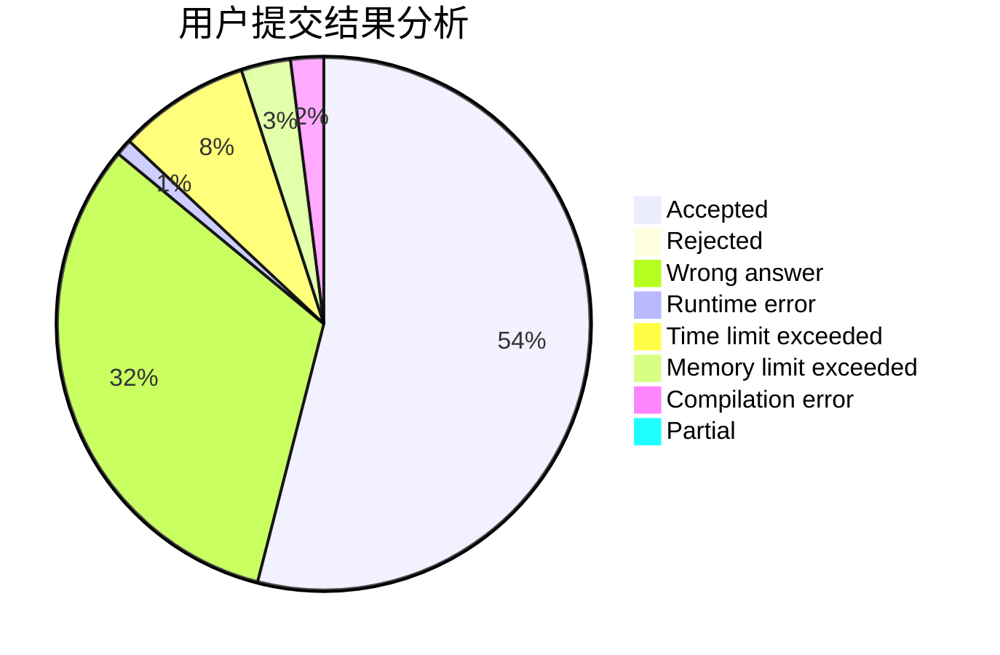
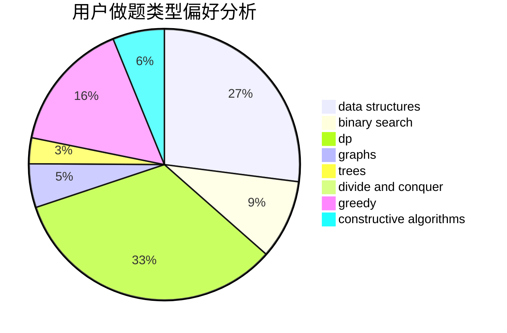
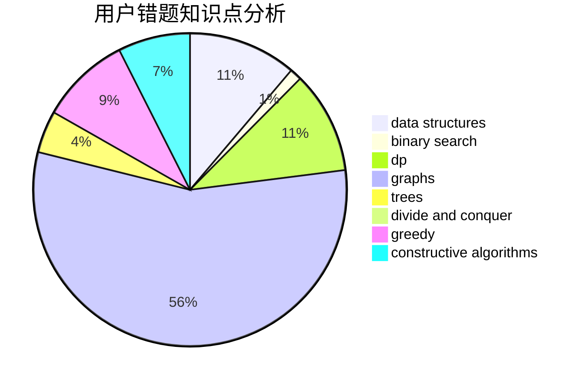

# 200815147

<!-- tabs:start -->

#### **用户提交结果分析**

#### **用户做题类型偏好分析**

#### **用户错题知识点分析**

<!-- tabs:end -->
# 推荐题目
[1218C](https://codeforces.com/contest/1218/problem/C)		dp		  
[1214G](https://codeforces.com/contest/1214/problem/G)		bitmasks,
                        data structures		  
[1216D](https://codeforces.com/contest/1216/problem/D)		math		  
[102A](https://codeforces.com/contest/102/problem/A)		brute force		  
[1217A](https://codeforces.com/contest/1217/problem/A)		binary search,
                        math		  
[1215A](https://codeforces.com/contest/1215/problem/A)		greedy,
                        implementation,
                        math		  
[1214E](https://codeforces.com/contest/1214/problem/E)		constructive algorithms,
                        graphs,
                        math,
                        sortings,
                        trees		  
[1218H](https://codeforces.com/contest/1218/problem/H)		dfs and similar		  
[1217D](https://codeforces.com/contest/1217/problem/D)		constructive algorithms,
                        dfs and similar,
                        graphs		  
[1214D](https://codeforces.com/contest/1214/problem/D)		dfs and similar,
                        dp,
                        flows,
                        hashing		  
