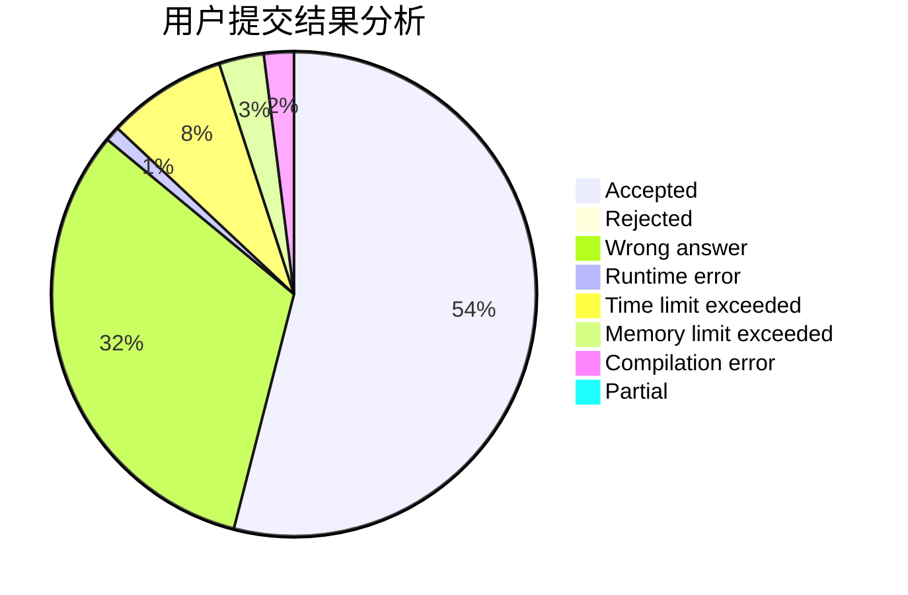
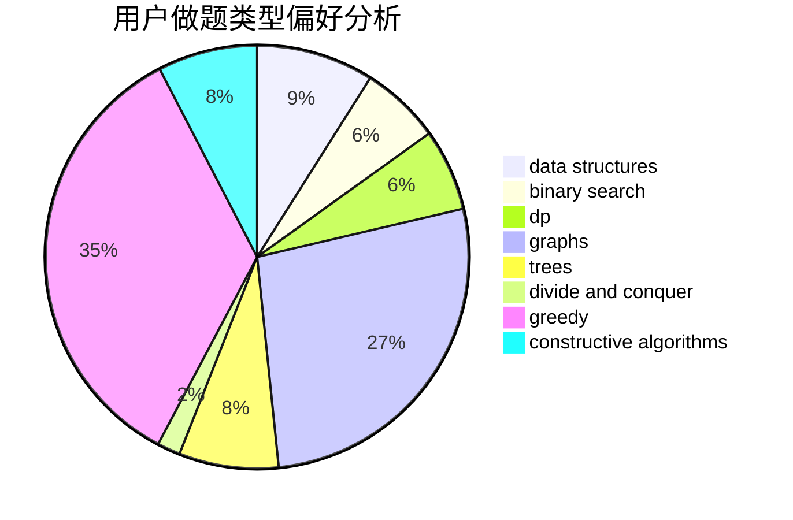
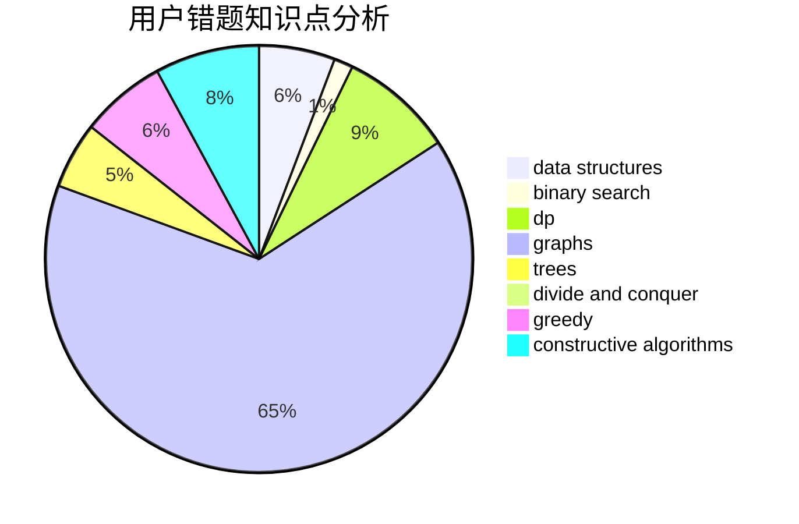

# 200815147

<!-- tabs:start -->

#### **用户提交结果分析**

#### **用户做题类型偏好分析**

#### **用户错题知识点分析**

<!-- tabs:end -->
# 推荐题目
[1225E](https://codeforces.com/contest/1225/problem/E)		binary search,
                        dp		  
[1220C](https://codeforces.com/contest/1220/problem/C)		games,
                        greedy,
                        strings		  
[1223A](https://codeforces.com/contest/1223/problem/A)		math		  
[1030B](https://codeforces.com/contest/1030/problem/B)		geometry		  
[1223E](https://codeforces.com/contest/1223/problem/E)		dp,
                        sortings,
                        trees		  
[1220E](https://codeforces.com/contest/1220/problem/E)		dfs and similar,
                        dp,
                        dsu,
                        graphs,
                        greedy,
                        trees		  
[1220A](https://codeforces.com/contest/1220/problem/A)		implementation,
                        sortings,
                        strings		  
[1225F](https://codeforces.com/contest/1225/problem/F)		constructive algorithms,
                        greedy,
                        trees		  
[1225A](https://codeforces.com/contest/1225/problem/A)		math		  
[121E](https://codeforces.com/contest/121/problem/E)		data structures		  
