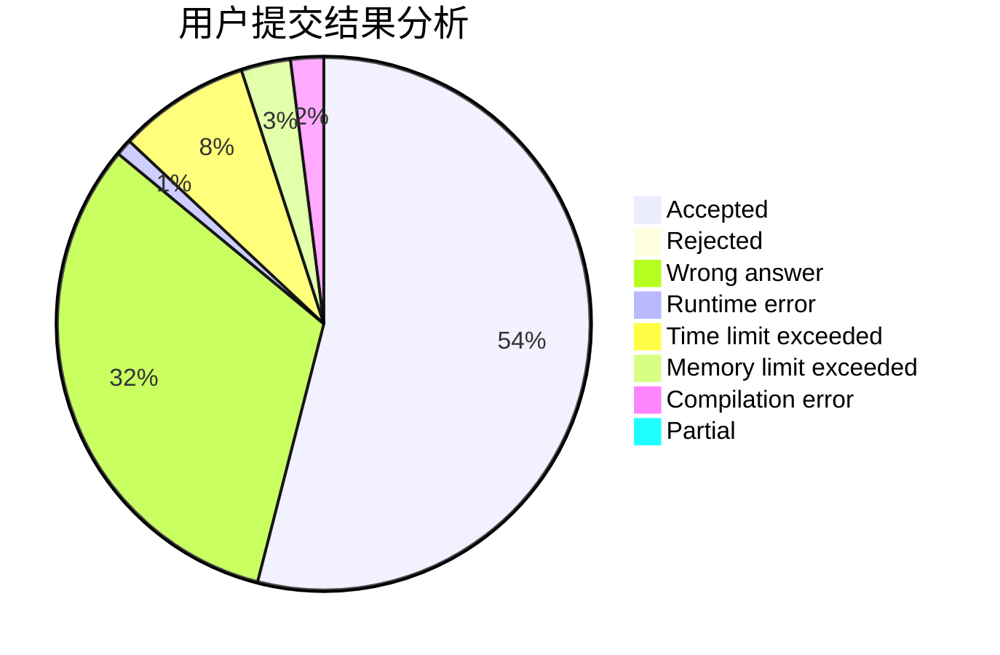
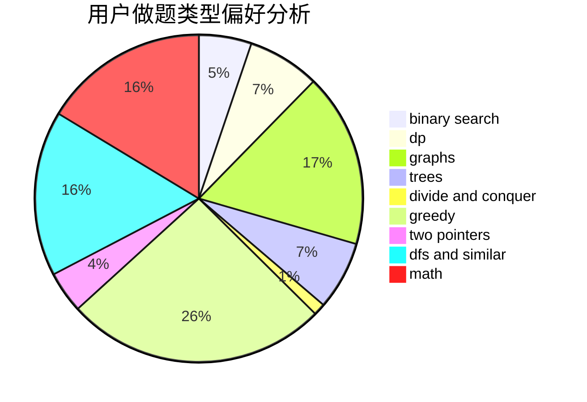

# 200815147

<!-- tabs:start -->

#### **用户提交结果分析**

#### **用户做题类型偏好分析**

<!-- tabs:end -->
# 推荐题目
[1225E](https://codeforces.com/contest/1225/problem/E)
[1220C](https://codeforces.com/contest/1220/problem/C)
[1223A](https://codeforces.com/contest/1223/problem/A)
[1030B](https://codeforces.com/contest/1030/problem/B)
[1223E](https://codeforces.com/contest/1223/problem/E)
[1220E](https://codeforces.com/contest/1220/problem/E)
[1220A](https://codeforces.com/contest/1220/problem/A)
[1225F](https://codeforces.com/contest/1225/problem/F)
[1225A](https://codeforces.com/contest/1225/problem/A)
[121E](https://codeforces.com/contest/121/problem/E)
