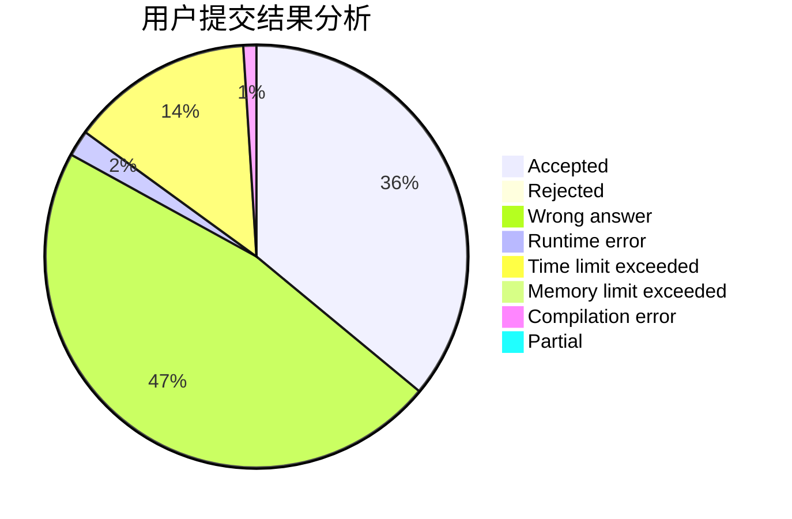
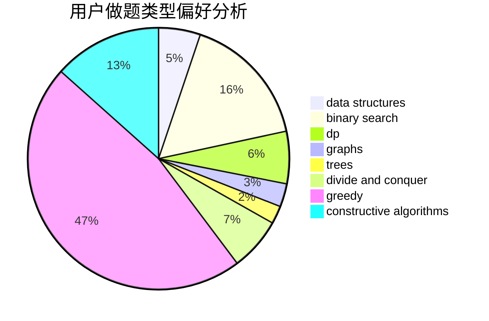
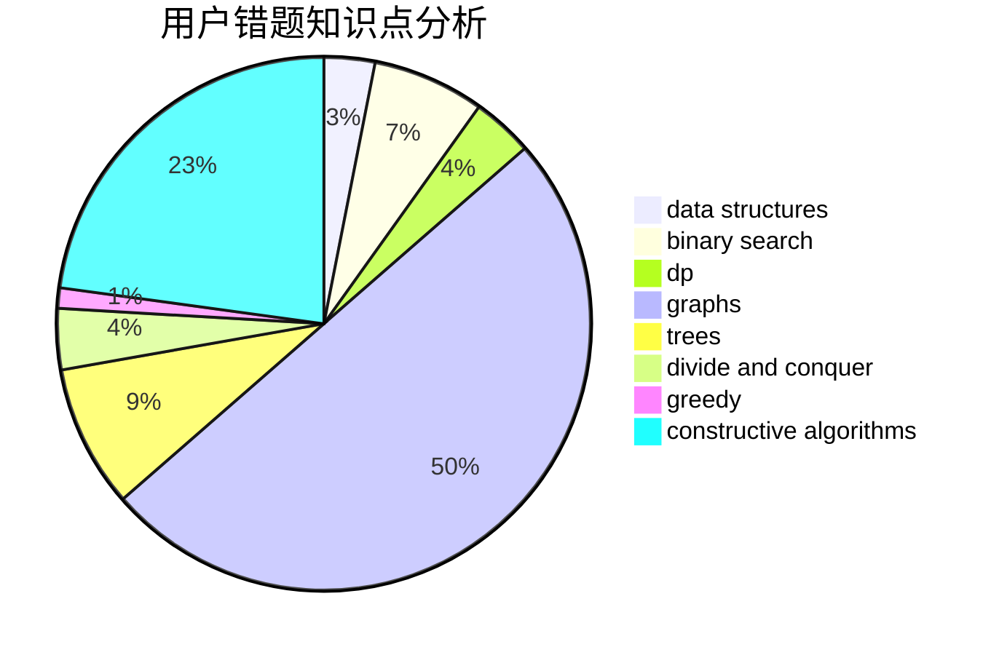

# Daniel_yuan
<!-- tabs:start -->
#### **用户提交结果分析**

#### **用户做题类型偏好分析**

#### **用户错题知识点分析**

<!-- tabs:end -->
# 推荐题目
[Shell Game](http://codeforces.com/problemset/problem/777/A)		constructive algorithms,
                        implementation,
                        math		  
[Make Them Odd](http://codeforces.com/problemset/problem/1277/B)		greedy,
                        number theory		  
[Walking Robot](http://codeforces.com/problemset/problem/1154/D)		greedy		  
[Product Sum](http://codeforces.com/problemset/problem/631/E)		data structures,
                        dp,
                        geometry		  
[Quiz](http://codeforces.com/problemset/problem/337/C)		binary search,
                        greedy,
                        math,
                        matrices,
                        number theory		  
[Working out](http://codeforces.com/problemset/problem/429/B)		dp		  
[Perfect Team](http://codeforces.com/problemset/problem/1221/C)		binary search,
                        math		  
[Arpa's loud Owf and Mehrdad's evil plan](https://codeforces.com/contest/742/problem/C)		dfs and similar,
                        math		  
[Buy One, Get One Free](http://codeforces.com/problemset/problem/335/F)		dp,
                        greedy		  
[Xor-tree](https://codeforces.com/contest/430/problem/C)		dfs and similar,
                        trees		  
<!-- tabs:start -->
#### **data structures**
[Shell Game](http://codeforces.com/problemset/problem/631/E)		data structures,
                        dp,
                        geometry		  
[Make Them Odd](https://codeforces.com/contest/1443/problem/F)		combinatorics,
                        data structures,
                        dsu,
                        greedy,
                        implementation		  
[Walking Robot](http://codeforces.com/problemset/problem/631/D)		data structures,
                        hashing,
                        implementation,
                        string suffix structures,
                        strings		  
[Product Sum](http://codeforces.com/problemset/problem/587/E)		data structures		  
[Quiz](http://codeforces.com/problemset/problem/420/D)		data structures		  
[Working out](http://codeforces.com/problemset/problem/339/D)		data structures,
                        trees		  
[Perfect Team](https://codeforces.com/contest/397/problem/E)		data structures,
                        graphs,
                        trees		  
[Arpa's loud Owf and Mehrdad's evil plan](http://codeforces.com/problemset/problem/741/E)		data structures,
                        string suffix structures		  
[Buy One, Get One Free](http://codeforces.com/problemset/problem/1340/A)		brute force,
                        data structures,
                        greedy,
                        implementation		  
[Xor-tree](http://codeforces.com/problemset/problem/1379/C)		binary search,
                        brute force,
                        data structures,
                        dfs and similar,
                        dp,
                        greedy,
                        sortings,
                        two pointers		  
#### **binary search**
[Shell Game](http://codeforces.com/problemset/problem/337/C)		binary search,
                        greedy,
                        math,
                        matrices,
                        number theory		  
[Make Them Odd](http://codeforces.com/problemset/problem/1221/C)		binary search,
                        math		  
[Walking Robot](http://codeforces.com/problemset/problem/335/A)		binary search,
                        constructive algorithms,
                        greedy		  
[Product Sum](http://codeforces.com/problemset/problem/1379/C)		binary search,
                        brute force,
                        data structures,
                        dfs and similar,
                        dp,
                        greedy,
                        sortings,
                        two pointers		  
[Quiz](http://codeforces.com/problemset/problem/1114/E)		binary search,
                        interactive,
                        number theory,
                        probabilities		  
[Working out](http://codeforces.com/problemset/problem/1492/C)		binary search,
                        data structures,
                        dp,
                        greedy,
                        two pointers		  
[Perfect Team](http://codeforces.com/problemset/problem/1463/D)		binary search,
                        constructive algorithms,
                        greedy,
                        two pointers		  
[Arpa's loud Owf and Mehrdad's evil plan](http://codeforces.com/problemset/problem/1490/G)		binary search,
                        data structures,
                        math		  
[Buy One, Get One Free](http://codeforces.com/problemset/problem/1479/D)		binary search,
                        bitmasks,
                        brute force,
                        data structures,
                        probabilities,
                        trees		  
[Xor-tree](http://codeforces.com/problemset/problem/1436/E)		binary search,
                        data structures,
                        two pointers		  
#### **dp**
[Shell Game](http://codeforces.com/problemset/problem/631/E)		data structures,
                        dp,
                        geometry		  
[Make Them Odd](http://codeforces.com/problemset/problem/429/B)		dp		  
[Walking Robot](http://codeforces.com/problemset/problem/335/F)		dp,
                        greedy		  
[Product Sum](http://codeforces.com/problemset/problem/158/E)		*special problem,
                        dp,
                        sortings		  
[Quiz](http://codeforces.com/problemset/problem/1379/C)		binary search,
                        brute force,
                        data structures,
                        dfs and similar,
                        dp,
                        greedy,
                        sortings,
                        two pointers		  
[Working out](http://codeforces.com/problemset/problem/274/B)		dfs and similar,
                        dp,
                        greedy,
                        trees		  
[Perfect Team](http://codeforces.com/problemset/problem/632/E)		divide and conquer,
                        dp,
                        fft,
                        math		  
[Arpa's loud Owf and Mehrdad's evil plan](https://codeforces.com/contest/759/problem/D)		brute force,
                        combinatorics,
                        dp,
                        string suffix structures		  
[Buy One, Get One Free](http://codeforces.com/problemset/problem/1239/A)		combinatorics,
                        dp,
                        math		  
[Xor-tree](http://codeforces.com/problemset/problem/1459/B)		dp,
                        math		  
#### **graph**
[Shell Game](https://codeforces.com/contest/397/problem/E)		data structures,
                        graphs,
                        trees		  
[Make Them Odd](http://codeforces.com/problemset/problem/612/E)		combinatorics,
                        constructive algorithms,
                        dfs and similar,
                        graphs,
                        math		  
[Walking Robot](http://codeforces.com/problemset/problem/107/A)		dfs and similar,
                        graphs		  
[Product Sum](http://codeforces.com/problemset/problem/1360/C)		constructive algorithms,
                        graph matchings,
                        greedy,
                        sortings		  
[Quiz](http://codeforces.com/problemset/problem/1392/I)		fft,
                        graphs,
                        math		  
[Working out](http://codeforces.com/problemset/problem/1487/C)		brute force,
                        constructive algorithms,
                        dfs and similar,
                        graphs,
                        greedy,
                        implementation,
                        math		  
[Perfect Team](http://codeforces.com/problemset/problem/1437/C)		dp,
                        flows,
                        graph matchings,
                        greedy,
                        math,
                        sortings		  
[Arpa's loud Owf and Mehrdad's evil plan](http://codeforces.com/problemset/problem/1470/D)		constructive algorithms,
                        dfs and similar,
                        graph matchings,
                        graphs,
                        greedy		  
[Buy One, Get One Free](http://codeforces.com/problemset/problem/1476/C)		dp,
                        graphs,
                        greedy		  
[Xor-tree](http://codeforces.com/problemset/problem/1304/D)		constructive algorithms,
                        graphs,
                        greedy,
                        two pointers		  
#### **trees**
[Shell Game](https://codeforces.com/contest/430/problem/C)		dfs and similar,
                        trees		  
[Make Them Odd](http://codeforces.com/problemset/problem/339/D)		data structures,
                        trees		  
[Walking Robot](https://codeforces.com/contest/397/problem/E)		data structures,
                        graphs,
                        trees		  
[Product Sum](http://codeforces.com/problemset/problem/274/B)		dfs and similar,
                        dp,
                        greedy,
                        trees		  
[Quiz](http://codeforces.com/problemset/problem/1479/D)		binary search,
                        bitmasks,
                        brute force,
                        data structures,
                        probabilities,
                        trees		  
[Working out](http://codeforces.com/problemset/problem/1511/C)		brute force,
                        data structures,
                        implementation,
                        trees		  
[Perfect Team](http://codeforces.com/problemset/problem/1499/F)		combinatorics,
                        dfs and similar,
                        dp,
                        trees		  
[Arpa's loud Owf and Mehrdad's evil plan](http://codeforces.com/problemset/problem/1491/E)		brute force,
                        dfs and similar,
                        divide and conquer,
                        number theory,
                        trees		  
[Buy One, Get One Free](http://codeforces.com/problemset/problem/1466/D)		data structures,
                        greedy,
                        sortings,
                        trees		  
[Xor-tree](http://codeforces.com/problemset/problem/1495/D)		combinatorics,
                        dfs and similar,
                        graphs,
                        math,
                        shortest paths,
                        trees		  
#### **divide and conquer**
[Shell Game](http://codeforces.com/problemset/problem/632/E)		divide and conquer,
                        dp,
                        fft,
                        math		  
[Make Them Odd](http://codeforces.com/problemset/problem/1461/D)		binary search,
                        brute force,
                        data structures,
                        divide and conquer,
                        implementation,
                        sortings		  
[Walking Robot](http://codeforces.com/problemset/problem/1466/G)		combinatorics,
                        divide and conquer,
                        hashing,
                        math,
                        string suffix structures,
                        strings		  
[Product Sum](http://codeforces.com/problemset/problem/1490/D)		dfs and similar,
                        divide and conquer,
                        implementation		  
[Quiz](https://codeforces.com/contest/1483/problem/C)		data structures,
                        divide and conquer,
                        dp		  
[Working out](http://codeforces.com/problemset/problem/1491/E)		brute force,
                        dfs and similar,
                        divide and conquer,
                        number theory,
                        trees		  
[Perfect Team](http://codeforces.com/problemset/problem/1303/G)		data structures,
                        divide and conquer,
                        geometry,
                        trees		  
[Arpa's loud Owf and Mehrdad's evil plan](http://codeforces.com/problemset/problem/1494/D)		constructive algorithms,
                        data structures,
                        dfs and similar,
                        divide and conquer,
                        dsu,
                        greedy,
                        sortings,
                        trees		  
[Buy One, Get One Free](http://codeforces.com/problemset/problem/1482/E)		data structures,
                        divide and conquer,
                        dp		  
[Xor-tree](http://codeforces.com/problemset/problem/566/C)		dfs and similar,
                        divide and conquer,
                        trees		  
#### **greedy**
[Shell Game](http://codeforces.com/problemset/problem/1277/B)		greedy,
                        number theory		  
[Make Them Odd](http://codeforces.com/problemset/problem/1154/D)		greedy		  
[Walking Robot](http://codeforces.com/problemset/problem/337/C)		binary search,
                        greedy,
                        math,
                        matrices,
                        number theory		  
[Product Sum](http://codeforces.com/problemset/problem/335/F)		dp,
                        greedy		  
[Quiz](https://codeforces.com/contest/1443/problem/F)		combinatorics,
                        data structures,
                        dsu,
                        greedy,
                        implementation		  
[Working out](http://codeforces.com/problemset/problem/335/A)		binary search,
                        constructive algorithms,
                        greedy		  
[Perfect Team](https://codeforces.com/contest/1417/problem/D)		constructive algorithms,
                        greedy,
                        math		  
[Arpa's loud Owf and Mehrdad's evil plan](http://codeforces.com/problemset/problem/1107/A)		greedy,
                        strings		  
[Buy One, Get One Free](http://codeforces.com/problemset/problem/1340/A)		brute force,
                        data structures,
                        greedy,
                        implementation		  
[Xor-tree](http://codeforces.com/problemset/problem/1379/C)		binary search,
                        brute force,
                        data structures,
                        dfs and similar,
                        dp,
                        greedy,
                        sortings,
                        two pointers		  
#### **constructive algorithms**
[Shell Game](http://codeforces.com/problemset/problem/777/A)		constructive algorithms,
                        implementation,
                        math		  
[Make Them Odd](http://codeforces.com/problemset/problem/1415/D)		bitmasks,
                        brute force,
                        constructive algorithms		  
[Walking Robot](http://codeforces.com/problemset/problem/335/A)		binary search,
                        constructive algorithms,
                        greedy		  
[Product Sum](https://codeforces.com/contest/1417/problem/D)		constructive algorithms,
                        greedy,
                        math		  
[Quiz](http://codeforces.com/problemset/problem/1081/F)		constructive algorithms,
                        implementation,
                        interactive		  
[Working out](http://codeforces.com/problemset/problem/632/B)		brute force,
                        constructive algorithms		  
[Perfect Team](http://codeforces.com/problemset/problem/612/E)		combinatorics,
                        constructive algorithms,
                        dfs and similar,
                        graphs,
                        math		  
[Arpa's loud Owf and Mehrdad's evil plan](http://codeforces.com/problemset/problem/720/C)		constructive algorithms		  
[Buy One, Get One Free](http://codeforces.com/problemset/problem/1360/C)		constructive algorithms,
                        graph matchings,
                        greedy,
                        sortings		  
[Xor-tree](http://codeforces.com/problemset/problem/1493/A)		constructive algorithms,
                        greedy		  
#### **sortings**
[Shell Game](http://codeforces.com/problemset/problem/378/B)		implementation,
                        sortings		  
[Make Them Odd](http://codeforces.com/problemset/problem/158/E)		*special problem,
                        dp,
                        sortings		  
[Walking Robot](http://codeforces.com/problemset/problem/1379/C)		binary search,
                        brute force,
                        data structures,
                        dfs and similar,
                        dp,
                        greedy,
                        sortings,
                        two pointers		  
[Product Sum](http://codeforces.com/problemset/problem/777/B)		data structures,
                        dp,
                        greedy,
                        sortings		  
[Quiz](http://codeforces.com/problemset/problem/1360/C)		constructive algorithms,
                        graph matchings,
                        greedy,
                        sortings		  
[Working out](https://codeforces.com/contest/1496/problem/C)		geometry,
                        greedy,
                        math,
                        sortings		  
[Perfect Team](http://codeforces.com/problemset/problem/1495/A)		geometry,
                        greedy,
                        math,
                        sortings		  
[Arpa's loud Owf and Mehrdad's evil plan](http://codeforces.com/problemset/problem/1497/A)		brute force,
                        data structures,
                        greedy,
                        sortings		  
[Buy One, Get One Free](http://codeforces.com/problemset/problem/1427/A)		math,
                        sortings		  
[Xor-tree](http://codeforces.com/problemset/problem/1461/D)		binary search,
                        brute force,
                        data structures,
                        divide and conquer,
                        implementation,
                        sortings		  
<!-- tabs:end -->
