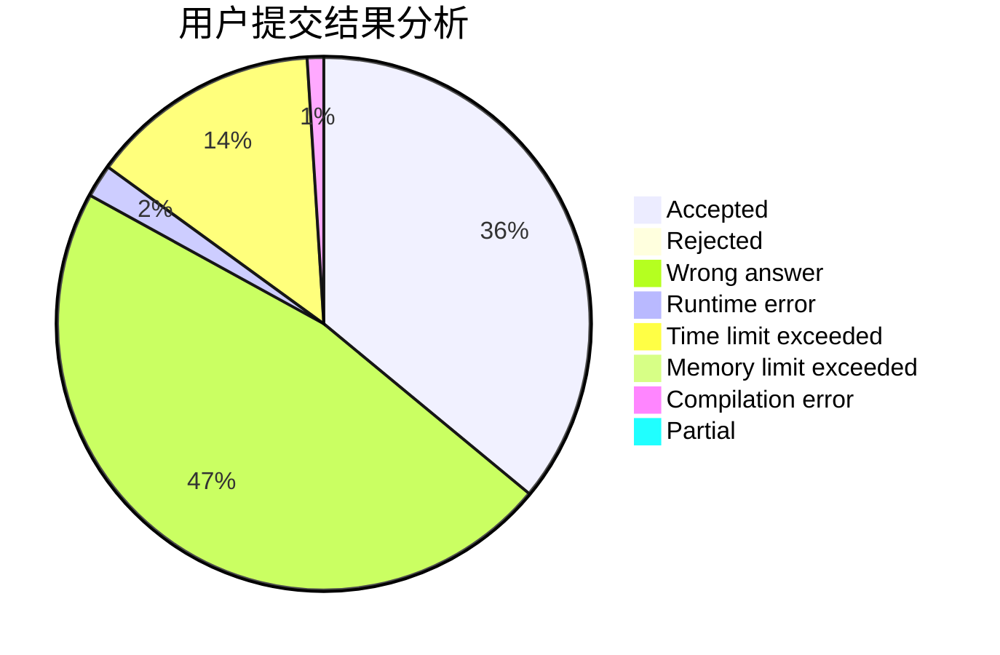
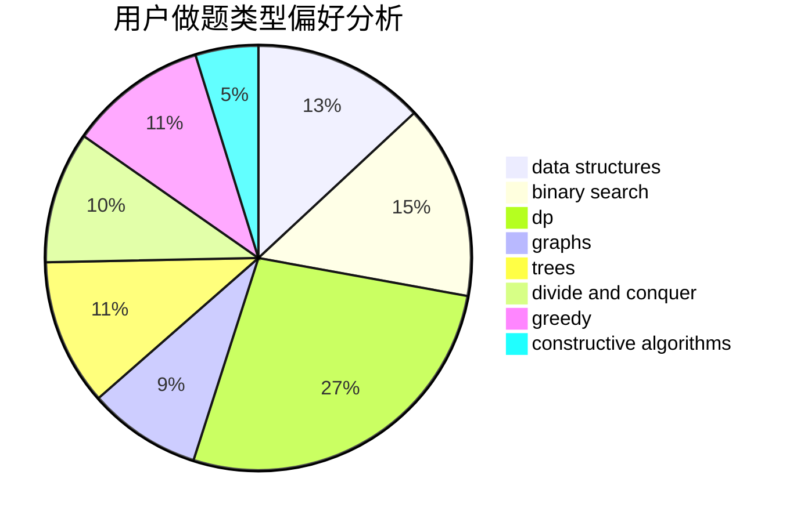
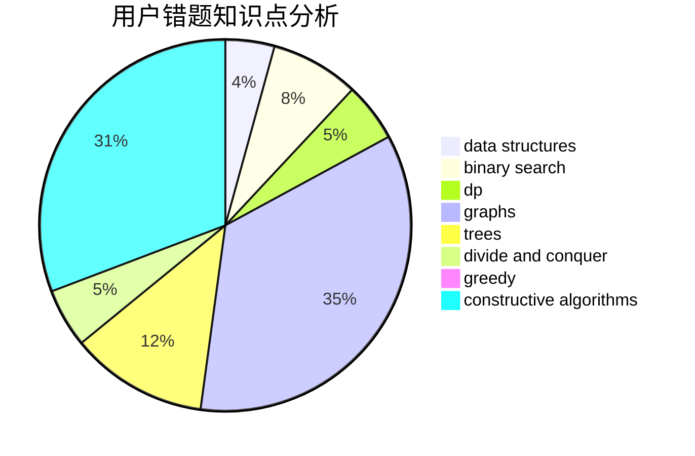

# Daniel_yuan

<!-- tabs:start -->

#### **用户提交结果分析**

#### **用户做题类型偏好分析**

#### **用户错题知识点分析**

<!-- tabs:end -->
# 推荐题目
[794G](https://codeforces.com/contest/794/problem/G)		combinatorics,
                        dp,
                        math		  
[1156D](https://codeforces.com/contest/1156/problem/D)		dfs and similar,
                        divide and conquer,
                        dp,
                        dsu,
                        trees		  
[1425A](https://codeforces.com/contest/1425/problem/A)		games,
                        greedy		  
[737C](https://codeforces.com/contest/737/problem/C)		dsu,graphs,sortings,trees		  
[662D](https://codeforces.com/contest/662/problem/D)		constructive algorithms,
                        greedy,
                        implementation,
                        math		  
[12482](https://codeforces.com/contest/1248/problem/2)		dsu,graphs,sortings,trees		  
[762F](https://codeforces.com/contest/762/problem/F)		combinatorics,
                        graphs,
                        trees		  
[360E](https://codeforces.com/contest/360/problem/E)		graphs,
                        greedy,
                        shortest paths		  
[44G](https://codeforces.com/contest/44/problem/G)		data structures,
                        implementation		  
[363B](https://codeforces.com/contest/363/problem/B)		brute force,
                        dp		  
