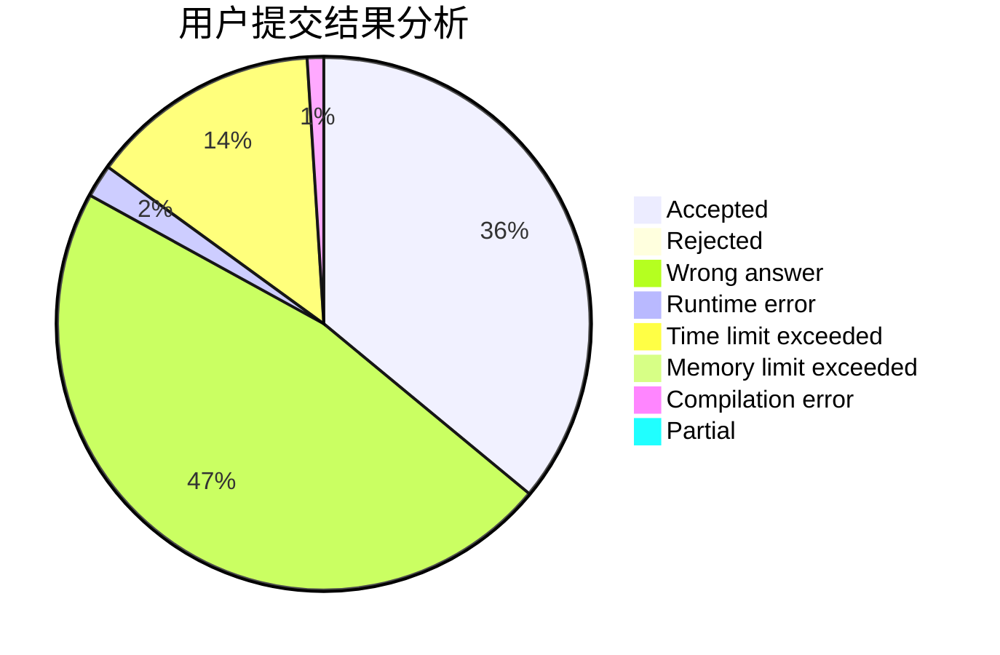
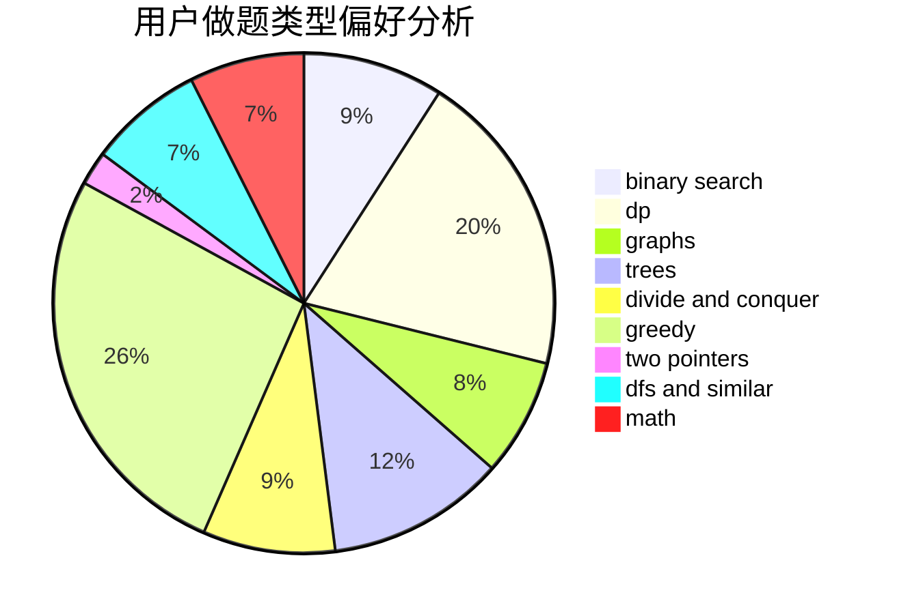

# Daniel_yuan

<!-- tabs:start -->

#### **用户提交结果分析**

#### **用户做题类型偏好分析**

<!-- tabs:end -->
# 推荐题目
[794G](https://codeforces.com/contest/794/problem/G)
[1156D](https://codeforces.com/contest/1156/problem/D)
[1425A](https://codeforces.com/contest/1425/problem/A)
[737C](https://codeforces.com/contest/737/problem/C)
[662D](https://codeforces.com/contest/662/problem/D)
[12482](https://codeforces.com/contest/1248/problem/2)
[762F](https://codeforces.com/contest/762/problem/F)
[360E](https://codeforces.com/contest/360/problem/E)
[44G](https://codeforces.com/contest/44/problem/G)
[363B](https://codeforces.com/contest/363/problem/B)
