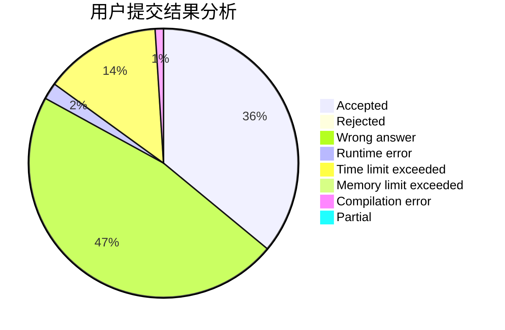
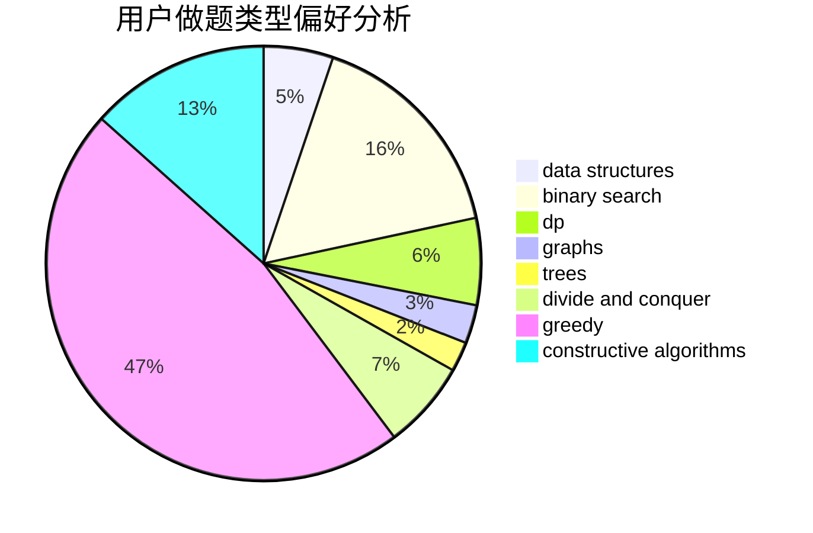
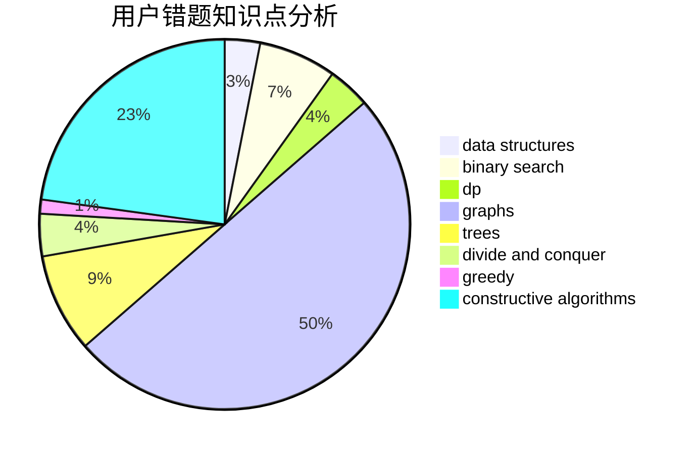

# Daniel_yuan

<!-- tabs:start -->

#### **用户提交结果分析**

#### **用户做题类型偏好分析**

#### **用户错题知识点分析**

<!-- tabs:end -->
# 推荐题目
[777A](https://codeforces.com/contest/777/problem/A)		constructive algorithms,
                        implementation,
                        math		  
[1154D](https://codeforces.com/contest/1154/problem/D)		greedy		  
[1417D](https://codeforces.com/contest/1417/problem/D)		dsu,graphs,sortings,trees		  
[720C](https://codeforces.com/contest/720/problem/C)		constructive algorithms		  
[631E](https://codeforces.com/contest/631/problem/E)		data structures,
                        dp,
                        geometry		  
[1243A](https://codeforces.com/contest/1243/problem/A)		implementation		  
[742C](https://codeforces.com/contest/742/problem/C)		dsu,graphs,sortings,trees		  
[335A](https://codeforces.com/contest/335/problem/A)		binary search,
                        constructive algorithms,
                        greedy		  
[429B](https://codeforces.com/contest/429/problem/B)		dp		  
[335F](https://codeforces.com/contest/335/problem/F)		dp,
                        greedy		  
