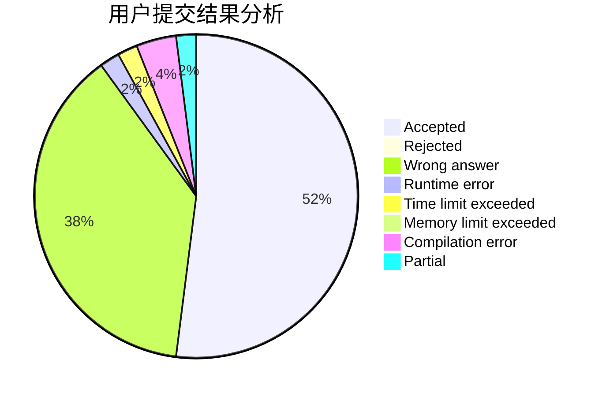
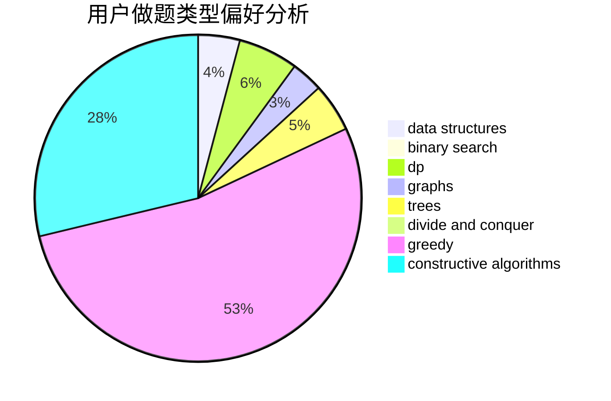
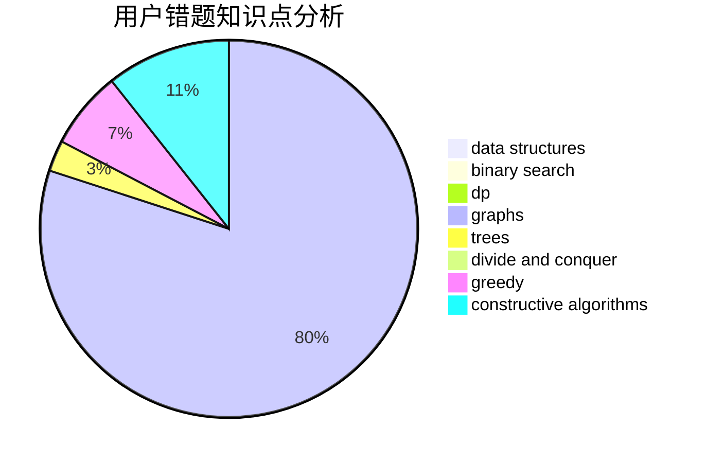

# Danielzxx

<!-- tabs:start -->

#### **用户提交结果分析**

#### **用户做题类型偏好分析**

#### **用户错题知识点分析**

<!-- tabs:end -->
# 推荐题目
[1463C](https://codeforces.com/contest/1463/problem/C)		implementation		  
[52A](https://codeforces.com/contest/52/problem/A)		implementation		  
[550E](https://codeforces.com/contest/550/problem/E)		constructive algorithms,
                        greedy,
                        implementation,
                        math		  
[1375C](https://codeforces.com/contest/1375/problem/C)		constructive algorithms,
                        data structures,
                        greedy		  
[260D](https://codeforces.com/contest/260/problem/D)		constructive algorithms,
                        dsu,
                        graphs,
                        greedy,
                        trees		  
[743E](https://codeforces.com/contest/743/problem/E)		binary search,
                        bitmasks,
                        brute force,
                        dp		  
[1295F](https://codeforces.com/contest/1295/problem/F)		combinatorics,
                        dp,
                        probabilities		  
[51A](https://codeforces.com/contest/51/problem/A)		implementation		  
[25A](https://codeforces.com/contest/25/problem/A)		brute force		  
[1033C](https://codeforces.com/contest/1033/problem/C)		brute force,
                        dp,
                        games		  
