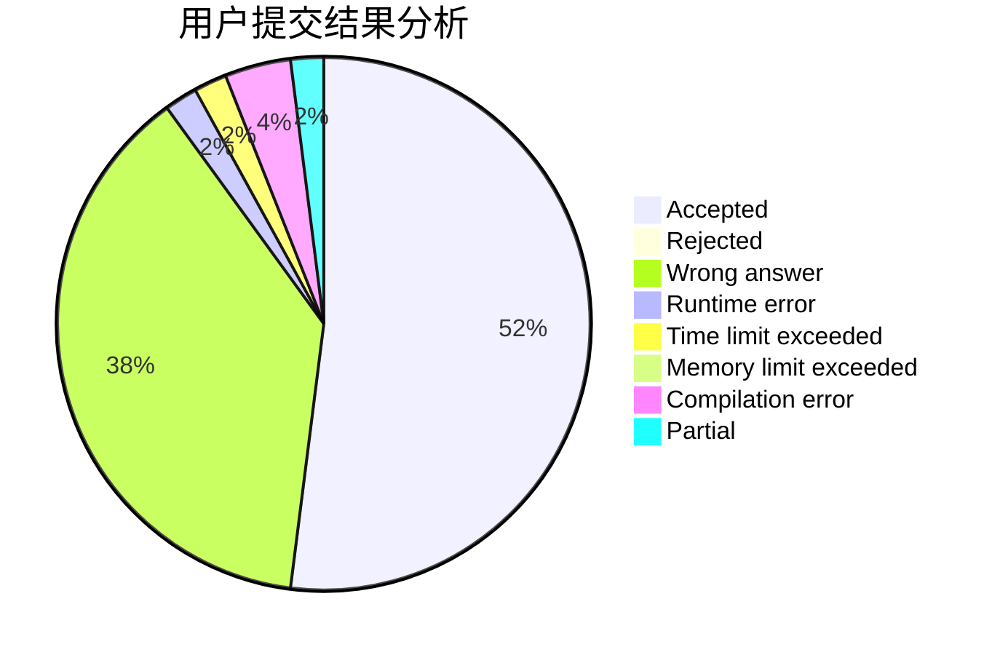
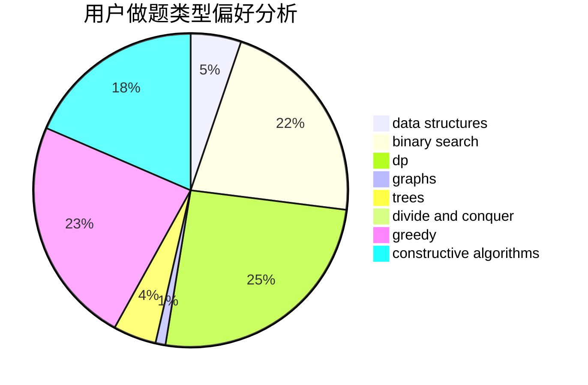
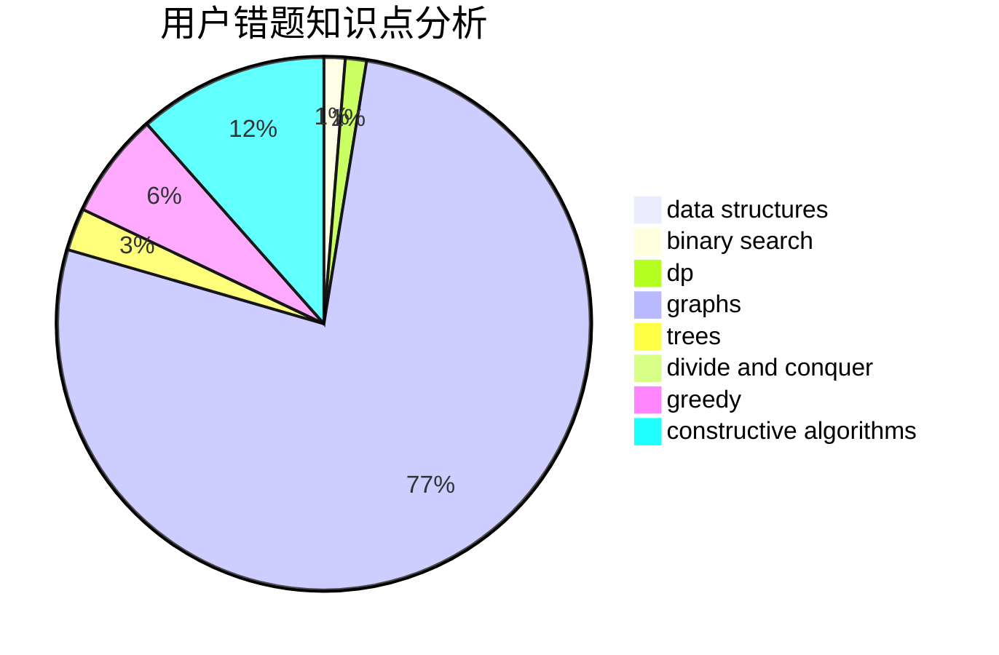

# Danielzxx
<!-- tabs:start -->
#### **用户提交结果分析**

#### **用户做题类型偏好分析**

#### **用户错题知识点分析**

<!-- tabs:end -->
# 推荐题目
[Chocolates](http://codeforces.com/problemset/problem/1139/B)		greedy,
                        implementation		  
[Too Much Money](http://codeforces.com/problemset/problem/725/E)		brute force,
                        greedy		  
[Increasing Matrix](http://codeforces.com/problemset/problem/1231/C)		greedy		  
[A Prank](http://codeforces.com/problemset/problem/1062/A)		greedy,
                        implementation		  
[Alice and Bob](http://codeforces.com/problemset/problem/346/A)		games,
                        math,
                        number theory		  
[Crazy Town](https://codeforces.com/contest/499/problem/C)		geometry		  
[Minimax Problem](http://codeforces.com/problemset/problem/1288/D)		binary search,
                        bitmasks,
                        dp		  
[Sharti](http://codeforces.com/problemset/problem/494/E)		data structures,
                        games		  
[Multiplication Table](http://codeforces.com/problemset/problem/39/H)		implementation		  
[Fragile Bridges](http://codeforces.com/problemset/problem/201/C)		dp		  
<!-- tabs:start -->
#### **data structures**
[Chocolates](http://codeforces.com/problemset/problem/494/E)		data structures,
                        games		  
[Too Much Money](http://codeforces.com/problemset/problem/777/C)		binary search,
                        data structures,
                        dp,
                        greedy,
                        implementation,
                        two pointers		  
[Increasing Matrix](http://codeforces.com/problemset/problem/1042/F)		data structures,
                        dfs and similar,
                        dsu,
                        graphs,
                        greedy,
                        sortings,
                        trees		  
[A Prank](http://codeforces.com/problemset/problem/689/D)		binary search,
                        data structures		  
[Alice and Bob](http://codeforces.com/problemset/problem/1288/E)		data structures		  
[Crazy Town](http://codeforces.com/problemset/problem/575/I)		data structures		  
[Minimax Problem](http://codeforces.com/problemset/problem/1106/D)		data structures,
                        dfs and similar,
                        graphs,
                        greedy,
                        shortest paths		  
[Sharti](http://codeforces.com/problemset/problem/1335/E1)		binary search,
                        brute force,
                        data structures,
                        dp,
                        two pointers		  
[Multiplication Table](http://codeforces.com/problemset/problem/526/F)		data structures,
                        divide and conquer		  
[Fragile Bridges](http://codeforces.com/problemset/problem/5/C)		constructive algorithms,
                        data structures,
                        dp,
                        greedy,
                        sortings,
                        strings		  
#### **binary search**
[Chocolates](http://codeforces.com/problemset/problem/1288/D)		binary search,
                        bitmasks,
                        dp		  
[Too Much Money](http://codeforces.com/problemset/problem/777/C)		binary search,
                        data structures,
                        dp,
                        greedy,
                        implementation,
                        two pointers		  
[Increasing Matrix](http://codeforces.com/problemset/problem/689/D)		binary search,
                        data structures		  
[A Prank](http://codeforces.com/problemset/problem/501/E)		binary search,
                        combinatorics,
                        implementation		  
[Alice and Bob](http://codeforces.com/problemset/problem/1335/E1)		binary search,
                        brute force,
                        data structures,
                        dp,
                        two pointers		  
[Crazy Town](http://codeforces.com/problemset/problem/1492/C)		binary search,
                        data structures,
                        dp,
                        greedy,
                        two pointers		  
[Minimax Problem](http://codeforces.com/problemset/problem/1463/D)		binary search,
                        constructive algorithms,
                        greedy,
                        two pointers		  
[Sharti](http://codeforces.com/problemset/problem/1490/G)		binary search,
                        data structures,
                        math		  
[Multiplication Table](http://codeforces.com/problemset/problem/1479/D)		binary search,
                        bitmasks,
                        brute force,
                        data structures,
                        probabilities,
                        trees		  
[Fragile Bridges](http://codeforces.com/problemset/problem/1436/E)		binary search,
                        data structures,
                        two pointers		  
#### **dp**
[Chocolates](http://codeforces.com/problemset/problem/1288/D)		binary search,
                        bitmasks,
                        dp		  
[Too Much Money](http://codeforces.com/problemset/problem/201/C)		dp		  
[Increasing Matrix](http://codeforces.com/problemset/problem/772/C)		constructive algorithms,
                        dp,
                        graphs,
                        math,
                        number theory		  
[A Prank](http://codeforces.com/problemset/problem/777/C)		binary search,
                        data structures,
                        dp,
                        greedy,
                        implementation,
                        two pointers		  
[Alice and Bob](https://codeforces.com/contest/236/problem/D)		dp,
                        math,
                        probabilities		  
[Crazy Town](http://codeforces.com/problemset/problem/1032/F)		dp,
                        trees		  
[Minimax Problem](http://codeforces.com/problemset/problem/1206/B)		dp,
                        implementation		  
[Sharti](http://codeforces.com/problemset/problem/1286/F)		brute force,
                        constructive algorithms,
                        dp,
                        fft,
                        implementation,
                        math		  
[Multiplication Table](http://codeforces.com/problemset/problem/429/C)		bitmasks,
                        constructive algorithms,
                        dp,
                        greedy,
                        trees		  
[Fragile Bridges](http://codeforces.com/problemset/problem/729/F)		dp		  
#### **graph**
[Chocolates](http://codeforces.com/problemset/problem/772/C)		constructive algorithms,
                        dp,
                        graphs,
                        math,
                        number theory		  
[Too Much Money](http://codeforces.com/problemset/problem/23/B)		constructive algorithms,
                        graphs,
                        math		  
[Increasing Matrix](http://codeforces.com/problemset/problem/1042/F)		data structures,
                        dfs and similar,
                        dsu,
                        graphs,
                        greedy,
                        sortings,
                        trees		  
[A Prank](http://codeforces.com/problemset/problem/612/E)		combinatorics,
                        constructive algorithms,
                        dfs and similar,
                        graphs,
                        math		  
[Alice and Bob](http://codeforces.com/problemset/problem/1239/D)		2-sat,
                        dfs and similar,
                        graph matchings,
                        graphs		  
[Crazy Town](http://codeforces.com/problemset/problem/1106/D)		data structures,
                        dfs and similar,
                        graphs,
                        greedy,
                        shortest paths		  
[Minimax Problem](https://codeforces.com/contest/1287/problem/D)		constructive algorithms,
                        data structures,
                        dfs and similar,
                        graphs,
                        greedy,
                        trees		  
[Sharti](http://codeforces.com/problemset/problem/613/D)		dfs and similar,
                        divide and conquer,
                        dp,
                        graphs,
                        sortings,
                        trees		  
[Multiplication Table](http://codeforces.com/problemset/problem/1487/C)		brute force,
                        constructive algorithms,
                        dfs and similar,
                        graphs,
                        greedy,
                        implementation,
                        math		  
[Fragile Bridges](http://codeforces.com/problemset/problem/1437/C)		dp,
                        flows,
                        graph matchings,
                        greedy,
                        math,
                        sortings		  
#### **trees**
[Chocolates](http://codeforces.com/problemset/problem/1032/F)		dp,
                        trees		  
[Too Much Money](http://codeforces.com/problemset/problem/1042/F)		data structures,
                        dfs and similar,
                        dsu,
                        graphs,
                        greedy,
                        sortings,
                        trees		  
[Increasing Matrix](http://codeforces.com/problemset/problem/429/C)		bitmasks,
                        constructive algorithms,
                        dp,
                        greedy,
                        trees		  
[A Prank](https://codeforces.com/contest/1287/problem/D)		constructive algorithms,
                        data structures,
                        dfs and similar,
                        graphs,
                        greedy,
                        trees		  
[Alice and Bob](http://codeforces.com/problemset/problem/613/D)		dfs and similar,
                        divide and conquer,
                        dp,
                        graphs,
                        sortings,
                        trees		  
[Crazy Town](http://codeforces.com/problemset/problem/1479/D)		binary search,
                        bitmasks,
                        brute force,
                        data structures,
                        probabilities,
                        trees		  
[Minimax Problem](http://codeforces.com/problemset/problem/1511/C)		brute force,
                        data structures,
                        implementation,
                        trees		  
[Sharti](http://codeforces.com/problemset/problem/1499/F)		combinatorics,
                        dfs and similar,
                        dp,
                        trees		  
[Multiplication Table](http://codeforces.com/problemset/problem/1491/E)		brute force,
                        dfs and similar,
                        divide and conquer,
                        number theory,
                        trees		  
[Fragile Bridges](http://codeforces.com/problemset/problem/1466/D)		data structures,
                        greedy,
                        sortings,
                        trees		  
#### **divide and conquer**
[Chocolates](http://codeforces.com/problemset/problem/526/F)		data structures,
                        divide and conquer		  
[Too Much Money](http://codeforces.com/problemset/problem/613/D)		dfs and similar,
                        divide and conquer,
                        dp,
                        graphs,
                        sortings,
                        trees		  
[Increasing Matrix](http://codeforces.com/problemset/problem/1461/D)		binary search,
                        brute force,
                        data structures,
                        divide and conquer,
                        implementation,
                        sortings		  
[A Prank](http://codeforces.com/problemset/problem/1466/G)		combinatorics,
                        divide and conquer,
                        hashing,
                        math,
                        string suffix structures,
                        strings		  
[Alice and Bob](http://codeforces.com/problemset/problem/1490/D)		dfs and similar,
                        divide and conquer,
                        implementation		  
[Crazy Town](https://codeforces.com/contest/1483/problem/C)		data structures,
                        divide and conquer,
                        dp		  
[Minimax Problem](http://codeforces.com/problemset/problem/1491/E)		brute force,
                        dfs and similar,
                        divide and conquer,
                        number theory,
                        trees		  
[Sharti](http://codeforces.com/problemset/problem/1303/G)		data structures,
                        divide and conquer,
                        geometry,
                        trees		  
[Multiplication Table](http://codeforces.com/problemset/problem/1494/D)		constructive algorithms,
                        data structures,
                        dfs and similar,
                        divide and conquer,
                        dsu,
                        greedy,
                        sortings,
                        trees		  
[Fragile Bridges](http://codeforces.com/problemset/problem/1482/E)		data structures,
                        divide and conquer,
                        dp		  
#### **greedy**
[Chocolates](http://codeforces.com/problemset/problem/1139/B)		greedy,
                        implementation		  
[Too Much Money](http://codeforces.com/problemset/problem/725/E)		brute force,
                        greedy		  
[Increasing Matrix](http://codeforces.com/problemset/problem/1231/C)		greedy		  
[A Prank](http://codeforces.com/problemset/problem/1062/A)		greedy,
                        implementation		  
[Alice and Bob](http://codeforces.com/problemset/problem/777/C)		binary search,
                        data structures,
                        dp,
                        greedy,
                        implementation,
                        two pointers		  
[Crazy Town](http://codeforces.com/problemset/problem/1042/F)		data structures,
                        dfs and similar,
                        dsu,
                        graphs,
                        greedy,
                        sortings,
                        trees		  
[Minimax Problem](http://codeforces.com/problemset/problem/1368/D)		bitmasks,
                        greedy,
                        math		  
[Sharti](http://codeforces.com/problemset/problem/429/C)		bitmasks,
                        constructive algorithms,
                        dp,
                        greedy,
                        trees		  
[Multiplication Table](http://codeforces.com/problemset/problem/58/B)		greedy		  
[Fragile Bridges](http://codeforces.com/problemset/problem/1492/D)		bitmasks,
                        constructive algorithms,
                        greedy,
                        math		  
#### **constructive algorithms**
[Chocolates](http://codeforces.com/problemset/problem/772/C)		constructive algorithms,
                        dp,
                        graphs,
                        math,
                        number theory		  
[Too Much Money](http://codeforces.com/problemset/problem/23/B)		constructive algorithms,
                        graphs,
                        math		  
[Increasing Matrix](http://codeforces.com/problemset/problem/629/A)		brute force,
                        combinatorics,
                        constructive algorithms,
                        implementation		  
[A Prank](https://codeforces.com/contest/1287/problem/E1)		brute force,
                        constructive algorithms,
                        interactive,
                        math		  
[Alice and Bob](http://codeforces.com/problemset/problem/347/A)		constructive algorithms,
                        implementation,
                        sortings		  
[Crazy Town](http://codeforces.com/problemset/problem/1286/F)		brute force,
                        constructive algorithms,
                        dp,
                        fft,
                        implementation,
                        math		  
[Minimax Problem](http://codeforces.com/problemset/problem/612/E)		combinatorics,
                        constructive algorithms,
                        dfs and similar,
                        graphs,
                        math		  
[Sharti](http://codeforces.com/problemset/problem/429/C)		bitmasks,
                        constructive algorithms,
                        dp,
                        greedy,
                        trees		  
[Multiplication Table](http://codeforces.com/problemset/problem/128/B)		brute force,
                        constructive algorithms,
                        hashing,
                        implementation,
                        string suffix structures,
                        strings		  
[Fragile Bridges](http://codeforces.com/problemset/problem/1492/D)		bitmasks,
                        constructive algorithms,
                        greedy,
                        math		  
#### **sortings**
[Chocolates](http://codeforces.com/problemset/problem/1042/F)		data structures,
                        dfs and similar,
                        dsu,
                        graphs,
                        greedy,
                        sortings,
                        trees		  
[Too Much Money](http://codeforces.com/problemset/problem/347/A)		constructive algorithms,
                        implementation,
                        sortings		  
[Increasing Matrix](http://codeforces.com/problemset/problem/1339/B)		constructive algorithms,
                        sortings		  
[A Prank](http://codeforces.com/problemset/problem/5/C)		constructive algorithms,
                        data structures,
                        dp,
                        greedy,
                        sortings,
                        strings		  
[Alice and Bob](http://codeforces.com/problemset/problem/1080/F)		data structures,
                        interactive,
                        sortings		  
[Crazy Town](http://codeforces.com/problemset/problem/613/D)		dfs and similar,
                        divide and conquer,
                        dp,
                        graphs,
                        sortings,
                        trees		  
[Minimax Problem](https://codeforces.com/contest/1496/problem/C)		geometry,
                        greedy,
                        math,
                        sortings		  
[Sharti](http://codeforces.com/problemset/problem/1495/A)		geometry,
                        greedy,
                        math,
                        sortings		  
[Multiplication Table](http://codeforces.com/problemset/problem/1497/A)		brute force,
                        data structures,
                        greedy,
                        sortings		  
[Fragile Bridges](http://codeforces.com/problemset/problem/1427/A)		math,
                        sortings		  
<!-- tabs:end -->
