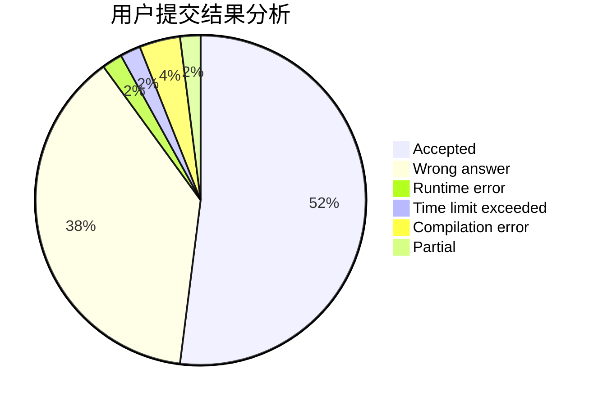
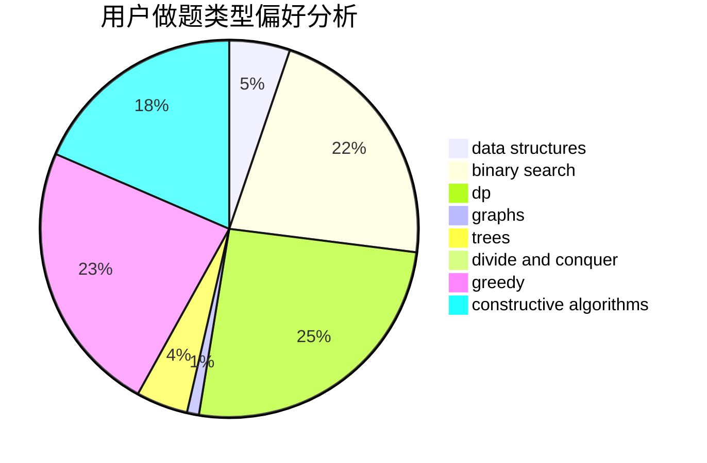
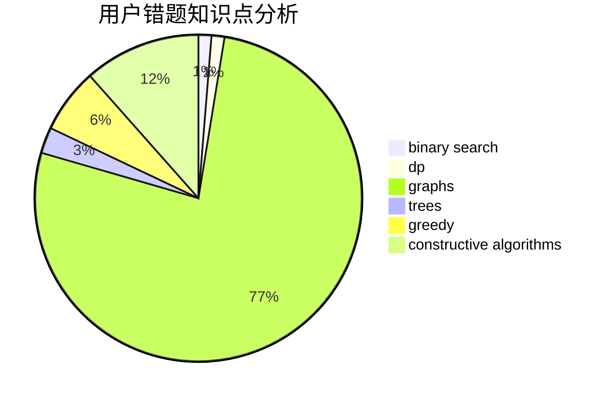

# Danielzxx
<!-- tabs:start -->
#### **用户提交结果分析**

#### **用户做题类型偏好分析**

#### **用户错题知识点分析**

<!-- tabs:end -->
# 推荐题目
[Chocolates](http://codeforces.com/problemset/problem/1139/B)		greedy,
                        implementation		  
[Too Much Money](http://codeforces.com/problemset/problem/725/E)		brute force,
                        greedy		  
[Increasing Matrix](http://codeforces.com/problemset/problem/1231/C)		greedy		  
[A Prank](http://codeforces.com/problemset/problem/1062/A)		greedy,
                        implementation		  
[Alice and Bob](http://codeforces.com/problemset/problem/346/A)		games,
                        math,
                        number theory		  
[Crazy Town](https://codeforces.com/contest/499/problem/C)		geometry		  
[Minimax Problem](http://codeforces.com/problemset/problem/1288/D)		binary search,
                        bitmasks,
                        dp		  
[Sharti](http://codeforces.com/problemset/problem/494/E)		data structures,
                        games		  
[Multiplication Table](http://codeforces.com/problemset/problem/39/H)		implementation		  
[Fragile Bridges](http://codeforces.com/problemset/problem/201/C)		dp		  
<!-- tabs:start -->
#### **data structures**
[Sharti](http://codeforces.com/problemset/problem/494/E)		data structures,
                        games		  
[Alyona and Spreadsheet](http://codeforces.com/problemset/problem/777/C)		binary search,
                        data structures,
                        dp,
                        greedy,
                        implementation,
                        two pointers		  
[Leaf Sets](http://codeforces.com/problemset/problem/1042/F)		data structures,
                        dfs and similar,
                        dsu,
                        graphs,
                        greedy,
                        sortings,
                        trees		  
[Friends and Subsequences](http://codeforces.com/problemset/problem/689/D)		binary search,
                        data structures		  
[Messenger Simulator](http://codeforces.com/problemset/problem/1288/E)		data structures		  
[Robots protection](http://codeforces.com/problemset/problem/575/I)		data structures		  
[Lunar New Year and a Wander](http://codeforces.com/problemset/problem/1106/D)		data structures,
                        dfs and similar,
                        graphs,
                        greedy,
                        shortest paths		  
[Three Blocks Palindrome (easy version)](http://codeforces.com/problemset/problem/1335/E1)		binary search,
                        brute force,
                        data structures,
                        dp,
                        two pointers		  
[Pudding Monsters](http://codeforces.com/problemset/problem/526/F)		data structures,
                        divide and conquer		  
[Longest Regular Bracket Sequence](http://codeforces.com/problemset/problem/5/C)		constructive algorithms,
                        data structures,
                        dp,
                        greedy,
                        sortings,
                        strings		  
#### **binary search**
[Minimax Problem](http://codeforces.com/problemset/problem/1288/D)		binary search,
                        bitmasks,
                        dp		  
[Alyona and Spreadsheet](http://codeforces.com/problemset/problem/777/C)		binary search,
                        data structures,
                        dp,
                        greedy,
                        implementation,
                        two pointers		  
[Friends and Subsequences](http://codeforces.com/problemset/problem/689/D)		binary search,
                        data structures		  
[Misha and Palindrome Degree](http://codeforces.com/problemset/problem/501/E)		binary search,
                        combinatorics,
                        implementation		  
[Three Blocks Palindrome (easy version)](http://codeforces.com/problemset/problem/1335/E1)		binary search,
                        brute force,
                        data structures,
                        dp,
                        two pointers		  
[Maximum width](http://codeforces.com/problemset/problem/1492/C)		binary search,
                        data structures,
                        dp,
                        greedy,
                        two pointers		  
[Pairs](http://codeforces.com/problemset/problem/1463/D)		binary search,
                        constructive algorithms,
                        greedy,
                        two pointers		  
[Old Floppy Drive](http://codeforces.com/problemset/problem/1490/G)		binary search,
                        data structures,
                        math		  
[Odd Mineral Resource](http://codeforces.com/problemset/problem/1479/D)		binary search,
                        bitmasks,
                        brute force,
                        data structures,
                        probabilities,
                        trees		  
[Complicated Computations](http://codeforces.com/problemset/problem/1436/E)		binary search,
                        data structures,
                        two pointers		  
#### **dp**
[Minimax Problem](http://codeforces.com/problemset/problem/1288/D)		binary search,
                        bitmasks,
                        dp		  
[Fragile Bridges](http://codeforces.com/problemset/problem/201/C)		dp		  
[Vulnerable Kerbals](http://codeforces.com/problemset/problem/772/C)		constructive algorithms,
                        dp,
                        graphs,
                        math,
                        number theory		  
[Alyona and Spreadsheet](http://codeforces.com/problemset/problem/777/C)		binary search,
                        data structures,
                        dp,
                        greedy,
                        implementation,
                        two pointers		  
[Let's Play Osu!](https://codeforces.com/contest/236/problem/D)		dp,
                        math,
                        probabilities		  
[Vasya and Maximum Matching](http://codeforces.com/problemset/problem/1032/F)		dp,
                        trees		  
[Make Product Equal One](http://codeforces.com/problemset/problem/1206/B)		dp,
                        implementation		  
[Harry The Potter](http://codeforces.com/problemset/problem/1286/F)		brute force,
                        constructive algorithms,
                        dp,
                        fft,
                        implementation,
                        math		  
[Guess the Tree](http://codeforces.com/problemset/problem/429/C)		bitmasks,
                        constructive algorithms,
                        dp,
                        greedy,
                        trees		  
[Financiers Game](http://codeforces.com/problemset/problem/729/F)		dp		  
#### **graph**
[Vulnerable Kerbals](http://codeforces.com/problemset/problem/772/C)		constructive algorithms,
                        dp,
                        graphs,
                        math,
                        number theory		  
[Party](http://codeforces.com/problemset/problem/23/B)		constructive algorithms,
                        graphs,
                        math		  
[Leaf Sets](http://codeforces.com/problemset/problem/1042/F)		data structures,
                        dfs and similar,
                        dsu,
                        graphs,
                        greedy,
                        sortings,
                        trees		  
[Square Root of Permutation](http://codeforces.com/problemset/problem/612/E)		combinatorics,
                        constructive algorithms,
                        dfs and similar,
                        graphs,
                        math		  
[Catowice City](http://codeforces.com/problemset/problem/1239/D)		2-sat,
                        dfs and similar,
                        graph matchings,
                        graphs		  
[Lunar New Year and a Wander](http://codeforces.com/problemset/problem/1106/D)		data structures,
                        dfs and similar,
                        graphs,
                        greedy,
                        shortest paths		  
[Numbers on Tree](https://codeforces.com/contest/1287/problem/D)		constructive algorithms,
                        data structures,
                        dfs and similar,
                        graphs,
                        greedy,
                        trees		  
[Kingdom and its Cities](http://codeforces.com/problemset/problem/613/D)		dfs and similar,
                        divide and conquer,
                        dp,
                        graphs,
                        sortings,
                        trees		  
[Minimum Ties](http://codeforces.com/problemset/problem/1487/C)		brute force,
                        constructive algorithms,
                        dfs and similar,
                        graphs,
                        greedy,
                        implementation,
                        math		  
[Chef Monocarp](http://codeforces.com/problemset/problem/1437/C)		dp,
                        flows,
                        graph matchings,
                        greedy,
                        math,
                        sortings		  
#### **trees**
[Vasya and Maximum Matching](http://codeforces.com/problemset/problem/1032/F)		dp,
                        trees		  
[Leaf Sets](http://codeforces.com/problemset/problem/1042/F)		data structures,
                        dfs and similar,
                        dsu,
                        graphs,
                        greedy,
                        sortings,
                        trees		  
[Guess the Tree](http://codeforces.com/problemset/problem/429/C)		bitmasks,
                        constructive algorithms,
                        dp,
                        greedy,
                        trees		  
[Numbers on Tree](https://codeforces.com/contest/1287/problem/D)		constructive algorithms,
                        data structures,
                        dfs and similar,
                        graphs,
                        greedy,
                        trees		  
[Kingdom and its Cities](http://codeforces.com/problemset/problem/613/D)		dfs and similar,
                        divide and conquer,
                        dp,
                        graphs,
                        sortings,
                        trees		  
[Odd Mineral Resource](http://codeforces.com/problemset/problem/1479/D)		binary search,
                        bitmasks,
                        brute force,
                        data structures,
                        probabilities,
                        trees		  
[Yet Another Card Deck](http://codeforces.com/problemset/problem/1511/C)		brute force,
                        data structures,
                        implementation,
                        trees		  
[Diameter Cuts](http://codeforces.com/problemset/problem/1499/F)		combinatorics,
                        dfs and similar,
                        dp,
                        trees		  
[Fib-tree](http://codeforces.com/problemset/problem/1491/E)		brute force,
                        dfs and similar,
                        divide and conquer,
                        number theory,
                        trees		  
[13th Labour of Heracles](http://codeforces.com/problemset/problem/1466/D)		data structures,
                        greedy,
                        sortings,
                        trees		  
#### **divide and conquer**
[Pudding Monsters](http://codeforces.com/problemset/problem/526/F)		data structures,
                        divide and conquer		  
[Kingdom and its Cities](http://codeforces.com/problemset/problem/613/D)		dfs and similar,
                        divide and conquer,
                        dp,
                        graphs,
                        sortings,
                        trees		  
[Divide and Summarize](http://codeforces.com/problemset/problem/1461/D)		binary search,
                        brute force,
                        data structures,
                        divide and conquer,
                        implementation,
                        sortings		  
[Song of the Sirens](http://codeforces.com/problemset/problem/1466/G)		combinatorics,
                        divide and conquer,
                        hashing,
                        math,
                        string suffix structures,
                        strings		  
[Permutation Transformation](http://codeforces.com/problemset/problem/1490/D)		dfs and similar,
                        divide and conquer,
                        implementation		  
[Skyline Photo](https://codeforces.com/contest/1483/problem/C)		data structures,
                        divide and conquer,
                        dp		  
[Fib-tree](http://codeforces.com/problemset/problem/1491/E)		brute force,
                        dfs and similar,
                        divide and conquer,
                        number theory,
                        trees		  
[Sum of Prefix Sums](http://codeforces.com/problemset/problem/1303/G)		data structures,
                        divide and conquer,
                        geometry,
                        trees		  
[Dogeforces](http://codeforces.com/problemset/problem/1494/D)		constructive algorithms,
                        data structures,
                        dfs and similar,
                        divide and conquer,
                        dsu,
                        greedy,
                        sortings,
                        trees		  
[Logistical Questions](http://codeforces.com/problemset/problem/566/C)		dfs and similar,
                        divide and conquer,
                        trees		  
#### **greedy**
[Chocolates](http://codeforces.com/problemset/problem/1139/B)		greedy,
                        implementation		  
[Too Much Money](http://codeforces.com/problemset/problem/725/E)		brute force,
                        greedy		  
[Increasing Matrix](http://codeforces.com/problemset/problem/1231/C)		greedy		  
[A Prank](http://codeforces.com/problemset/problem/1062/A)		greedy,
                        implementation		  
[Alyona and Spreadsheet](http://codeforces.com/problemset/problem/777/C)		binary search,
                        data structures,
                        dp,
                        greedy,
                        implementation,
                        two pointers		  
[Leaf Sets](http://codeforces.com/problemset/problem/1042/F)		data structures,
                        dfs and similar,
                        dsu,
                        graphs,
                        greedy,
                        sortings,
                        trees		  
[AND, OR and square sum](http://codeforces.com/problemset/problem/1368/D)		bitmasks,
                        greedy,
                        math		  
[Guess the Tree](http://codeforces.com/problemset/problem/429/C)		bitmasks,
                        constructive algorithms,
                        dp,
                        greedy,
                        trees		  
[Coins](http://codeforces.com/problemset/problem/58/B)		greedy		  
[Genius's Gambit](http://codeforces.com/problemset/problem/1492/D)		bitmasks,
                        constructive algorithms,
                        greedy,
                        math		  
#### **constructive algorithms**
[Vulnerable Kerbals](http://codeforces.com/problemset/problem/772/C)		constructive algorithms,
                        dp,
                        graphs,
                        math,
                        number theory		  
[Party](http://codeforces.com/problemset/problem/23/B)		constructive algorithms,
                        graphs,
                        math		  
[Far Relative’s Birthday Cake](http://codeforces.com/problemset/problem/629/A)		brute force,
                        combinatorics,
                        constructive algorithms,
                        implementation		  
[Madhouse (Easy version)](https://codeforces.com/contest/1287/problem/E1)		brute force,
                        constructive algorithms,
                        interactive,
                        math		  
[Difference Row](http://codeforces.com/problemset/problem/347/A)		constructive algorithms,
                        implementation,
                        sortings		  
[Harry The Potter](http://codeforces.com/problemset/problem/1286/F)		brute force,
                        constructive algorithms,
                        dp,
                        fft,
                        implementation,
                        math		  
[Square Root of Permutation](http://codeforces.com/problemset/problem/612/E)		combinatorics,
                        constructive algorithms,
                        dfs and similar,
                        graphs,
                        math		  
[Guess the Tree](http://codeforces.com/problemset/problem/429/C)		bitmasks,
                        constructive algorithms,
                        dp,
                        greedy,
                        trees		  
[String](http://codeforces.com/problemset/problem/128/B)		brute force,
                        constructive algorithms,
                        hashing,
                        implementation,
                        string suffix structures,
                        strings		  
[Genius's Gambit](http://codeforces.com/problemset/problem/1492/D)		bitmasks,
                        constructive algorithms,
                        greedy,
                        math		  
#### **sortings**
[Leaf Sets](http://codeforces.com/problemset/problem/1042/F)		data structures,
                        dfs and similar,
                        dsu,
                        graphs,
                        greedy,
                        sortings,
                        trees		  
[Difference Row](http://codeforces.com/problemset/problem/347/A)		constructive algorithms,
                        implementation,
                        sortings		  
[Sorted Adjacent Differences](http://codeforces.com/problemset/problem/1339/B)		constructive algorithms,
                        sortings		  
[Longest Regular Bracket Sequence](http://codeforces.com/problemset/problem/5/C)		constructive algorithms,
                        data structures,
                        dp,
                        greedy,
                        sortings,
                        strings		  
[Katya and Segments Sets](http://codeforces.com/problemset/problem/1080/F)		data structures,
                        interactive,
                        sortings		  
[Kingdom and its Cities](http://codeforces.com/problemset/problem/613/D)		dfs and similar,
                        divide and conquer,
                        dp,
                        graphs,
                        sortings,
                        trees		  
[Diamond Miner](https://codeforces.com/contest/1496/problem/C)		geometry,
                        greedy,
                        math,
                        sortings		  
[Meximization](http://codeforces.com/problemset/problem/1497/A)		brute force,
                        data structures,
                        greedy,
                        sortings		  
[Avoiding Zero](http://codeforces.com/problemset/problem/1427/A)		math,
                        sortings		  
[Divide and Summarize](http://codeforces.com/problemset/problem/1461/D)		binary search,
                        brute force,
                        data structures,
                        divide and conquer,
                        implementation,
                        sortings		  
<!-- tabs:end -->
