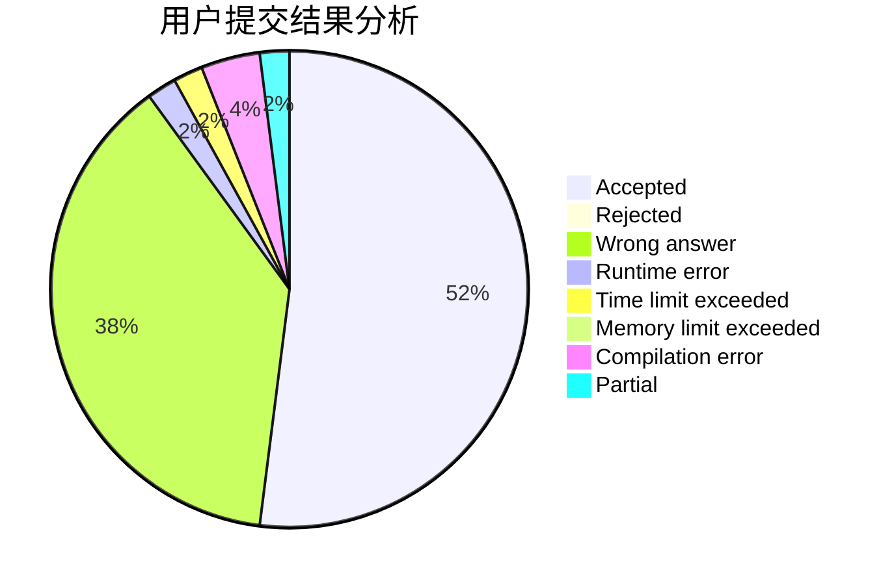
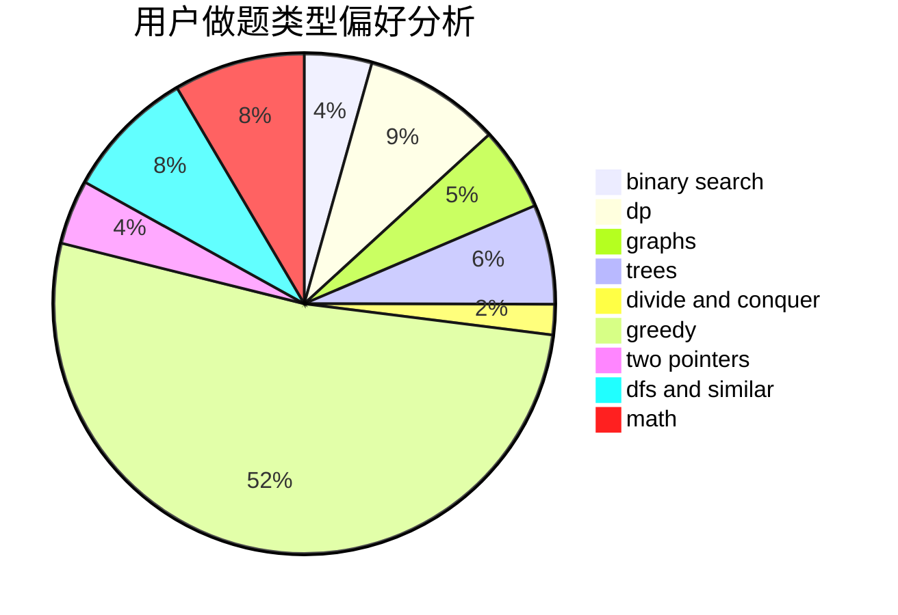

# Danielzxx

<!-- tabs:start -->

#### **用户提交结果分析**

#### **用户做题类型偏好分析**

<!-- tabs:end -->
# 推荐题目
[1463C](https://codeforces.com/contest/1463/problem/C)
[52A](https://codeforces.com/contest/52/problem/A)
[550E](https://codeforces.com/contest/550/problem/E)
[1375C](https://codeforces.com/contest/1375/problem/C)
[260D](https://codeforces.com/contest/260/problem/D)
[743E](https://codeforces.com/contest/743/problem/E)
[1295F](https://codeforces.com/contest/1295/problem/F)
[51A](https://codeforces.com/contest/51/problem/A)
[25A](https://codeforces.com/contest/25/problem/A)
[1033C](https://codeforces.com/contest/1033/problem/C)
