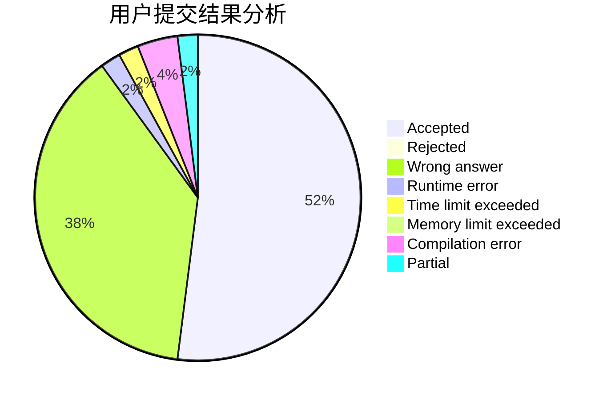
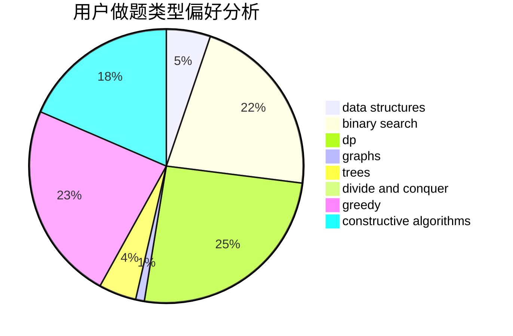
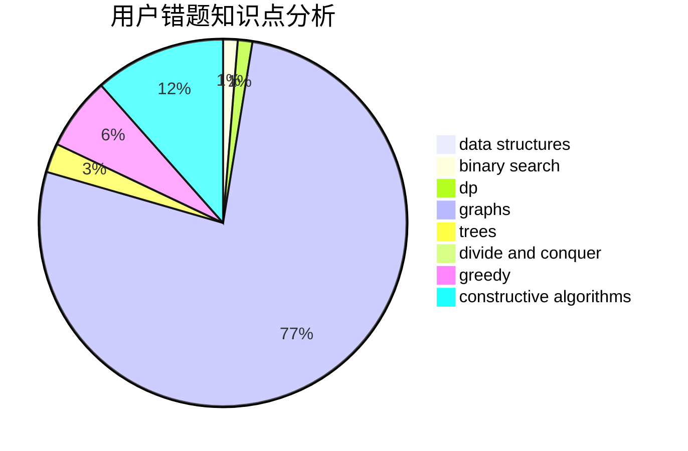

# Danielzxx

<!-- tabs:start -->

#### **用户提交结果分析**

#### **用户做题类型偏好分析**

#### **用户错题知识点分析**

<!-- tabs:end -->
# 推荐题目
[1453F](https://codeforces.com/contest/1453/problem/F)		dp		  
[509A](https://codeforces.com/contest/509/problem/A)		brute force,
                        implementation		  
[526F](https://codeforces.com/contest/526/problem/F)		data structures,
                        divide and conquer		  
[1368D](https://codeforces.com/contest/1368/problem/D)		bitmasks,
                        greedy,
                        math		  
[23B](https://codeforces.com/contest/23/problem/B)		constructive algorithms,
                        graphs,
                        math		  
[725E](https://codeforces.com/contest/725/problem/E)		brute force,
                        greedy		  
[1288D](https://codeforces.com/contest/1288/problem/D)		binary search,
                        bitmasks,
                        dp		  
[499C](https://codeforces.com/contest/499/problem/C)		dsu,graphs,sortings,trees		  
[236D](https://codeforces.com/contest/236/problem/D)		dsu,graphs,sortings,trees		  
[1032F](https://codeforces.com/contest/1032/problem/F)		dp,
                        trees		  
