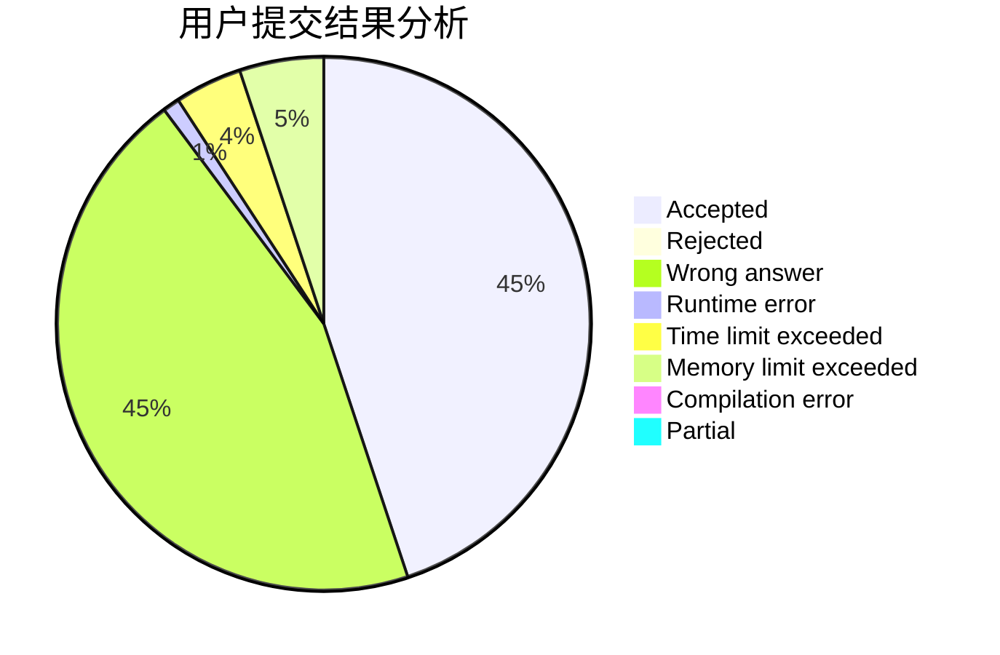
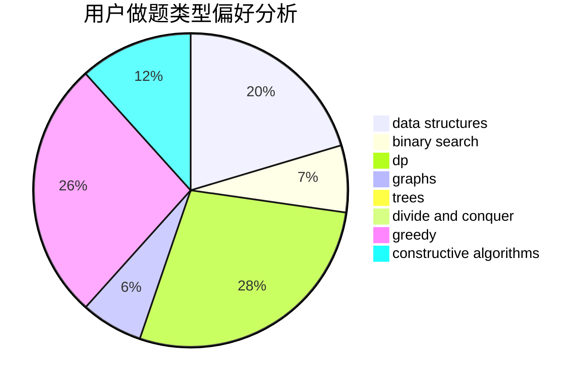
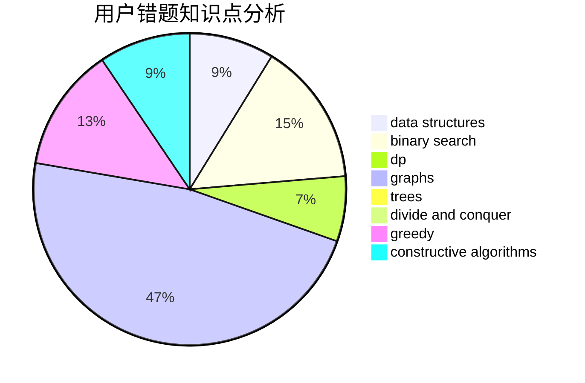

# Dayu2001
<!-- tabs:start -->
#### **用户提交结果分析**

#### **用户做题类型偏好分析**

#### **用户错题知识点分析**

<!-- tabs:end -->
# 推荐题目
[Tanya is 5!](http://codeforces.com/problemset/problem/737/E)		graph matchings,
                        graphs,
                        greedy,
                        schedules		  
[The Best Vacation](http://codeforces.com/problemset/problem/1358/D)		binary search,
                        brute force,
                        greedy,
                        implementation,
                        two pointers		  
[Cifera](http://codeforces.com/problemset/problem/114/A)		math		  
[Zuma](https://codeforces.com/contest/608/problem/D)		dp		  
[Cookie Clicker](http://codeforces.com/problemset/problem/377/E)		dp,
                        geometry		  
[Likes Display](http://codeforces.com/problemset/problem/1297/A)		*special problem,
                        implementation		  
[Square Difference](http://codeforces.com/problemset/problem/1033/B)		math,
                        number theory		  
[Bonus Distribution](http://codeforces.com/problemset/problem/1297/D)		*special problem,
                        binary search,
                        greedy,
                        sortings		  
[New Year Table](http://codeforces.com/problemset/problem/140/A)		geometry,
                        math		  
[Cloud of Hashtags](http://codeforces.com/problemset/problem/777/D)		binary search,
                        greedy,
                        implementation,
                        strings		  
<!-- tabs:start -->
#### **data structures**
[Gardener Alex](http://codeforces.com/problemset/problem/1220/F)		binary search,
                        data structures		  
[k-Amazing Numbers](https://codeforces.com/contest/1417/problem/C)		binary search,
                        data structures,
                        implementation,
                        two pointers		  
[Voting (Hard Version)](http://codeforces.com/problemset/problem/1251/E2)		binary search,
                        data structures,
                        greedy		  
[MEX maximizing](http://codeforces.com/problemset/problem/1294/D)		data structures,
                        greedy,
                        implementation,
                        math		  
[Complete the MST](http://codeforces.com/problemset/problem/1508/C)		data structures,
                        dfs and similar,
                        dsu,
                        graphs,
                        greedy,
                        math		  
[Virus](http://codeforces.com/problemset/problem/1423/H)		data structures,
                        divide and conquer,
                        dsu,
                        graphs		  
[Hanoi Factory](http://codeforces.com/problemset/problem/777/E)		brute force,
                        data structures,
                        dp,
                        greedy,
                        sortings		  
[Skyscrapers (hard version)](http://codeforces.com/problemset/problem/1313/C2)		data structures,
                        dp,
                        greedy		  
[NEKO's Maze Game](https://codeforces.com/contest/1293/problem/C)		data structures,
                        dsu,
                        implementation		  
[Team-Building](https://codeforces.com/contest/1445/problem/E)		data structures,
                        dfs and similar,
                        dsu,
                        graphs		  
#### **binary search**
[The Best Vacation](http://codeforces.com/problemset/problem/1358/D)		binary search,
                        brute force,
                        greedy,
                        implementation,
                        two pointers		  
[Bonus Distribution](http://codeforces.com/problemset/problem/1297/D)		*special problem,
                        binary search,
                        greedy,
                        sortings		  
[Cloud of Hashtags](http://codeforces.com/problemset/problem/777/D)		binary search,
                        greedy,
                        implementation,
                        strings		  
[String Game](http://codeforces.com/problemset/problem/778/A)		binary search,
                        greedy,
                        strings		  
[Gardener Alex](http://codeforces.com/problemset/problem/1220/F)		binary search,
                        data structures		  
[k-Amazing Numbers](https://codeforces.com/contest/1417/problem/C)		binary search,
                        data structures,
                        implementation,
                        two pointers		  
[Voting (Hard Version)](http://codeforces.com/problemset/problem/1251/E2)		binary search,
                        data structures,
                        greedy		  
[Wooden Raft](https://codeforces.com/contest/1240/problem/E)		binary search,
                        math,
                        number theory		  
[Maximum width](http://codeforces.com/problemset/problem/1492/C)		binary search,
                        data structures,
                        dp,
                        greedy,
                        two pointers		  
[Pairs](http://codeforces.com/problemset/problem/1463/D)		binary search,
                        constructive algorithms,
                        greedy,
                        two pointers		  
#### **dp**
[Zuma](https://codeforces.com/contest/608/problem/D)		dp		  
[Cookie Clicker](http://codeforces.com/problemset/problem/377/E)		dp,
                        geometry		  
[Good Contest](http://codeforces.com/problemset/problem/1295/F)		combinatorics,
                        dp,
                        probabilities		  
[Nora's Toy Boxes](http://codeforces.com/problemset/problem/1292/F)		bitmasks,
                        combinatorics,
                        dp		  
[Match & Catch](http://codeforces.com/problemset/problem/427/D)		dp,
                        string suffix structures,
                        strings		  
[As Simple as One and Two](http://codeforces.com/problemset/problem/1276/A)		dp,
                        greedy		  
[Ivan the Fool and the Probability Theory](https://codeforces.com/contest/1248/problem/C)		combinatorics,
                        dp,
                        math		  
[Obtain The String](http://codeforces.com/problemset/problem/1295/C)		dp,
                        greedy,
                        strings		  
[Canine poetry](http://codeforces.com/problemset/problem/1466/C)		dp,
                        greedy,
                        strings		  
[Hanoi Factory](http://codeforces.com/problemset/problem/777/E)		brute force,
                        data structures,
                        dp,
                        greedy,
                        sortings		  
#### **graph**
[Tanya is 5!](http://codeforces.com/problemset/problem/737/E)		graph matchings,
                        graphs,
                        greedy,
                        schedules		  
[The Shortest Statement](http://codeforces.com/problemset/problem/1051/F)		graphs,
                        shortest paths,
                        trees		  
[Hongcow Builds A Nation](https://codeforces.com/contest/745/problem/C)		dfs and similar,
                        graphs		  
[James and the Chase](http://codeforces.com/problemset/problem/1361/E)		dfs and similar,
                        graphs,
                        probabilities,
                        trees		  
[Complete the MST](http://codeforces.com/problemset/problem/1508/C)		data structures,
                        dfs and similar,
                        dsu,
                        graphs,
                        greedy,
                        math		  
[Virus](http://codeforces.com/problemset/problem/1423/H)		data structures,
                        divide and conquer,
                        dsu,
                        graphs		  
[Team-Building](https://codeforces.com/contest/1445/problem/E)		data structures,
                        dfs and similar,
                        dsu,
                        graphs		  
[Cheap Dinner](http://codeforces.com/problemset/problem/1487/E)		brute force,
                        data structures,
                        graphs,
                        greedy,
                        implementation,
                        sortings,
                        two pointers		  
[Minimum Ties](http://codeforces.com/problemset/problem/1487/C)		brute force,
                        constructive algorithms,
                        dfs and similar,
                        graphs,
                        greedy,
                        implementation,
                        math		  
[Chef Monocarp](http://codeforces.com/problemset/problem/1437/C)		dp,
                        flows,
                        graph matchings,
                        greedy,
                        math,
                        sortings		  
#### **trees**
[The Shortest Statement](http://codeforces.com/problemset/problem/1051/F)		graphs,
                        shortest paths,
                        trees		  
[James and the Chase](http://codeforces.com/problemset/problem/1361/E)		dfs and similar,
                        graphs,
                        probabilities,
                        trees		  
[Odd Mineral Resource](http://codeforces.com/problemset/problem/1479/D)		binary search,
                        bitmasks,
                        brute force,
                        data structures,
                        probabilities,
                        trees		  
[Yet Another Card Deck](http://codeforces.com/problemset/problem/1511/C)		brute force,
                        data structures,
                        implementation,
                        trees		  
[Diameter Cuts](http://codeforces.com/problemset/problem/1499/F)		combinatorics,
                        dfs and similar,
                        dp,
                        trees		  
[Fib-tree](http://codeforces.com/problemset/problem/1491/E)		brute force,
                        dfs and similar,
                        divide and conquer,
                        number theory,
                        trees		  
[13th Labour of Heracles](http://codeforces.com/problemset/problem/1466/D)		data structures,
                        greedy,
                        sortings,
                        trees		  
[BFS Trees](http://codeforces.com/problemset/problem/1495/D)		combinatorics,
                        dfs and similar,
                        graphs,
                        math,
                        shortest paths,
                        trees		  
[Sum of Prefix Sums](http://codeforces.com/problemset/problem/1303/G)		data structures,
                        divide and conquer,
                        geometry,
                        trees		  
[Number of Simple Paths](http://codeforces.com/problemset/problem/1454/E)		combinatorics,
                        dfs and similar,
                        graphs,
                        trees		  
#### **divide and conquer**
[X-OR](http://codeforces.com/problemset/problem/1364/E)		bitmasks,
                        constructive algorithms,
                        divide and conquer,
                        interactive,
                        probabilities		  
[Virus](http://codeforces.com/problemset/problem/1423/H)		data structures,
                        divide and conquer,
                        dsu,
                        graphs		  
[Divide and Summarize](http://codeforces.com/problemset/problem/1461/D)		binary search,
                        brute force,
                        data structures,
                        divide and conquer,
                        implementation,
                        sortings		  
[Song of the Sirens](http://codeforces.com/problemset/problem/1466/G)		combinatorics,
                        divide and conquer,
                        hashing,
                        math,
                        string suffix structures,
                        strings		  
[Permutation Transformation](http://codeforces.com/problemset/problem/1490/D)		dfs and similar,
                        divide and conquer,
                        implementation		  
[Skyline Photo](https://codeforces.com/contest/1483/problem/C)		data structures,
                        divide and conquer,
                        dp		  
[Fib-tree](http://codeforces.com/problemset/problem/1491/E)		brute force,
                        dfs and similar,
                        divide and conquer,
                        number theory,
                        trees		  
[Sum of Prefix Sums](http://codeforces.com/problemset/problem/1303/G)		data structures,
                        divide and conquer,
                        geometry,
                        trees		  
[Dogeforces](http://codeforces.com/problemset/problem/1494/D)		constructive algorithms,
                        data structures,
                        dfs and similar,
                        divide and conquer,
                        dsu,
                        greedy,
                        sortings,
                        trees		  
[Logistical Questions](http://codeforces.com/problemset/problem/566/C)		dfs and similar,
                        divide and conquer,
                        trees		  
#### **greedy**
[Tanya is 5!](http://codeforces.com/problemset/problem/737/E)		graph matchings,
                        graphs,
                        greedy,
                        schedules		  
[The Best Vacation](http://codeforces.com/problemset/problem/1358/D)		binary search,
                        brute force,
                        greedy,
                        implementation,
                        two pointers		  
[Bonus Distribution](http://codeforces.com/problemset/problem/1297/D)		*special problem,
                        binary search,
                        greedy,
                        sortings		  
[Cloud of Hashtags](http://codeforces.com/problemset/problem/777/D)		binary search,
                        greedy,
                        implementation,
                        strings		  
[String Game](http://codeforces.com/problemset/problem/778/A)		binary search,
                        greedy,
                        strings		  
[Obtain a Permutation](http://codeforces.com/problemset/problem/1294/E)		greedy,
                        implementation,
                        math		  
[Three Swaps](http://codeforces.com/problemset/problem/339/E)		constructive algorithms,
                        dfs and similar,
                        greedy		  
[Voting (Hard Version)](http://codeforces.com/problemset/problem/1251/E2)		binary search,
                        data structures,
                        greedy		  
[As Simple as One and Two](http://codeforces.com/problemset/problem/1276/A)		dp,
                        greedy		  
[Number Circle](http://codeforces.com/problemset/problem/1189/B)		greedy,
                        math,
                        sortings		  
#### **constructive algorithms**
[Negative Time Summation](http://codeforces.com/problemset/problem/1078/E)		constructive algorithms		  
[Three Swaps](http://codeforces.com/problemset/problem/339/E)		constructive algorithms,
                        dfs and similar,
                        greedy		  
[Add Candies](http://codeforces.com/problemset/problem/1447/A)		constructive algorithms,
                        math		  
[X-OR](http://codeforces.com/problemset/problem/1364/E)		bitmasks,
                        constructive algorithms,
                        divide and conquer,
                        interactive,
                        probabilities		  
[Multiples of Length](https://codeforces.com/contest/1397/problem/C)		constructive algorithms,
                        greedy,
                        number theory		  
[Anti-knapsack](http://codeforces.com/problemset/problem/1493/A)		constructive algorithms,
                        greedy		  
[Pairs](http://codeforces.com/problemset/problem/1463/D)		binary search,
                        constructive algorithms,
                        greedy,
                        two pointers		  
[XOR-gun](https://codeforces.com/contest/1456/problem/B)		bitmasks,
                        brute force,
                        constructive algorithms		  
[Genius's Gambit](http://codeforces.com/problemset/problem/1492/D)		bitmasks,
                        constructive algorithms,
                        greedy,
                        math		  
[3-Coloring](https://codeforces.com/contest/1504/problem/D)		constructive algorithms,
                        games,
                        interactive		  
#### **sortings**
[Bonus Distribution](http://codeforces.com/problemset/problem/1297/D)		*special problem,
                        binary search,
                        greedy,
                        sortings		  
[Cartoons](http://codeforces.com/problemset/problem/1297/B)		*special problem,
                        implementation,
                        sortings		  
[Number Circle](http://codeforces.com/problemset/problem/1189/B)		greedy,
                        math,
                        sortings		  
[Hanoi Factory](http://codeforces.com/problemset/problem/777/E)		brute force,
                        data structures,
                        dp,
                        greedy,
                        sortings		  
[Cheap Dinner](http://codeforces.com/problemset/problem/1487/E)		brute force,
                        data structures,
                        graphs,
                        greedy,
                        implementation,
                        sortings,
                        two pointers		  
[Diamond Miner](https://codeforces.com/contest/1496/problem/C)		geometry,
                        greedy,
                        math,
                        sortings		  
[Meximization](http://codeforces.com/problemset/problem/1497/A)		brute force,
                        data structures,
                        greedy,
                        sortings		  
[Avoiding Zero](http://codeforces.com/problemset/problem/1427/A)		math,
                        sortings		  
[Divide and Summarize](http://codeforces.com/problemset/problem/1461/D)		binary search,
                        brute force,
                        data structures,
                        divide and conquer,
                        implementation,
                        sortings		  
[Chef Monocarp](http://codeforces.com/problemset/problem/1437/C)		dp,
                        flows,
                        graph matchings,
                        greedy,
                        math,
                        sortings		  
<!-- tabs:end -->
