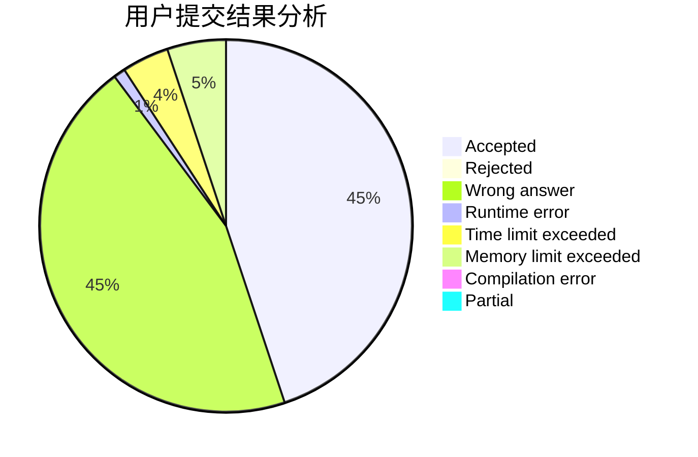
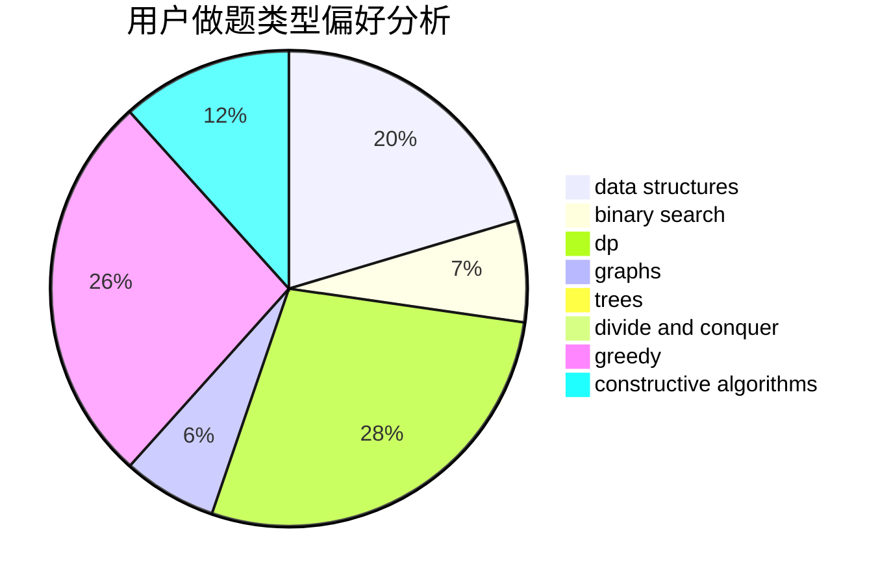
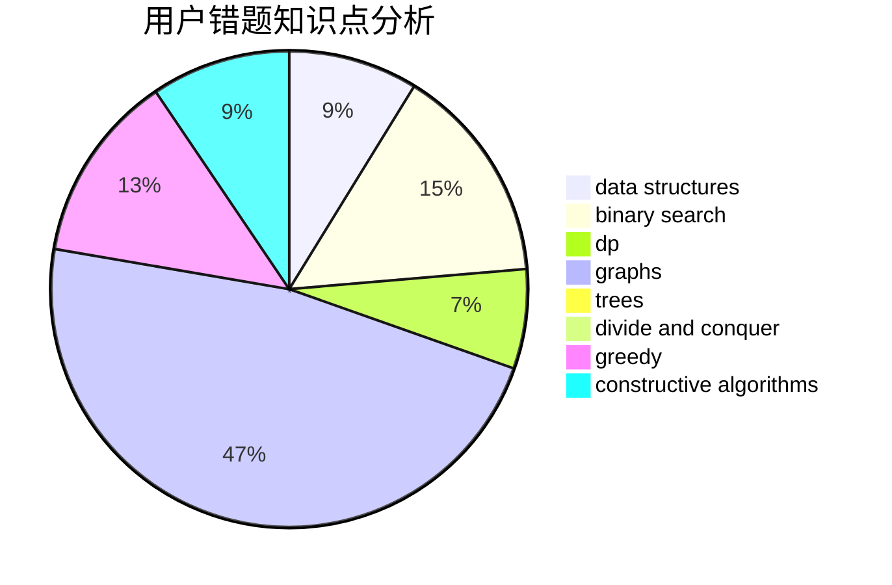

# Dayu2001

<!-- tabs:start -->

#### **用户提交结果分析**

#### **用户做题类型偏好分析**

#### **用户错题知识点分析**

<!-- tabs:end -->
# 推荐题目
[608D](https://codeforces.com/contest/608/problem/D)		dsu,graphs,sortings,trees		  
[1358D](https://codeforces.com/contest/1358/problem/D)		binary search,
                        brute force,
                        greedy,
                        implementation,
                        two pointers		  
[1417C](https://codeforces.com/contest/1417/problem/C)		dsu,graphs,sortings,trees		  
[1033B](https://codeforces.com/contest/1033/problem/B)		math,
                        number theory		  
[377E](https://codeforces.com/contest/377/problem/E)		dp,
                        geometry		  
[737E](https://codeforces.com/contest/737/problem/E)		graph matchings,
                        graphs,
                        greedy,
                        schedules		  
[1191D](https://codeforces.com/contest/1191/problem/D)		dsu,graphs,sortings,trees		  
[1276A](https://codeforces.com/contest/1276/problem/A)		dp,
                        greedy		  
[427D](https://codeforces.com/contest/427/problem/D)		dp,
                        string suffix structures,
                        strings		  
[114A](https://codeforces.com/contest/114/problem/A)		math		  
