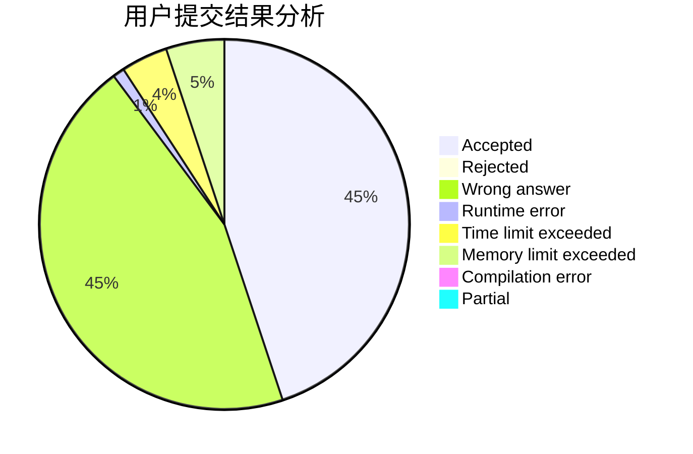
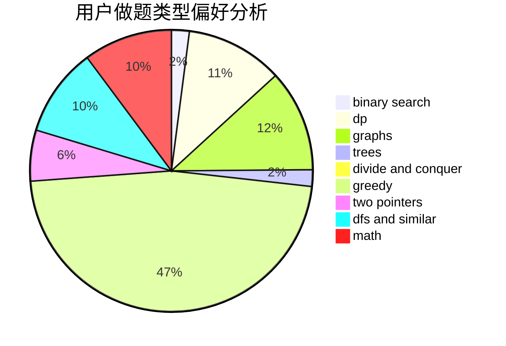

# Dayu2001

<!-- tabs:start -->

#### **用户提交结果分析**

#### **用户做题类型偏好分析**

<!-- tabs:end -->
# 推荐题目
[627E](https://codeforces.com/contest/627/problem/E)
[1366F](https://codeforces.com/contest/1366/problem/F)
[1424M](https://codeforces.com/contest/1424/problem/M)
[1033E](https://codeforces.com/contest/1033/problem/E)
[407B](https://codeforces.com/contest/407/problem/B)
[759B](https://codeforces.com/contest/759/problem/B)
[1197C](https://codeforces.com/contest/1197/problem/C)
[1282A](https://codeforces.com/contest/1282/problem/A)
[44C](https://codeforces.com/contest/44/problem/C)
[1151D](https://codeforces.com/contest/1151/problem/D)
