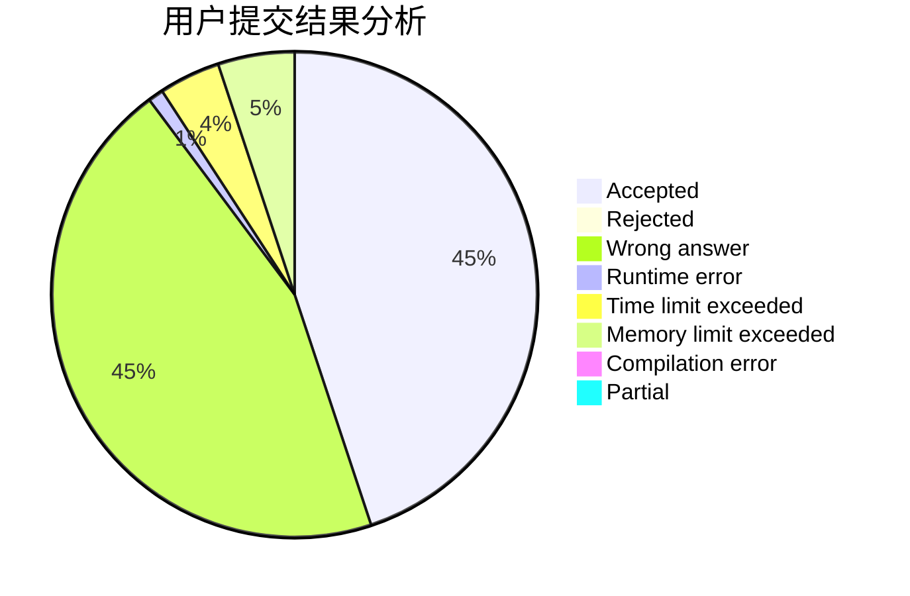
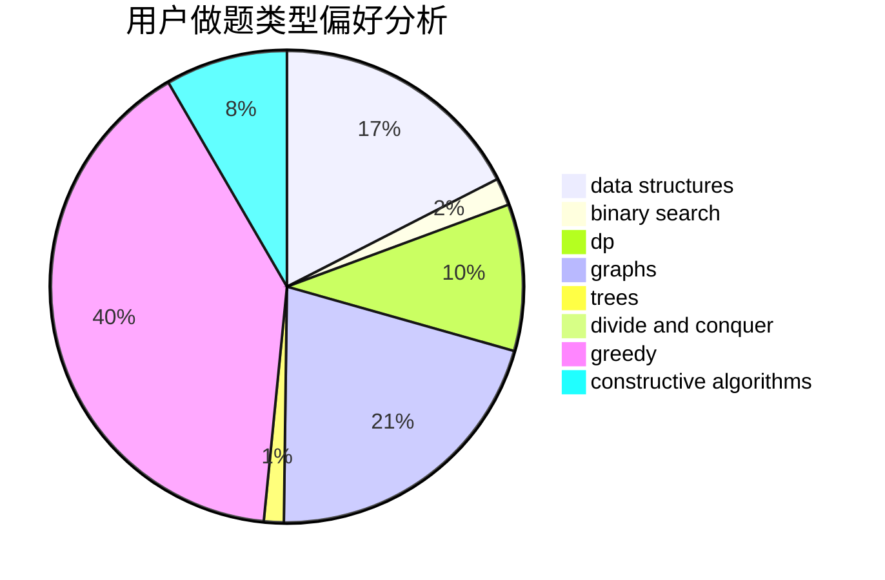
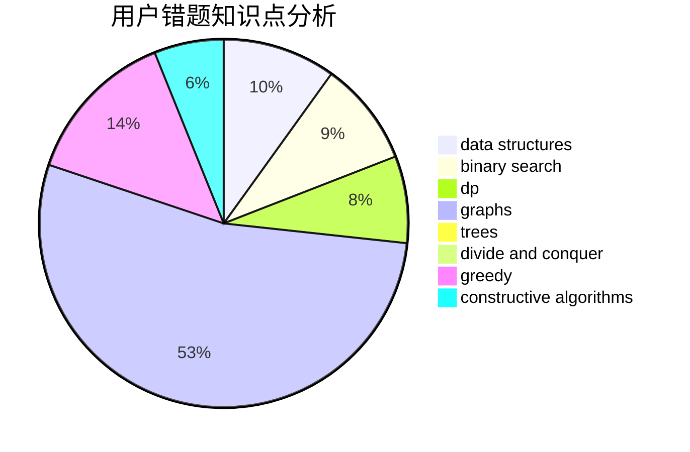

# Dayu2001

<!-- tabs:start -->

#### **用户提交结果分析**

#### **用户做题类型偏好分析**

#### **用户错题知识点分析**

<!-- tabs:end -->
# 推荐题目
[627E](https://codeforces.com/contest/627/problem/E)		two pointers		  
[1366F](https://codeforces.com/contest/1366/problem/F)		binary search,
                        dp,
                        geometry,
                        graphs		  
[1424M](https://codeforces.com/contest/1424/problem/M)		graphs,
                        sortings		  
[1033E](https://codeforces.com/contest/1033/problem/E)		binary search,
                        constructive algorithms,
                        dfs and similar,
                        graphs,
                        interactive		  
[407B](https://codeforces.com/contest/407/problem/B)		dp,
                        implementation		  
[759B](https://codeforces.com/contest/759/problem/B)		dsu,graphs,sortings,trees		  
[1197C](https://codeforces.com/contest/1197/problem/C)		greedy,
                        sortings		  
[1282A](https://codeforces.com/contest/1282/problem/A)		implementation,
                        math		  
[44C](https://codeforces.com/contest/44/problem/C)		implementation		  
[1151D](https://codeforces.com/contest/1151/problem/D)		greedy,
                        math,
                        sortings		  
