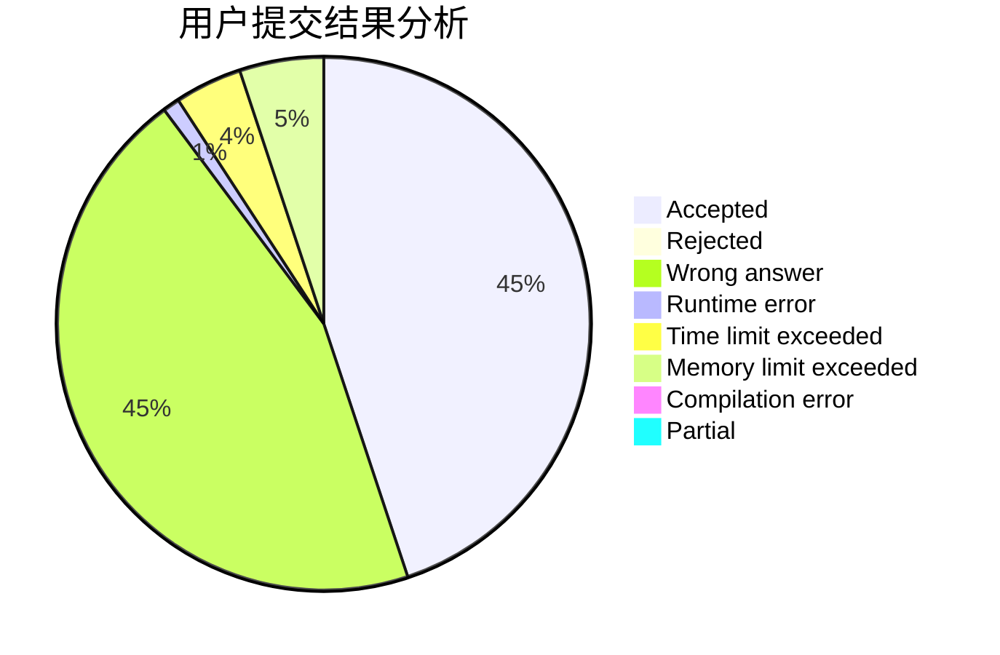
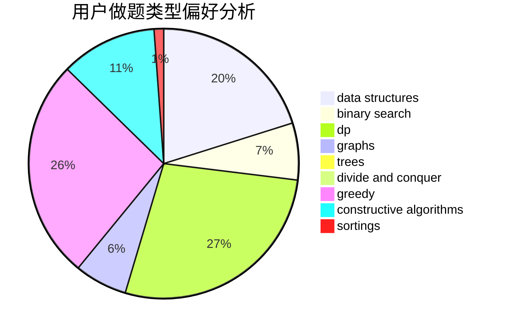
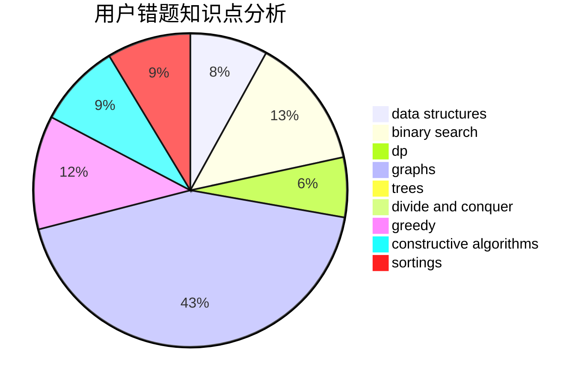

# Dayu2001
<!-- tabs:start -->
#### **用户提交结果分析**

#### **用户做题类型偏好分析**

#### **用户错题知识点分析**

<!-- tabs:end -->
# 推荐题目
[737E](http://codeforces.com/problemset/problem/737/E)		graph matchings,
                        graphs,
                        greedy,
                        schedules		  
[1358D](http://codeforces.com/problemset/problem/1358/D)		binary search,
                        brute force,
                        greedy,
                        implementation,
                        two pointers		  
[114A](http://codeforces.com/problemset/problem/114/A)		math		  
[608D](https://codeforces.com/contest/608/problem/D)		dp		  
[377E](http://codeforces.com/problemset/problem/377/E)		dp,
                        geometry		  
[1297A](http://codeforces.com/problemset/problem/1297/A)		*special problem,
                        implementation		  
[1033B](http://codeforces.com/problemset/problem/1033/B)		math,
                        number theory		  
[1297D](http://codeforces.com/problemset/problem/1297/D)		*special problem,
                        binary search,
                        greedy,
                        sortings		  
[140A](http://codeforces.com/problemset/problem/140/A)		geometry,
                        math		  
[777D](http://codeforces.com/problemset/problem/777/D)		binary search,
                        greedy,
                        implementation,
                        strings		  
<!-- tabs:start -->
#### **data structures**
[1220F](http://codeforces.com/problemset/problem/1220/F)		binary search,
                        data structures		  
[1417C](https://codeforces.com/contest/1417/problem/C)		binary search,
                        data structures,
                        implementation,
                        two pointers		  
[1251E2](http://codeforces.com/problemset/problem/1251/E2)		binary search,
                        data structures,
                        greedy		  
[1294D](http://codeforces.com/problemset/problem/1294/D)		data structures,
                        greedy,
                        implementation,
                        math		  
[1508C](http://codeforces.com/problemset/problem/1508/C)		data structures,
                        dfs and similar,
                        dsu,
                        graphs,
                        greedy,
                        math		  
[1423H](http://codeforces.com/problemset/problem/1423/H)		data structures,
                        divide and conquer,
                        dsu,
                        graphs		  
[777E](http://codeforces.com/problemset/problem/777/E)		brute force,
                        data structures,
                        dp,
                        greedy,
                        sortings		  
[1313C2](http://codeforces.com/problemset/problem/1313/C2)		data structures,
                        dp,
                        greedy		  
[1293C](https://codeforces.com/contest/1293/problem/C)		data structures,
                        dsu,
                        implementation		  
[1445E](https://codeforces.com/contest/1445/problem/E)		data structures,
                        dfs and similar,
                        dsu,
                        graphs		  
#### **binary search**
[1358D](http://codeforces.com/problemset/problem/1358/D)		binary search,
                        brute force,
                        greedy,
                        implementation,
                        two pointers		  
[1297D](http://codeforces.com/problemset/problem/1297/D)		*special problem,
                        binary search,
                        greedy,
                        sortings		  
[777D](http://codeforces.com/problemset/problem/777/D)		binary search,
                        greedy,
                        implementation,
                        strings		  
[778A](http://codeforces.com/problemset/problem/778/A)		binary search,
                        greedy,
                        strings		  
[1220F](http://codeforces.com/problemset/problem/1220/F)		binary search,
                        data structures		  
[1417C](https://codeforces.com/contest/1417/problem/C)		binary search,
                        data structures,
                        implementation,
                        two pointers		  
[1251E2](http://codeforces.com/problemset/problem/1251/E2)		binary search,
                        data structures,
                        greedy		  
[1240E](https://codeforces.com/contest/1240/problem/E)		binary search,
                        math,
                        number theory		  
[1492C](http://codeforces.com/problemset/problem/1492/C)		binary search,
                        data structures,
                        dp,
                        greedy,
                        two pointers		  
[1463D](http://codeforces.com/problemset/problem/1463/D)		binary search,
                        constructive algorithms,
                        greedy,
                        two pointers		  
#### **dp**
[608D](https://codeforces.com/contest/608/problem/D)		dp		  
[377E](http://codeforces.com/problemset/problem/377/E)		dp,
                        geometry		  
[1295F](http://codeforces.com/problemset/problem/1295/F)		combinatorics,
                        dp,
                        probabilities		  
[1292F](http://codeforces.com/problemset/problem/1292/F)		bitmasks,
                        combinatorics,
                        dp		  
[427D](http://codeforces.com/problemset/problem/427/D)		dp,
                        string suffix structures,
                        strings		  
[1276A](http://codeforces.com/problemset/problem/1276/A)		dp,
                        greedy		  
[1248C](https://codeforces.com/contest/1248/problem/C)		combinatorics,
                        dp,
                        math		  
[1295C](http://codeforces.com/problemset/problem/1295/C)		dp,
                        greedy,
                        strings		  
[1466C](http://codeforces.com/problemset/problem/1466/C)		dp,
                        greedy,
                        strings		  
[777E](http://codeforces.com/problemset/problem/777/E)		brute force,
                        data structures,
                        dp,
                        greedy,
                        sortings		  
#### **graph**
[737E](http://codeforces.com/problemset/problem/737/E)		graph matchings,
                        graphs,
                        greedy,
                        schedules		  
[1051F](http://codeforces.com/problemset/problem/1051/F)		graphs,
                        shortest paths,
                        trees		  
[745C](https://codeforces.com/contest/745/problem/C)		dfs and similar,
                        graphs		  
[1361E](http://codeforces.com/problemset/problem/1361/E)		dfs and similar,
                        graphs,
                        probabilities,
                        trees		  
[1508C](http://codeforces.com/problemset/problem/1508/C)		data structures,
                        dfs and similar,
                        dsu,
                        graphs,
                        greedy,
                        math		  
[1423H](http://codeforces.com/problemset/problem/1423/H)		data structures,
                        divide and conquer,
                        dsu,
                        graphs		  
[1445E](https://codeforces.com/contest/1445/problem/E)		data structures,
                        dfs and similar,
                        dsu,
                        graphs		  
[1487E](http://codeforces.com/problemset/problem/1487/E)		brute force,
                        data structures,
                        graphs,
                        greedy,
                        implementation,
                        sortings,
                        two pointers		  
[1487C](http://codeforces.com/problemset/problem/1487/C)		brute force,
                        constructive algorithms,
                        dfs and similar,
                        graphs,
                        greedy,
                        implementation,
                        math		  
[1437C](http://codeforces.com/problemset/problem/1437/C)		dp,
                        flows,
                        graph matchings,
                        greedy,
                        math,
                        sortings		  
#### **trees**
[1051F](http://codeforces.com/problemset/problem/1051/F)		graphs,
                        shortest paths,
                        trees		  
[1361E](http://codeforces.com/problemset/problem/1361/E)		dfs and similar,
                        graphs,
                        probabilities,
                        trees		  
[1479D](http://codeforces.com/problemset/problem/1479/D)		binary search,
                        bitmasks,
                        brute force,
                        data structures,
                        probabilities,
                        trees		  
[1511C](http://codeforces.com/problemset/problem/1511/C)		brute force,
                        data structures,
                        implementation,
                        trees		  
[1499F](http://codeforces.com/problemset/problem/1499/F)		combinatorics,
                        dfs and similar,
                        dp,
                        trees		  
[1491E](http://codeforces.com/problemset/problem/1491/E)		brute force,
                        dfs and similar,
                        divide and conquer,
                        number theory,
                        trees		  
[1466D](http://codeforces.com/problemset/problem/1466/D)		data structures,
                        greedy,
                        sortings,
                        trees		  
[1495D](http://codeforces.com/problemset/problem/1495/D)		combinatorics,
                        dfs and similar,
                        graphs,
                        math,
                        shortest paths,
                        trees		  
[1303G](http://codeforces.com/problemset/problem/1303/G)		data structures,
                        divide and conquer,
                        geometry,
                        trees		  
[1454E](http://codeforces.com/problemset/problem/1454/E)		combinatorics,
                        dfs and similar,
                        graphs,
                        trees		  
#### **divide and conquer**
[1364E](http://codeforces.com/problemset/problem/1364/E)		bitmasks,
                        constructive algorithms,
                        divide and conquer,
                        interactive,
                        probabilities		  
[1423H](http://codeforces.com/problemset/problem/1423/H)		data structures,
                        divide and conquer,
                        dsu,
                        graphs		  
[1461D](http://codeforces.com/problemset/problem/1461/D)		binary search,
                        brute force,
                        data structures,
                        divide and conquer,
                        implementation,
                        sortings		  
[1466G](http://codeforces.com/problemset/problem/1466/G)		combinatorics,
                        divide and conquer,
                        hashing,
                        math,
                        string suffix structures,
                        strings		  
[1490D](http://codeforces.com/problemset/problem/1490/D)		dfs and similar,
                        divide and conquer,
                        implementation		  
[1483C](https://codeforces.com/contest/1483/problem/C)		data structures,
                        divide and conquer,
                        dp		  
[1491E](http://codeforces.com/problemset/problem/1491/E)		brute force,
                        dfs and similar,
                        divide and conquer,
                        number theory,
                        trees		  
[1303G](http://codeforces.com/problemset/problem/1303/G)		data structures,
                        divide and conquer,
                        geometry,
                        trees		  
[1494D](http://codeforces.com/problemset/problem/1494/D)		constructive algorithms,
                        data structures,
                        dfs and similar,
                        divide and conquer,
                        dsu,
                        greedy,
                        sortings,
                        trees		  
[1482E](http://codeforces.com/problemset/problem/1482/E)		data structures,
                        divide and conquer,
                        dp		  
#### **greedy**
[737E](http://codeforces.com/problemset/problem/737/E)		graph matchings,
                        graphs,
                        greedy,
                        schedules		  
[1358D](http://codeforces.com/problemset/problem/1358/D)		binary search,
                        brute force,
                        greedy,
                        implementation,
                        two pointers		  
[1297D](http://codeforces.com/problemset/problem/1297/D)		*special problem,
                        binary search,
                        greedy,
                        sortings		  
[777D](http://codeforces.com/problemset/problem/777/D)		binary search,
                        greedy,
                        implementation,
                        strings		  
[778A](http://codeforces.com/problemset/problem/778/A)		binary search,
                        greedy,
                        strings		  
[1294E](http://codeforces.com/problemset/problem/1294/E)		greedy,
                        implementation,
                        math		  
[339E](http://codeforces.com/problemset/problem/339/E)		constructive algorithms,
                        dfs and similar,
                        greedy		  
[1251E2](http://codeforces.com/problemset/problem/1251/E2)		binary search,
                        data structures,
                        greedy		  
[1276A](http://codeforces.com/problemset/problem/1276/A)		dp,
                        greedy		  
[1189B](http://codeforces.com/problemset/problem/1189/B)		greedy,
                        math,
                        sortings		  
#### **constructive algorithms**
[1078E](http://codeforces.com/problemset/problem/1078/E)		constructive algorithms		  
[339E](http://codeforces.com/problemset/problem/339/E)		constructive algorithms,
                        dfs and similar,
                        greedy		  
[1447A](http://codeforces.com/problemset/problem/1447/A)		constructive algorithms,
                        math		  
[1364E](http://codeforces.com/problemset/problem/1364/E)		bitmasks,
                        constructive algorithms,
                        divide and conquer,
                        interactive,
                        probabilities		  
[1397C](https://codeforces.com/contest/1397/problem/C)		constructive algorithms,
                        greedy,
                        number theory		  
[1493A](http://codeforces.com/problemset/problem/1493/A)		constructive algorithms,
                        greedy		  
[1463D](http://codeforces.com/problemset/problem/1463/D)		binary search,
                        constructive algorithms,
                        greedy,
                        two pointers		  
[1456B](https://codeforces.com/contest/1456/problem/B)		bitmasks,
                        brute force,
                        constructive algorithms		  
[1492D](http://codeforces.com/problemset/problem/1492/D)		bitmasks,
                        constructive algorithms,
                        greedy,
                        math		  
[1504D](https://codeforces.com/contest/1504/problem/D)		constructive algorithms,
                        games,
                        interactive		  
#### **sortings**
[1297D](http://codeforces.com/problemset/problem/1297/D)		*special problem,
                        binary search,
                        greedy,
                        sortings		  
[1297B](http://codeforces.com/problemset/problem/1297/B)		*special problem,
                        implementation,
                        sortings		  
[1189B](http://codeforces.com/problemset/problem/1189/B)		greedy,
                        math,
                        sortings		  
[777E](http://codeforces.com/problemset/problem/777/E)		brute force,
                        data structures,
                        dp,
                        greedy,
                        sortings		  
[1487E](http://codeforces.com/problemset/problem/1487/E)		brute force,
                        data structures,
                        graphs,
                        greedy,
                        implementation,
                        sortings,
                        two pointers		  
[1496C](https://codeforces.com/contest/1496/problem/C)		geometry,
                        greedy,
                        math,
                        sortings		  
[1495A](http://codeforces.com/problemset/problem/1495/A)		geometry,
                        greedy,
                        math,
                        sortings		  
[1497A](http://codeforces.com/problemset/problem/1497/A)		brute force,
                        data structures,
                        greedy,
                        sortings		  
[1427A](http://codeforces.com/problemset/problem/1427/A)		math,
                        sortings		  
[1461D](http://codeforces.com/problemset/problem/1461/D)		binary search,
                        brute force,
                        data structures,
                        divide and conquer,
                        implementation,
                        sortings		  
<!-- tabs:end -->
