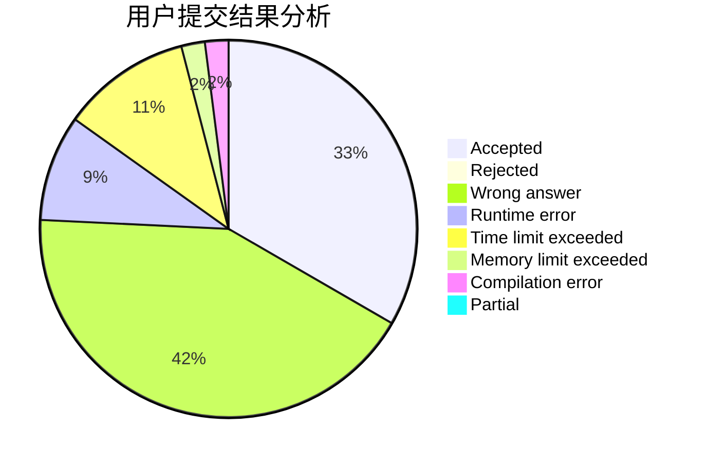
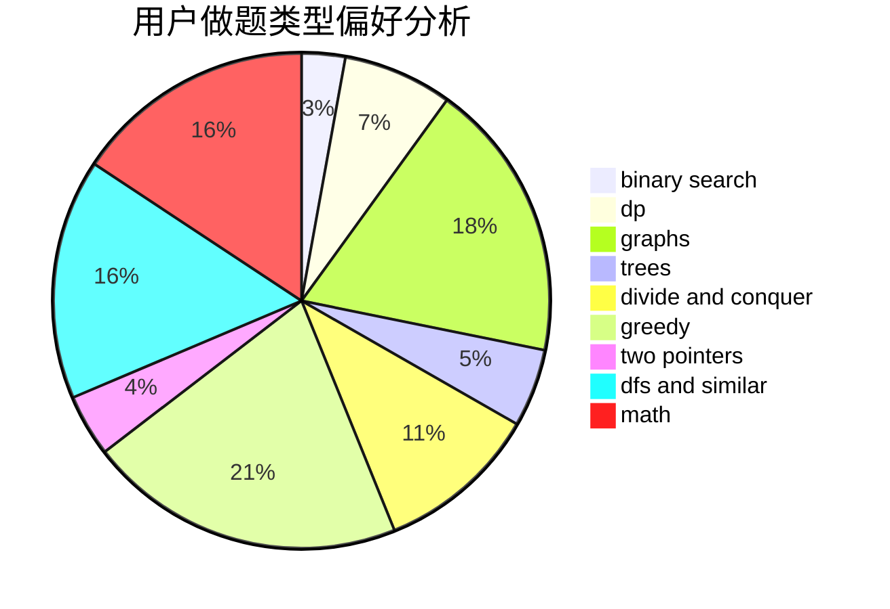

# Dbenyong

<!-- tabs:start -->

#### **用户提交结果分析**

#### **用户做题类型偏好分析**

<!-- tabs:end -->
# 推荐题目
[1279C](https://codeforces.com/contest/1279/problem/C)
[1037H](https://codeforces.com/contest/1037/problem/H)
[1303F](https://codeforces.com/contest/1303/problem/F)
[607E](https://codeforces.com/contest/607/problem/E)
[796D](https://codeforces.com/contest/796/problem/D)
[1424J](https://codeforces.com/contest/1424/problem/J)
[1307F](https://codeforces.com/contest/1307/problem/F)
[482E](https://codeforces.com/contest/482/problem/E)
[56B](https://codeforces.com/contest/56/problem/B)
[1312A](https://codeforces.com/contest/1312/problem/A)
