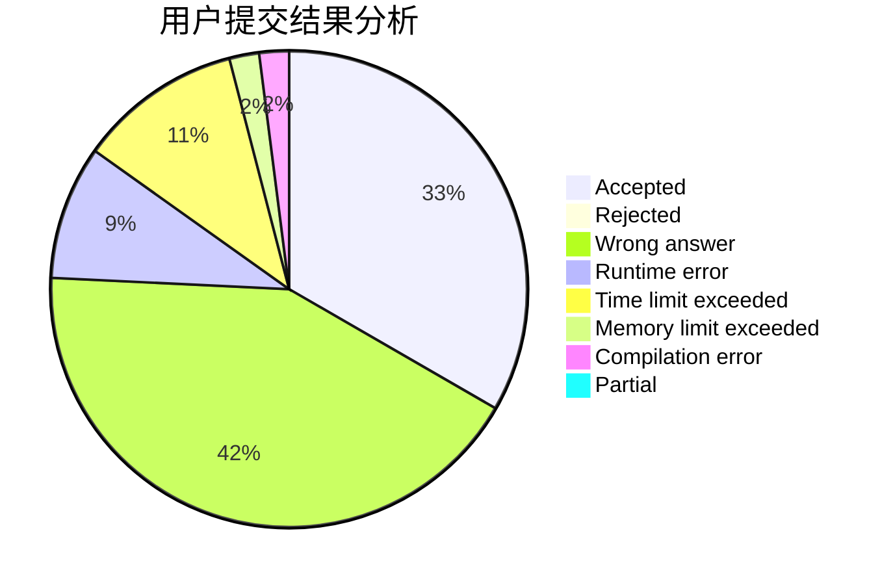
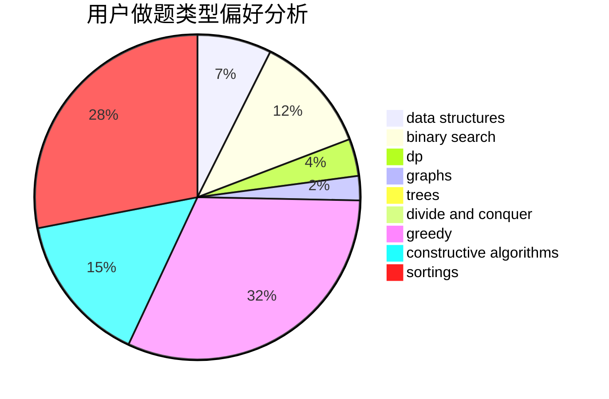
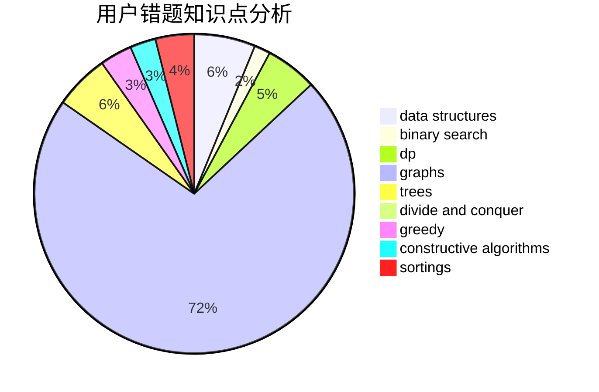

# Dbenyong
<!-- tabs:start -->
#### **用户提交结果分析**

#### **用户做题类型偏好分析**

#### **用户错题知识点分析**

<!-- tabs:end -->
# 推荐题目
[1357A7](http://codeforces.com/problemset/problem/1357/A7)		nan		  
[778C](http://codeforces.com/problemset/problem/778/C)		brute force,
                        dfs and similar,
                        dsu,
                        hashing,
                        strings,
                        trees		  
[545B](http://codeforces.com/problemset/problem/545/B)		greedy		  
[463A](http://codeforces.com/problemset/problem/463/A)		brute force,
                        implementation		  
[1103C](http://codeforces.com/problemset/problem/1103/C)		constructive algorithms,
                        dfs and similar,
                        graphs,
                        math		  
[733C](http://codeforces.com/problemset/problem/733/C)		constructive algorithms,
                        dp,
                        greedy,
                        two pointers		  
[1129A1](http://codeforces.com/problemset/problem/1129/A1)		brute force,
                        greedy		  
[1314D](https://codeforces.com/contest/1314/problem/D)		dp,
                        graphs,
                        probabilities		  
[1468L](http://codeforces.com/problemset/problem/1468/L)		binary search,
                        greedy,
                        math,
                        number theory		  
[35A](http://codeforces.com/problemset/problem/35/A)		implementation		  
<!-- tabs:start -->
#### **data structures**
[575I](http://codeforces.com/problemset/problem/575/I)		data structures		  
[1408E](http://codeforces.com/problemset/problem/1408/E)		data structures,
                        dsu,
                        graphs,
                        greedy,
                        sortings,
                        trees		  
[1492C](http://codeforces.com/problemset/problem/1492/C)		binary search,
                        data structures,
                        dp,
                        greedy,
                        two pointers		  
[1490G](http://codeforces.com/problemset/problem/1490/G)		binary search,
                        data structures,
                        math		  
[1479D](http://codeforces.com/problemset/problem/1479/D)		binary search,
                        bitmasks,
                        brute force,
                        data structures,
                        probabilities,
                        trees		  
[1497A](http://codeforces.com/problemset/problem/1497/A)		brute force,
                        data structures,
                        greedy,
                        sortings		  
[1491C](http://codeforces.com/problemset/problem/1491/C)		brute force,
                        data structures,
                        dp,
                        greedy,
                        implementation		  
[1492B](http://codeforces.com/problemset/problem/1492/B)		data structures,
                        greedy,
                        math		  
[1436E](http://codeforces.com/problemset/problem/1436/E)		binary search,
                        data structures,
                        two pointers		  
[1461D](http://codeforces.com/problemset/problem/1461/D)		binary search,
                        brute force,
                        data structures,
                        divide and conquer,
                        implementation,
                        sortings		  
#### **binary search**
[1468L](http://codeforces.com/problemset/problem/1468/L)		binary search,
                        greedy,
                        math,
                        number theory		  
[587D](http://codeforces.com/problemset/problem/587/D)		2-sat,
                        binary search		  
[1409E](http://codeforces.com/problemset/problem/1409/E)		binary search,
                        dp,
                        sortings,
                        two pointers		  
[1492C](http://codeforces.com/problemset/problem/1492/C)		binary search,
                        data structures,
                        dp,
                        greedy,
                        two pointers		  
[1463D](http://codeforces.com/problemset/problem/1463/D)		binary search,
                        constructive algorithms,
                        greedy,
                        two pointers		  
[1490G](http://codeforces.com/problemset/problem/1490/G)		binary search,
                        data structures,
                        math		  
[1479D](http://codeforces.com/problemset/problem/1479/D)		binary search,
                        bitmasks,
                        brute force,
                        data structures,
                        probabilities,
                        trees		  
[1436E](http://codeforces.com/problemset/problem/1436/E)		binary search,
                        data structures,
                        two pointers		  
[1461D](http://codeforces.com/problemset/problem/1461/D)		binary search,
                        brute force,
                        data structures,
                        divide and conquer,
                        implementation,
                        sortings		  
[1493C](http://codeforces.com/problemset/problem/1493/C)		binary search,
                        brute force,
                        constructive algorithms,
                        greedy,
                        strings		  
#### **dp**
[733C](http://codeforces.com/problemset/problem/733/C)		constructive algorithms,
                        dp,
                        greedy,
                        two pointers		  
[1314D](https://codeforces.com/contest/1314/problem/D)		dp,
                        graphs,
                        probabilities		  
[106C](http://codeforces.com/problemset/problem/106/C)		dp		  
[165E](http://codeforces.com/problemset/problem/165/E)		bitmasks,
                        brute force,
                        dfs and similar,
                        dp		  
[1398D](http://codeforces.com/problemset/problem/1398/D)		dp,
                        greedy,
                        sortings		  
[1409E](http://codeforces.com/problemset/problem/1409/E)		binary search,
                        dp,
                        sortings,
                        two pointers		  
[1492C](http://codeforces.com/problemset/problem/1492/C)		binary search,
                        data structures,
                        dp,
                        greedy,
                        two pointers		  
[1457C](https://codeforces.com/contest/1457/problem/C)		brute force,
                        dp,
                        implementation		  
[1491C](http://codeforces.com/problemset/problem/1491/C)		brute force,
                        data structures,
                        dp,
                        greedy,
                        implementation		  
[1437C](http://codeforces.com/problemset/problem/1437/C)		dp,
                        flows,
                        graph matchings,
                        greedy,
                        math,
                        sortings		  
#### **graph**
[1103C](http://codeforces.com/problemset/problem/1103/C)		constructive algorithms,
                        dfs and similar,
                        graphs,
                        math		  
[1314D](https://codeforces.com/contest/1314/problem/D)		dp,
                        graphs,
                        probabilities		  
[1037E](http://codeforces.com/problemset/problem/1037/E)		graphs		  
[1408E](http://codeforces.com/problemset/problem/1408/E)		data structures,
                        dsu,
                        graphs,
                        greedy,
                        sortings,
                        trees		  
[1487C](http://codeforces.com/problemset/problem/1487/C)		brute force,
                        constructive algorithms,
                        dfs and similar,
                        graphs,
                        greedy,
                        implementation,
                        math		  
[1437C](http://codeforces.com/problemset/problem/1437/C)		dp,
                        flows,
                        graph matchings,
                        greedy,
                        math,
                        sortings		  
[1470D](http://codeforces.com/problemset/problem/1470/D)		constructive algorithms,
                        dfs and similar,
                        graph matchings,
                        graphs,
                        greedy		  
[1476C](http://codeforces.com/problemset/problem/1476/C)		dp,
                        graphs,
                        greedy		  
[1304D](http://codeforces.com/problemset/problem/1304/D)		constructive algorithms,
                        graphs,
                        greedy,
                        two pointers		  
[1475C](http://codeforces.com/problemset/problem/1475/C)		combinatorics,
                        graphs,
                        math		  
#### **trees**
[778C](http://codeforces.com/problemset/problem/778/C)		brute force,
                        dfs and similar,
                        dsu,
                        hashing,
                        strings,
                        trees		  
[1408E](http://codeforces.com/problemset/problem/1408/E)		data structures,
                        dsu,
                        graphs,
                        greedy,
                        sortings,
                        trees		  
[1479D](http://codeforces.com/problemset/problem/1479/D)		binary search,
                        bitmasks,
                        brute force,
                        data structures,
                        probabilities,
                        trees		  
[1511C](http://codeforces.com/problemset/problem/1511/C)		brute force,
                        data structures,
                        implementation,
                        trees		  
[1499F](http://codeforces.com/problemset/problem/1499/F)		combinatorics,
                        dfs and similar,
                        dp,
                        trees		  
[1491E](http://codeforces.com/problemset/problem/1491/E)		brute force,
                        dfs and similar,
                        divide and conquer,
                        number theory,
                        trees		  
[1466D](http://codeforces.com/problemset/problem/1466/D)		data structures,
                        greedy,
                        sortings,
                        trees		  
[1495D](http://codeforces.com/problemset/problem/1495/D)		combinatorics,
                        dfs and similar,
                        graphs,
                        math,
                        shortest paths,
                        trees		  
[1303G](http://codeforces.com/problemset/problem/1303/G)		data structures,
                        divide and conquer,
                        geometry,
                        trees		  
[1454E](http://codeforces.com/problemset/problem/1454/E)		combinatorics,
                        dfs and similar,
                        graphs,
                        trees		  
#### **divide and conquer**
[1461D](http://codeforces.com/problemset/problem/1461/D)		binary search,
                        brute force,
                        data structures,
                        divide and conquer,
                        implementation,
                        sortings		  
[1466G](http://codeforces.com/problemset/problem/1466/G)		combinatorics,
                        divide and conquer,
                        hashing,
                        math,
                        string suffix structures,
                        strings		  
[1490D](http://codeforces.com/problemset/problem/1490/D)		dfs and similar,
                        divide and conquer,
                        implementation		  
[1483C](https://codeforces.com/contest/1483/problem/C)		data structures,
                        divide and conquer,
                        dp		  
[1491E](http://codeforces.com/problemset/problem/1491/E)		brute force,
                        dfs and similar,
                        divide and conquer,
                        number theory,
                        trees		  
[1303G](http://codeforces.com/problemset/problem/1303/G)		data structures,
                        divide and conquer,
                        geometry,
                        trees		  
[1494D](http://codeforces.com/problemset/problem/1494/D)		constructive algorithms,
                        data structures,
                        dfs and similar,
                        divide and conquer,
                        dsu,
                        greedy,
                        sortings,
                        trees		  
[1482E](http://codeforces.com/problemset/problem/1482/E)		data structures,
                        divide and conquer,
                        dp		  
[566C](http://codeforces.com/problemset/problem/566/C)		dfs and similar,
                        divide and conquer,
                        trees		  
[1428F](http://codeforces.com/problemset/problem/1428/F)		binary search,
                        data structures,
                        divide and conquer,
                        dp,
                        two pointers		  
#### **greedy**
[545B](http://codeforces.com/problemset/problem/545/B)		greedy		  
[733C](http://codeforces.com/problemset/problem/733/C)		constructive algorithms,
                        dp,
                        greedy,
                        two pointers		  
[1129A1](http://codeforces.com/problemset/problem/1129/A1)		brute force,
                        greedy		  
[1468L](http://codeforces.com/problemset/problem/1468/L)		binary search,
                        greedy,
                        math,
                        number theory		  
[1303C](http://codeforces.com/problemset/problem/1303/C)		dfs and similar,
                        greedy,
                        implementation		  
[1341B](http://codeforces.com/problemset/problem/1341/B)		greedy,
                        implementation		  
[1296D](http://codeforces.com/problemset/problem/1296/D)		greedy,
                        sortings		  
[1398D](http://codeforces.com/problemset/problem/1398/D)		dp,
                        greedy,
                        sortings		  
[1417B](http://codeforces.com/problemset/problem/1417/B)		greedy,
                        math,
                        sortings		  
[1408E](http://codeforces.com/problemset/problem/1408/E)		data structures,
                        dsu,
                        graphs,
                        greedy,
                        sortings,
                        trees		  
#### **constructive algorithms**
[1103C](http://codeforces.com/problemset/problem/1103/C)		constructive algorithms,
                        dfs and similar,
                        graphs,
                        math		  
[733C](http://codeforces.com/problemset/problem/733/C)		constructive algorithms,
                        dp,
                        greedy,
                        two pointers		  
[778D](http://codeforces.com/problemset/problem/778/D)		constructive algorithms		  
[1270C](http://codeforces.com/problemset/problem/1270/C)		bitmasks,
                        constructive algorithms,
                        math		  
[1493A](http://codeforces.com/problemset/problem/1493/A)		constructive algorithms,
                        greedy		  
[1463D](http://codeforces.com/problemset/problem/1463/D)		binary search,
                        constructive algorithms,
                        greedy,
                        two pointers		  
[1456B](https://codeforces.com/contest/1456/problem/B)		bitmasks,
                        brute force,
                        constructive algorithms		  
[1492D](http://codeforces.com/problemset/problem/1492/D)		bitmasks,
                        constructive algorithms,
                        greedy,
                        math		  
[1504D](https://codeforces.com/contest/1504/problem/D)		constructive algorithms,
                        games,
                        interactive		  
[1483A](https://codeforces.com/contest/1483/problem/A)		brute force,
                        constructive algorithms,
                        greedy,
                        implementation		  
#### **sortings**
[1296D](http://codeforces.com/problemset/problem/1296/D)		greedy,
                        sortings		  
[1398D](http://codeforces.com/problemset/problem/1398/D)		dp,
                        greedy,
                        sortings		  
[1417B](http://codeforces.com/problemset/problem/1417/B)		greedy,
                        math,
                        sortings		  
[1408E](http://codeforces.com/problemset/problem/1408/E)		data structures,
                        dsu,
                        graphs,
                        greedy,
                        sortings,
                        trees		  
[1409E](http://codeforces.com/problemset/problem/1409/E)		binary search,
                        dp,
                        sortings,
                        two pointers		  
[1496C](https://codeforces.com/contest/1496/problem/C)		geometry,
                        greedy,
                        math,
                        sortings		  
[1495A](http://codeforces.com/problemset/problem/1495/A)		geometry,
                        greedy,
                        math,
                        sortings		  
[1497A](http://codeforces.com/problemset/problem/1497/A)		brute force,
                        data structures,
                        greedy,
                        sortings		  
[1427A](http://codeforces.com/problemset/problem/1427/A)		math,
                        sortings		  
[1461D](http://codeforces.com/problemset/problem/1461/D)		binary search,
                        brute force,
                        data structures,
                        divide and conquer,
                        implementation,
                        sortings		  
<!-- tabs:end -->
