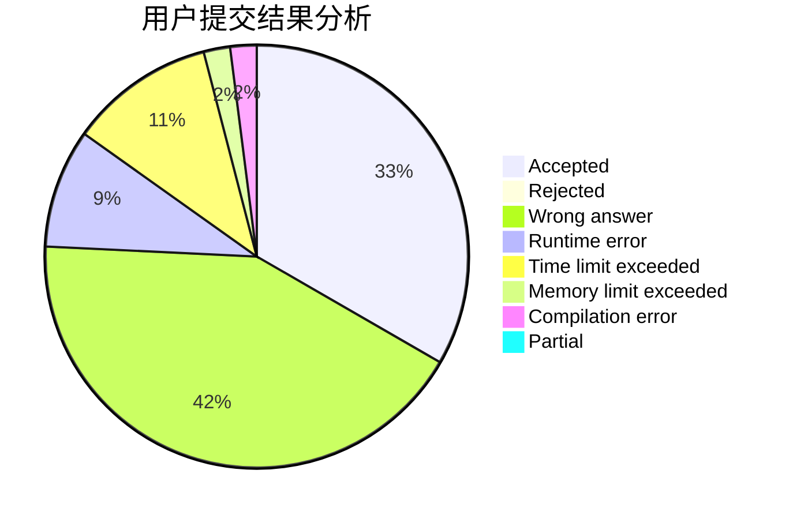
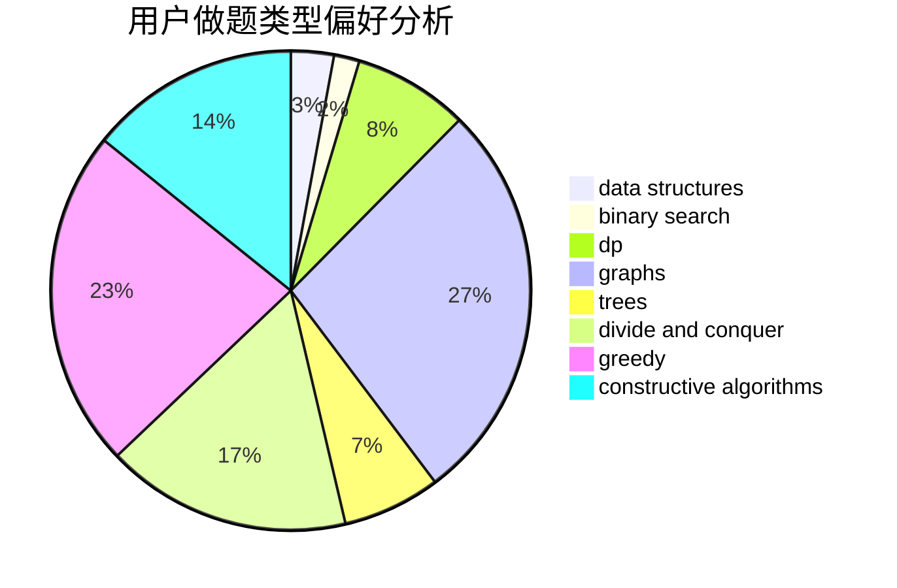
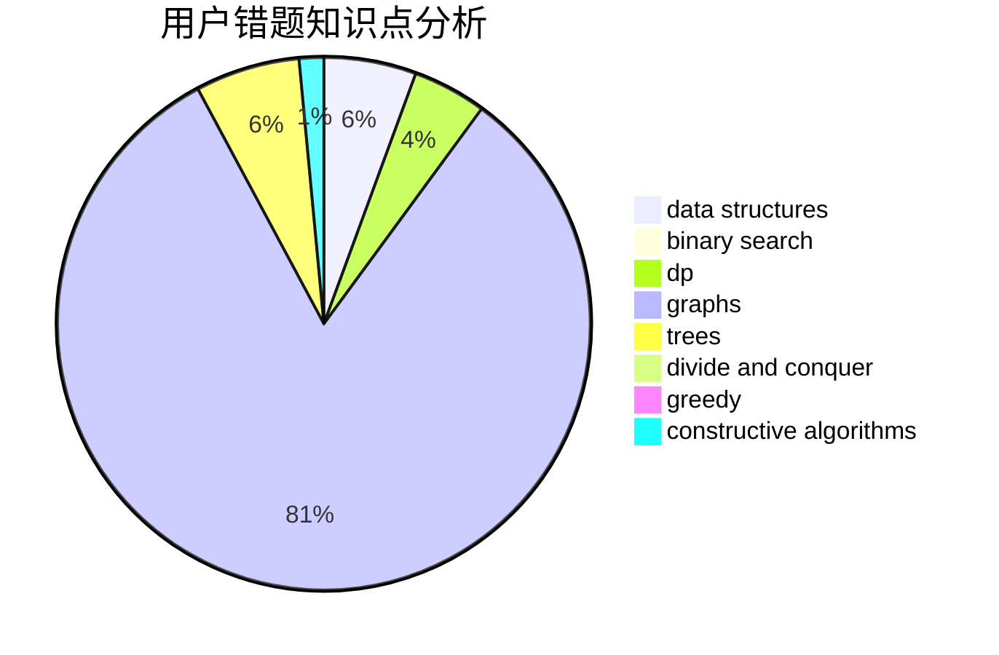

# Dbenyong

<!-- tabs:start -->

#### **用户提交结果分析**

#### **用户做题类型偏好分析**

#### **用户错题知识点分析**

<!-- tabs:end -->
# 推荐题目
[1279C](https://codeforces.com/contest/1279/problem/C)		data structures,
                        implementation		  
[1037H](https://codeforces.com/contest/1037/problem/H)		data structures,
                        string suffix structures		  
[1303F](https://codeforces.com/contest/1303/problem/F)		dsu,
                        implementation		  
[607E](https://codeforces.com/contest/607/problem/E)		binary search,
                        geometry		  
[796D](https://codeforces.com/contest/796/problem/D)		constructive algorithms,
                        dfs and similar,
                        dp,
                        graphs,
                        shortest paths,
                        trees		  
[1424J](https://codeforces.com/contest/1424/problem/J)		dsu,graphs,sortings,trees		  
[1307F](https://codeforces.com/contest/1307/problem/F)		dfs and similar,
                        dsu,
                        trees		  
[482E](https://codeforces.com/contest/482/problem/E)		data structures,
                        trees		  
[56B](https://codeforces.com/contest/56/problem/B)		implementation		  
[1312A](https://codeforces.com/contest/1312/problem/A)		geometry,
                        greedy,
                        math,
                        number theory		  
