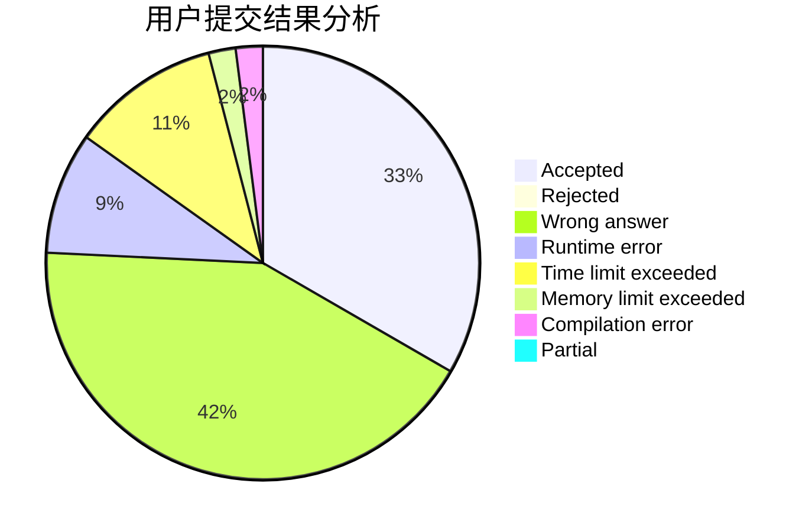
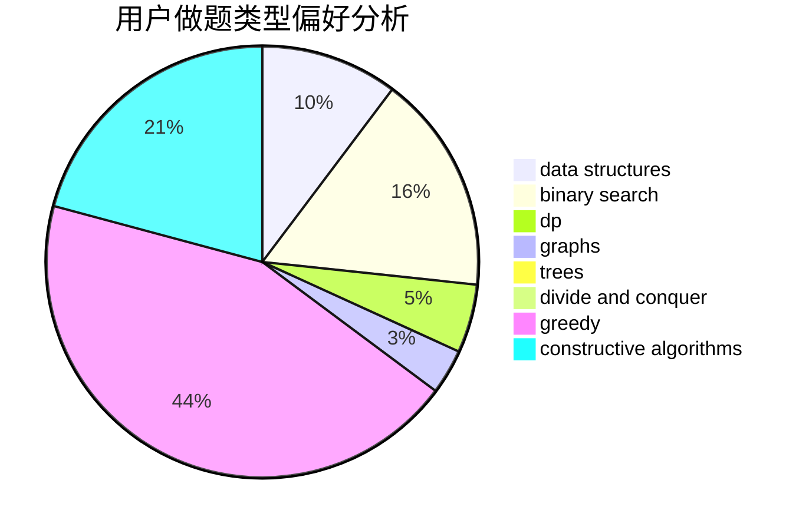
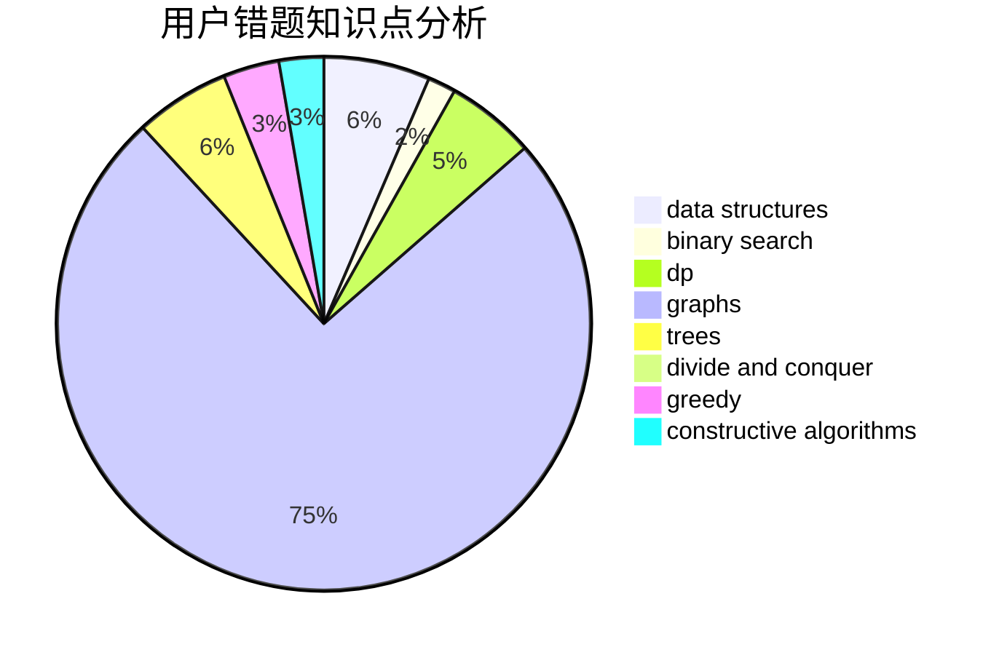

# Dbenyong

<!-- tabs:start -->

#### **用户提交结果分析**

#### **用户做题类型偏好分析**

#### **用户错题知识点分析**

<!-- tabs:end -->
# 推荐题目
[1270C](https://codeforces.com/contest/1270/problem/C)		bitmasks,
                        constructive algorithms,
                        math		  
[1037E](https://codeforces.com/contest/1037/problem/E)		graphs		  
[1296D](https://codeforces.com/contest/1296/problem/D)		greedy,
                        sortings		  
[587D](https://codeforces.com/contest/587/problem/D)		2-sat,
                        binary search		  
[778C](https://codeforces.com/contest/778/problem/C)		brute force,
                        dfs and similar,
                        dsu,
                        hashing,
                        strings,
                        trees		  
[1417B](https://codeforces.com/contest/1417/problem/B)		greedy,
                        math,
                        sortings		  
[1300A](https://codeforces.com/contest/1300/problem/A)		implementation,
                        math		  
[463A](https://codeforces.com/contest/463/problem/A)		brute force,
                        implementation		  
[545B](https://codeforces.com/contest/545/problem/B)		greedy		  
[1303C](https://codeforces.com/contest/1303/problem/C)		dfs and similar,
                        greedy,
                        implementation		  
