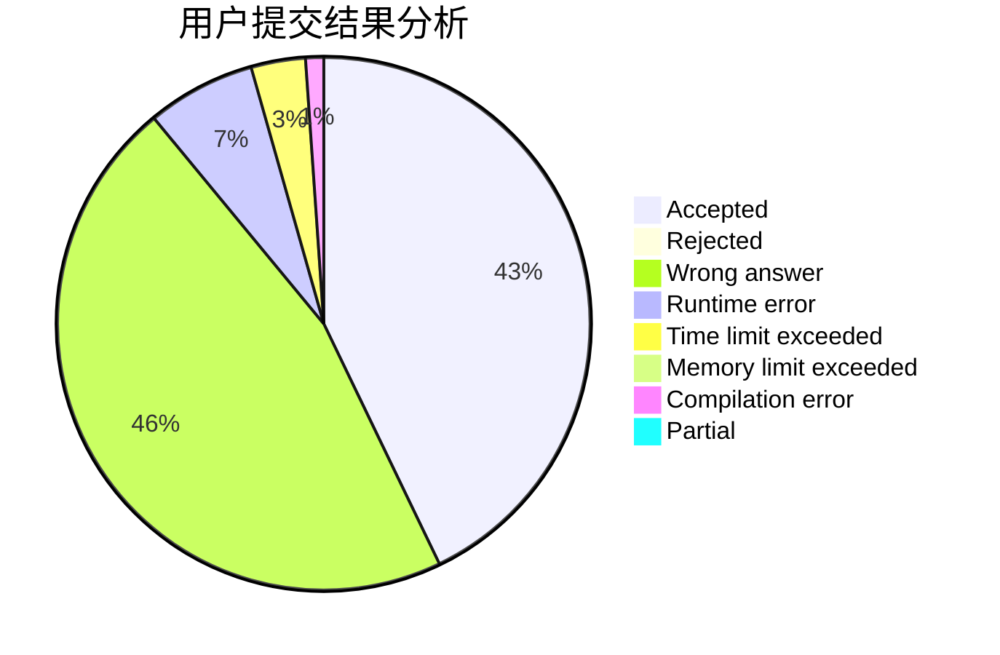
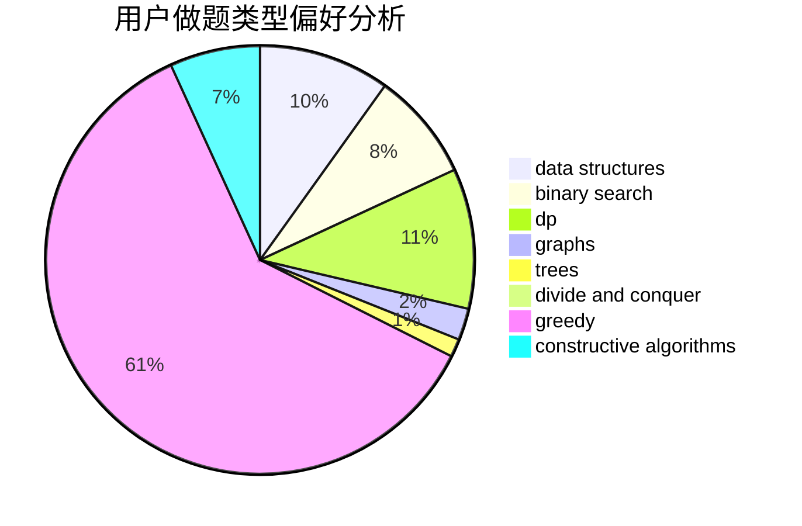

# DeLus1oN

<!-- tabs:start -->

#### **用户提交结果分析**

#### **用户做题类型偏好分析**

#### **用户错题知识点分析**

<!-- tabs:end -->
# 推荐题目
[763A](https://codeforces.com/contest/763/problem/A)		dfs and similar,
                        dp,
                        dsu,
                        graphs,
                        implementation,
                        trees		  
[766E](https://codeforces.com/contest/766/problem/E)		bitmasks,
                        constructive algorithms,
                        data structures,
                        dfs and similar,
                        dp,
                        math,
                        trees		  
[677C](https://codeforces.com/contest/677/problem/C)		bitmasks,
                        combinatorics,
                        implementation,
                        strings		  
[1064A](https://codeforces.com/contest/1064/problem/A)		brute force,
                        geometry,
                        math		  
[480A](https://codeforces.com/contest/480/problem/A)		dsu,graphs,sortings,trees		  
[797C](https://codeforces.com/contest/797/problem/C)		data structures,
                        greedy,
                        strings		  
[782E](https://codeforces.com/contest/782/problem/E)		dsu,graphs,sortings,trees		  
[1013A](https://codeforces.com/contest/1013/problem/A)		math		  
[215C](https://codeforces.com/contest/215/problem/C)		brute force,
                        implementation		  
[1150C](https://codeforces.com/contest/1150/problem/C)		dsu,graphs,sortings,trees		  
