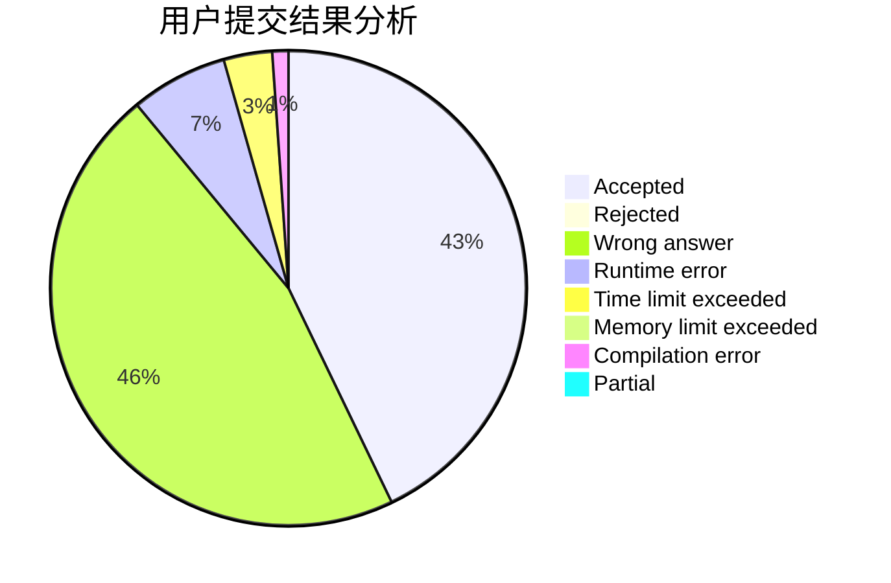
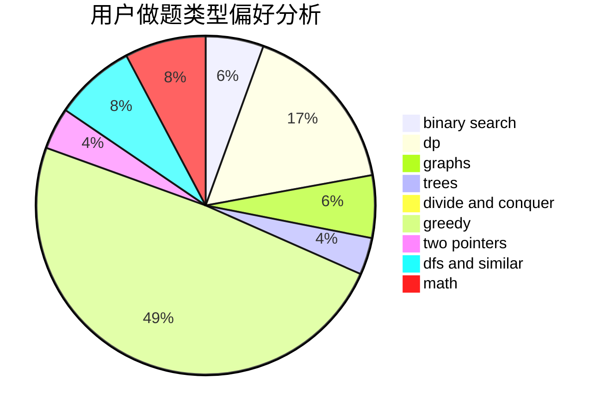

# DeLus1oN

<!-- tabs:start -->

#### **用户提交结果分析**

#### **用户做题类型偏好分析**

<!-- tabs:end -->
# 推荐题目
[763A](https://codeforces.com/contest/763/problem/A)
[766E](https://codeforces.com/contest/766/problem/E)
[677C](https://codeforces.com/contest/677/problem/C)
[1064A](https://codeforces.com/contest/1064/problem/A)
[480A](https://codeforces.com/contest/480/problem/A)
[797C](https://codeforces.com/contest/797/problem/C)
[782E](https://codeforces.com/contest/782/problem/E)
[1013A](https://codeforces.com/contest/1013/problem/A)
[215C](https://codeforces.com/contest/215/problem/C)
[1150C](https://codeforces.com/contest/1150/problem/C)
