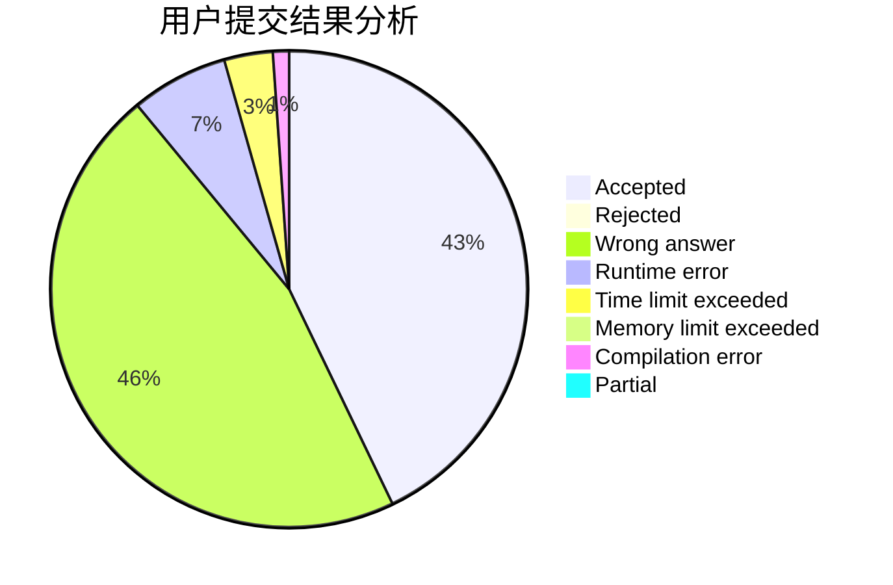
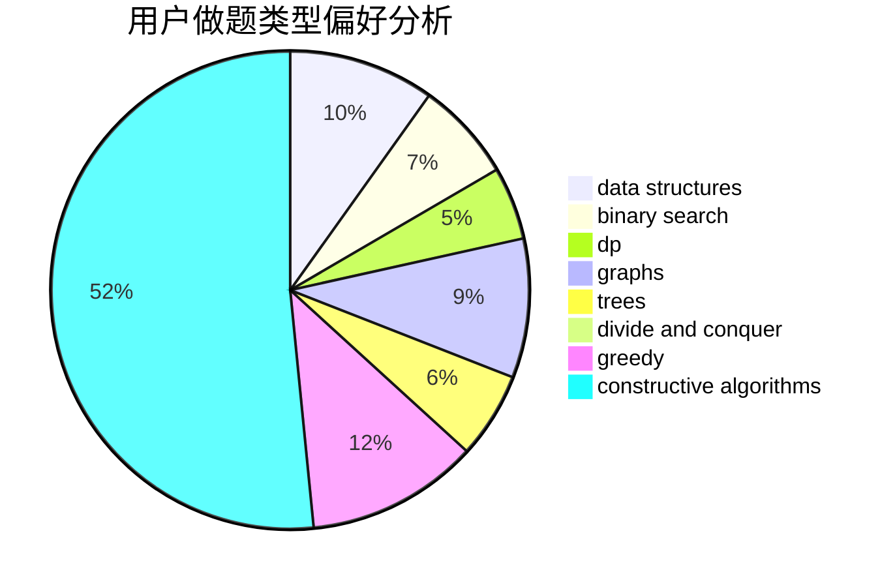

# DeLus1oN

<!-- tabs:start -->

#### **用户提交结果分析**

#### **用户做题类型偏好分析**

#### **用户错题知识点分析**

<!-- tabs:end -->
# 推荐题目
[742D](https://codeforces.com/contest/742/problem/D)		dsu,graphs,sortings,trees		  
[747B](https://codeforces.com/contest/747/problem/B)		implementation,
                        strings		  
[653C](https://codeforces.com/contest/653/problem/C)		brute force,
                        implementation		  
[1063D](https://codeforces.com/contest/1063/problem/D)		brute force,
                        math		  
[461A](https://codeforces.com/contest/461/problem/A)		greedy,
                        sortings		  
[779A](https://codeforces.com/contest/779/problem/A)		constructive algorithms,
                        math		  
[764B](https://codeforces.com/contest/764/problem/B)		constructive algorithms,
                        implementation		  
[1012C](https://codeforces.com/contest/1012/problem/C)		dp		  
[18E](https://codeforces.com/contest/18/problem/E)		dp		  
[1148H](https://codeforces.com/contest/1148/problem/H)		data structures		  
