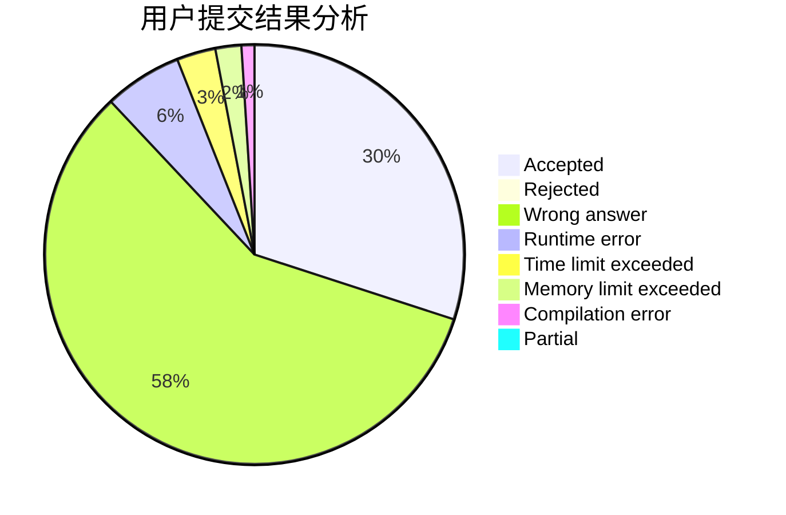
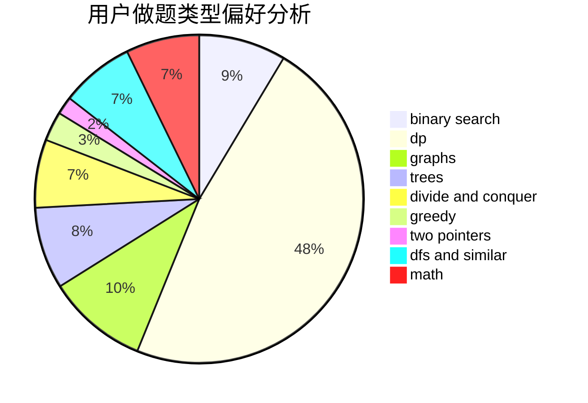

# DeaL57

<!-- tabs:start -->

#### **用户提交结果分析**

#### **用户做题类型偏好分析**

<!-- tabs:end -->
# 推荐题目
[798C](https://codeforces.com/contest/798/problem/C)
[1063F](https://codeforces.com/contest/1063/problem/F)
[394C](https://codeforces.com/contest/394/problem/C)
[102B](https://codeforces.com/contest/102/problem/B)
[798B](https://codeforces.com/contest/798/problem/B)
[604C](https://codeforces.com/contest/604/problem/C)
[645D](https://codeforces.com/contest/645/problem/D)
[1358E](https://codeforces.com/contest/1358/problem/E)
[1020E](https://codeforces.com/contest/1020/problem/E)
[102A](https://codeforces.com/contest/102/problem/A)
