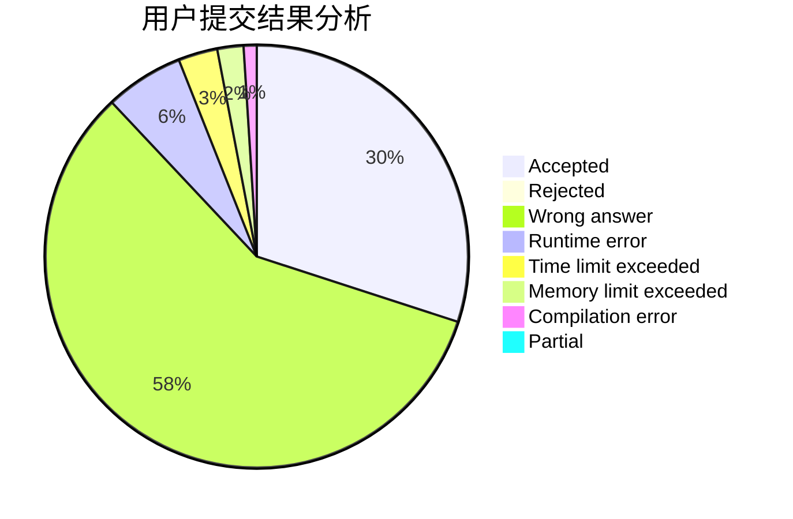
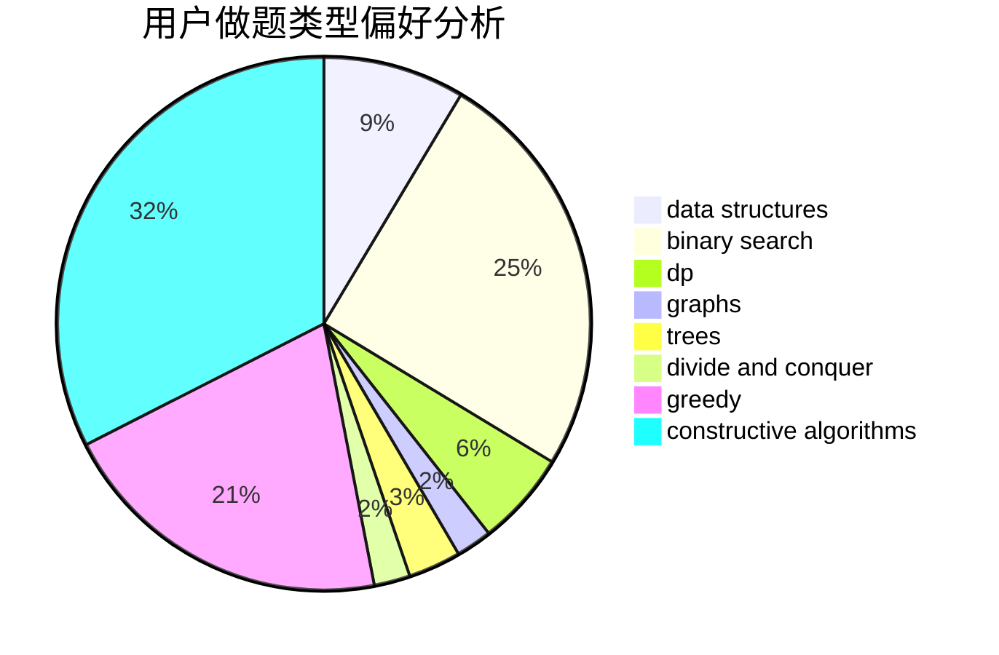

# DeaL57

<!-- tabs:start -->

#### **用户提交结果分析**

#### **用户做题类型偏好分析**

#### **用户错题知识点分析**

<!-- tabs:end -->
# 推荐题目
[77E](https://codeforces.com/contest/77/problem/E)		geometry		  
[1063C](https://codeforces.com/contest/1063/problem/C)		binary search,
                        constructive algorithms,
                        geometry,
                        interactive		  
[366C](https://codeforces.com/contest/366/problem/C)		dp		  
[1029E](https://codeforces.com/contest/1029/problem/E)		dp,
                        graphs,
                        greedy		  
[77B](https://codeforces.com/contest/77/problem/B)		math,
                        probabilities		  
[584C](https://codeforces.com/contest/584/problem/C)		constructive algorithms,
                        greedy,
                        strings		  
[621B](https://codeforces.com/contest/621/problem/B)		combinatorics,
                        implementation		  
[1352A](https://codeforces.com/contest/1352/problem/A)		implementation,
                        math		  
[1020B](https://codeforces.com/contest/1020/problem/B)		brute force,
                        dfs and similar,
                        graphs		  
[1029D](https://codeforces.com/contest/1029/problem/D)		implementation,
                        math		  
