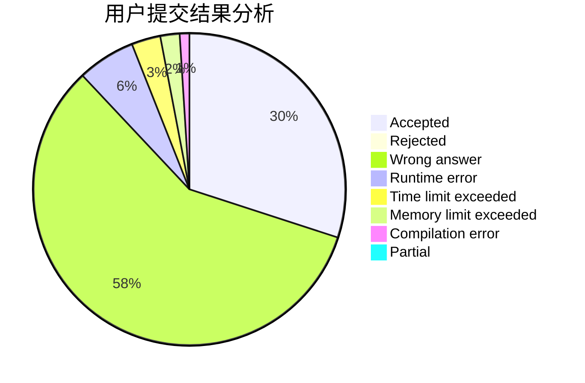
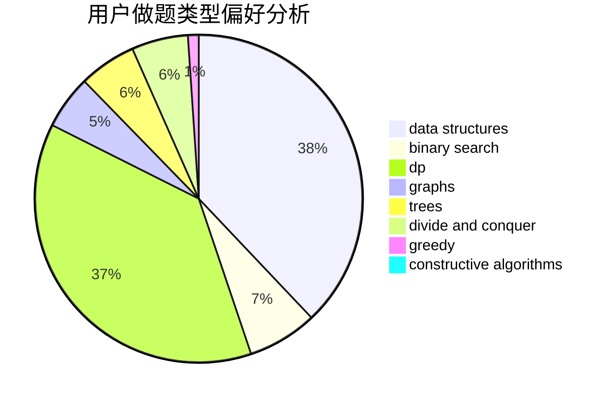

# DeaL57

<!-- tabs:start -->

#### **用户提交结果分析**

#### **用户做题类型偏好分析**

#### **用户错题知识点分析**

<!-- tabs:end -->
# 推荐题目
[798C](https://codeforces.com/contest/798/problem/C)		dp,
                        greedy,
                        number theory		  
[1063F](https://codeforces.com/contest/1063/problem/F)		data structures,
                        dp,
                        string suffix structures		  
[394C](https://codeforces.com/contest/394/problem/C)		constructive algorithms,
                        greedy		  
[102B](https://codeforces.com/contest/102/problem/B)		implementation		  
[798B](https://codeforces.com/contest/798/problem/B)		brute force,
                        dp,
                        strings		  
[604C](https://codeforces.com/contest/604/problem/C)		dsu,graphs,sortings,trees		  
[645D](https://codeforces.com/contest/645/problem/D)		binary search,
                        dp,
                        graphs		  
[1358E](https://codeforces.com/contest/1358/problem/E)		constructive algorithms,
                        data structures,
                        greedy,
                        implementation		  
[1020E](https://codeforces.com/contest/1020/problem/E)		dsu,graphs,sortings,trees		  
[102A](https://codeforces.com/contest/102/problem/A)		brute force		  
