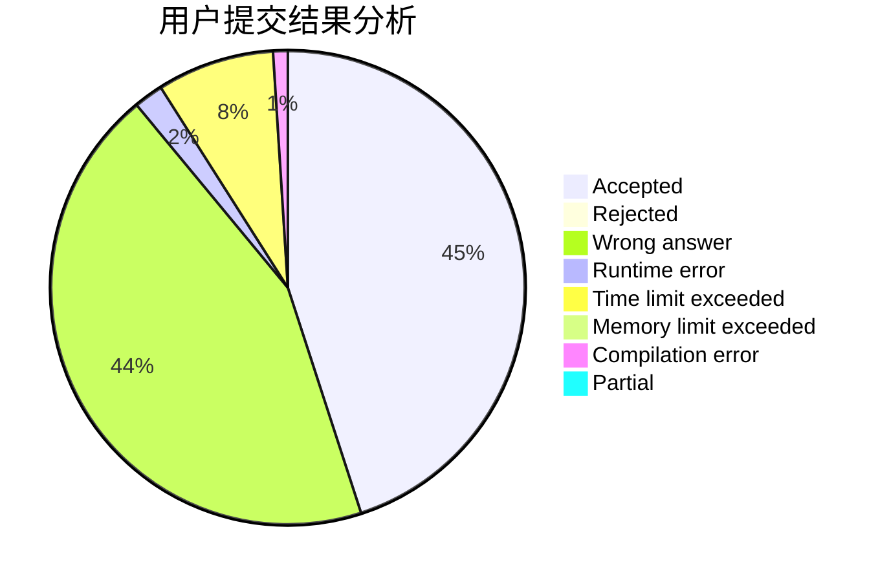
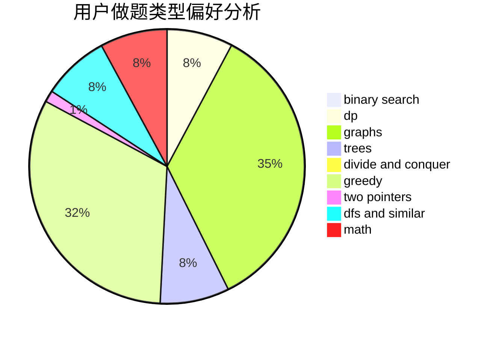

# DeaphetS

<!-- tabs:start -->

#### **用户提交结果分析**

#### **用户做题类型偏好分析**

<!-- tabs:end -->
# 推荐题目
[1279E](https://codeforces.com/contest/1279/problem/E)
[1380D](https://codeforces.com/contest/1380/problem/D)
[39B](https://codeforces.com/contest/39/problem/B)
[494A](https://codeforces.com/contest/494/problem/A)
[1488F](https://codeforces.com/contest/1488/problem/F)
[1154A](https://codeforces.com/contest/1154/problem/A)
[121C](https://codeforces.com/contest/121/problem/C)
[1399D](https://codeforces.com/contest/1399/problem/D)
[1321E](https://codeforces.com/contest/1321/problem/E)
[1443F](https://codeforces.com/contest/1443/problem/F)
