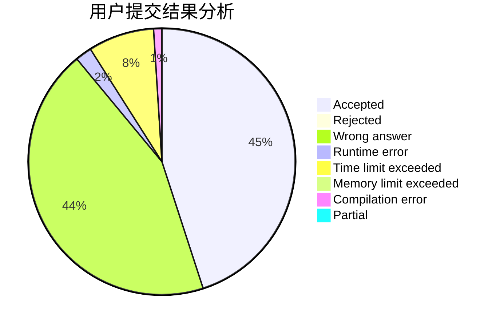
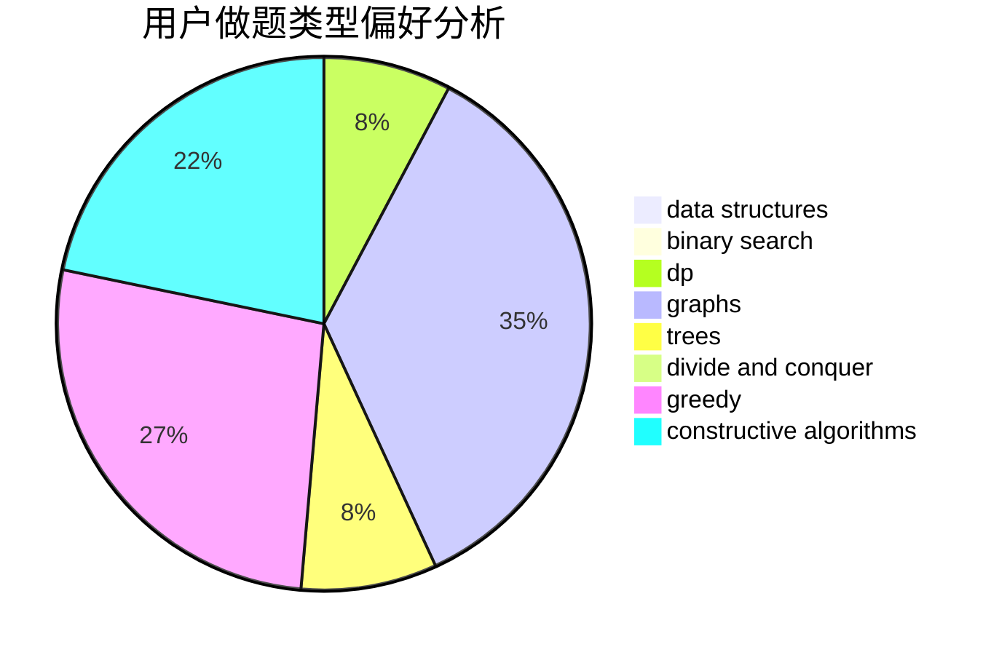
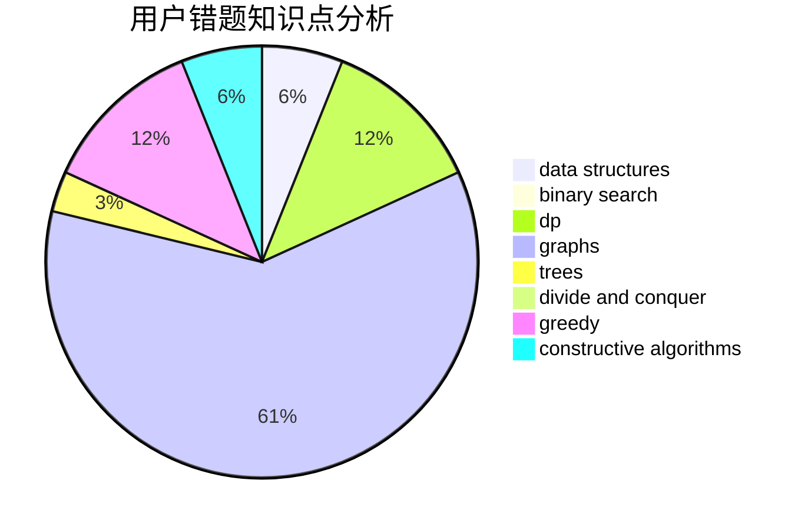

# DeaphetS

<!-- tabs:start -->

#### **用户提交结果分析**

#### **用户做题类型偏好分析**

#### **用户错题知识点分析**

<!-- tabs:end -->
# 推荐题目
[1279E](https://codeforces.com/contest/1279/problem/E)		combinatorics,
                        dp		  
[1380D](https://codeforces.com/contest/1380/problem/D)		constructive algorithms,
                        greedy,
                        implementation,
                        math,
                        two pointers		  
[39B](https://codeforces.com/contest/39/problem/B)		greedy		  
[494A](https://codeforces.com/contest/494/problem/A)		greedy		  
[1488F](https://codeforces.com/contest/1488/problem/F)		*special problem,
                        *special problem,
                        binary search,
                        data structures		  
[1154A](https://codeforces.com/contest/1154/problem/A)		math		  
[121C](https://codeforces.com/contest/121/problem/C)		brute force,
                        combinatorics,
                        number theory		  
[1399D](https://codeforces.com/contest/1399/problem/D)		constructive algorithms,
                        data structures,
                        greedy,
                        implementation		  
[1321E](https://codeforces.com/contest/1321/problem/E)		dsu,graphs,sortings,trees		  
[1443F](https://codeforces.com/contest/1443/problem/F)		dsu,graphs,sortings,trees		  
