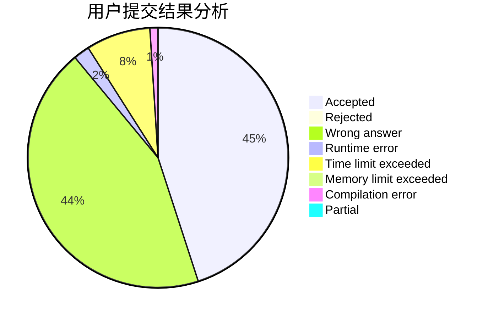
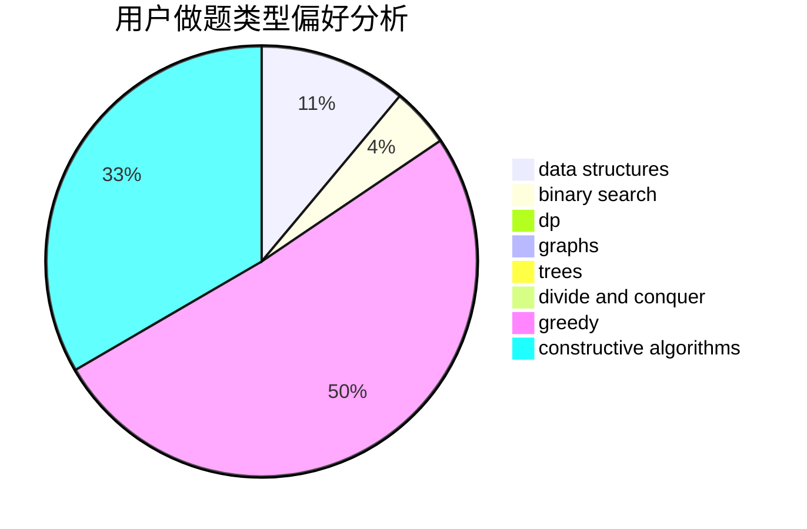
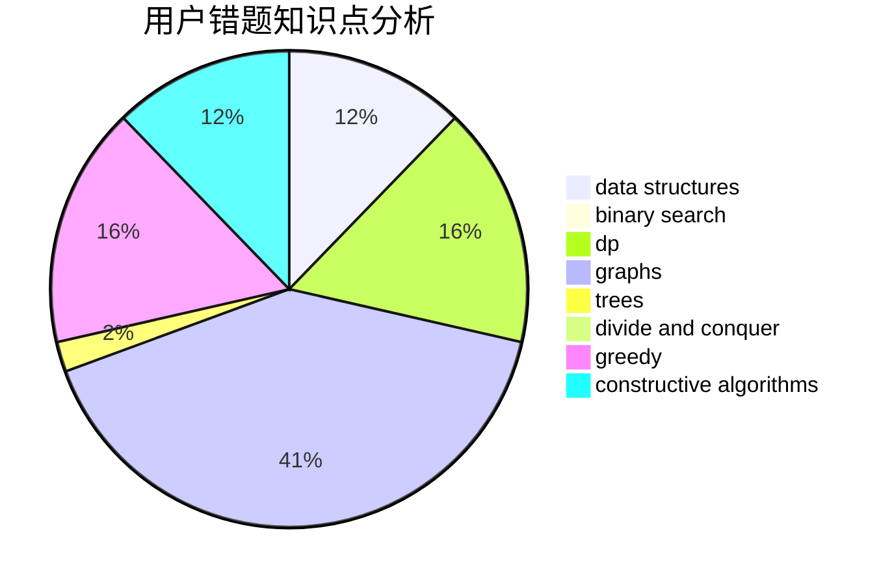

# DeaphetS

<!-- tabs:start -->

#### **用户提交结果分析**

#### **用户做题类型偏好分析**

#### **用户错题知识点分析**

<!-- tabs:end -->
# 推荐题目
[1270E](https://codeforces.com/contest/1270/problem/E)		constructive algorithms,
                        geometry,
                        math		  
[1371E2](https://codeforces.com/contest/1371E/problem/2)		binary search,
                        combinatorics,
                        dp,
                        math,
                        number theory,
                        sortings		  
[368B](https://codeforces.com/contest/368/problem/B)		data structures,
                        dp		  
[475A](https://codeforces.com/contest/475/problem/A)		implementation		  
[1480B](https://codeforces.com/contest/1480/problem/B)		greedy,
                        implementation,
                        sortings		  
[1152A](https://codeforces.com/contest/1152/problem/A)		greedy,
                        implementation,
                        math		  
[1214B](https://codeforces.com/contest/1214/problem/B)		brute force,
                        math		  
[1391A](https://codeforces.com/contest/1391/problem/A)		constructive algorithms,
                        math		  
[1312C](https://codeforces.com/contest/1312/problem/C)		bitmasks,
                        greedy,
                        implementation,
                        math,
                        number theory,
                        ternary search		  
[1433G](https://codeforces.com/contest/1433/problem/G)		brute force,
                        graphs,
                        shortest paths		  
