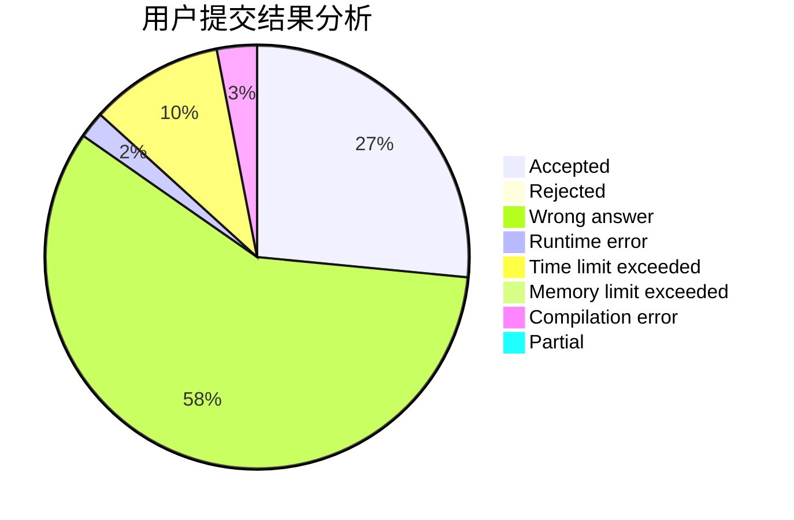
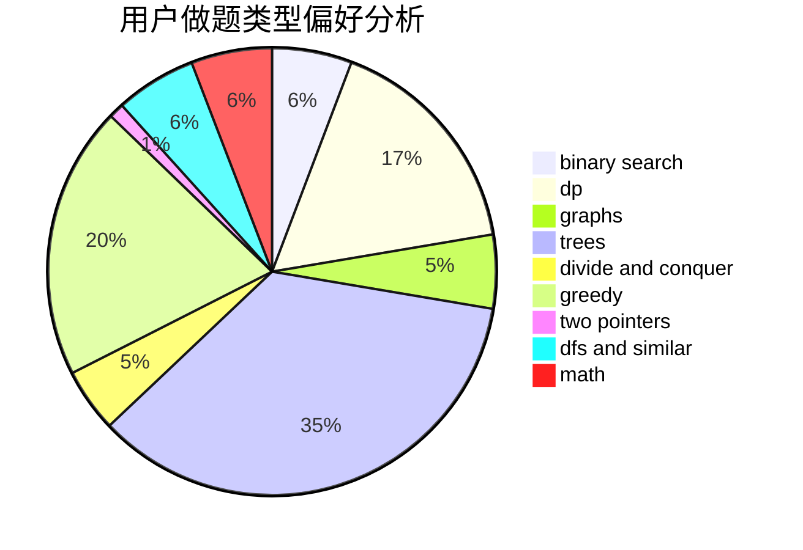

# Deep_Kevin

<!-- tabs:start -->

#### **用户提交结果分析**

#### **用户做题类型偏好分析**

<!-- tabs:end -->
# 推荐题目
[348B](https://codeforces.com/contest/348/problem/B)
[1104C](https://codeforces.com/contest/1104/problem/C)
[1290F](https://codeforces.com/contest/1290/problem/F)
[198C](https://codeforces.com/contest/198/problem/C)
[118E](https://codeforces.com/contest/118/problem/E)
[513C](https://codeforces.com/contest/513/problem/C)
[798E](https://codeforces.com/contest/798/problem/E)
[1074B](https://codeforces.com/contest/1074/problem/B)
[1051D](https://codeforces.com/contest/1051/problem/D)
[354D](https://codeforces.com/contest/354/problem/D)
