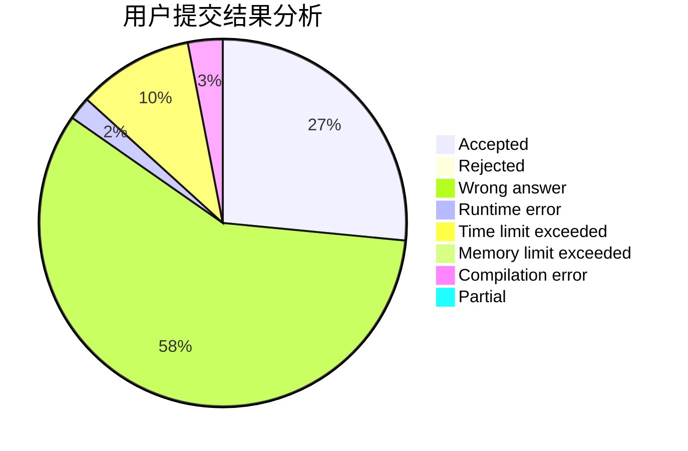
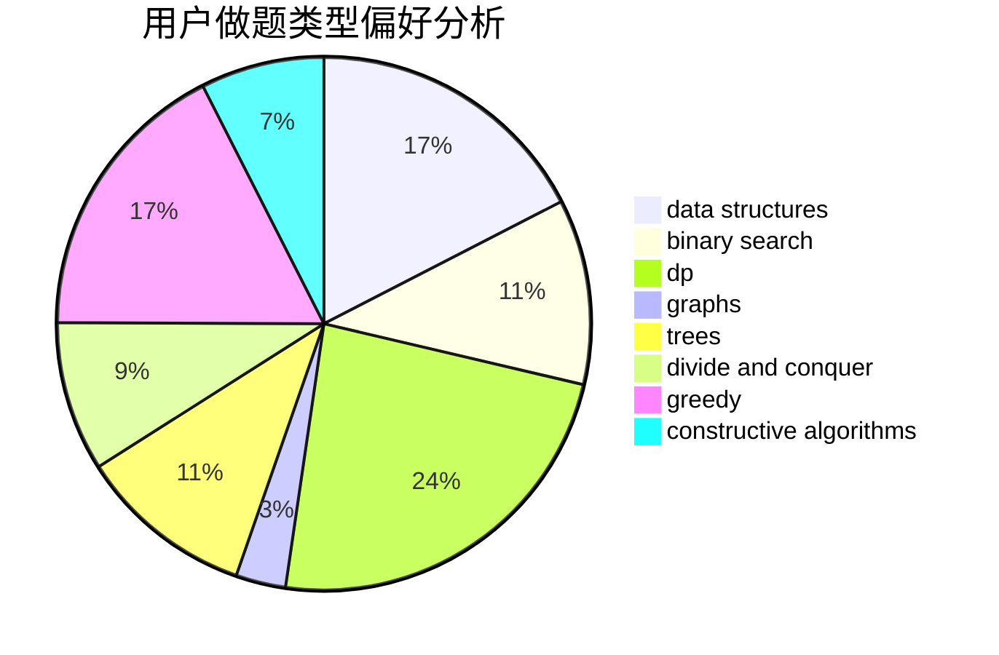
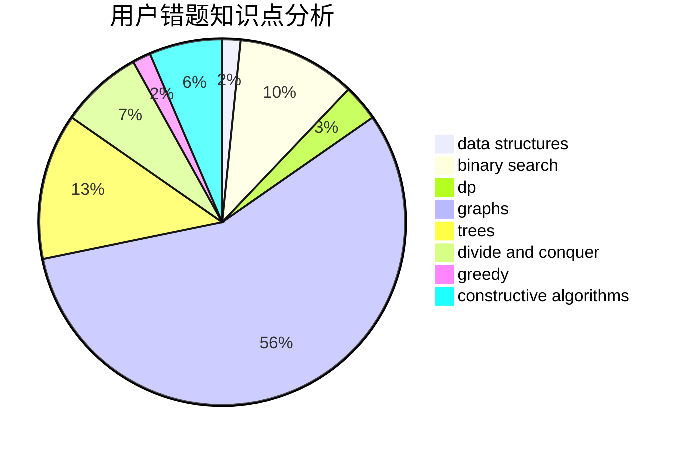

# Deep_Kevin

<!-- tabs:start -->

#### **用户提交结果分析**

#### **用户做题类型偏好分析**

#### **用户错题知识点分析**

<!-- tabs:end -->
# 推荐题目
[348B](https://codeforces.com/contest/348/problem/B)		dfs and similar,
                        number theory,
                        trees		  
[1104C](https://codeforces.com/contest/1104/problem/C)		dsu,graphs,sortings,trees		  
[1290F](https://codeforces.com/contest/1290/problem/F)		dp		  
[198C](https://codeforces.com/contest/198/problem/C)		binary search,
                        geometry		  
[118E](https://codeforces.com/contest/118/problem/E)		dfs and similar,
                        graphs		  
[513C](https://codeforces.com/contest/513/problem/C)		bitmasks,
                        probabilities		  
[798E](https://codeforces.com/contest/798/problem/E)		constructive algorithms,
                        data structures,
                        graphs,
                        sortings		  
[1074B](https://codeforces.com/contest/1074/problem/B)		dsu,graphs,sortings,trees		  
[1051D](https://codeforces.com/contest/1051/problem/D)		bitmasks,
                        dp		  
[354D](https://codeforces.com/contest/354/problem/D)		dp		  
