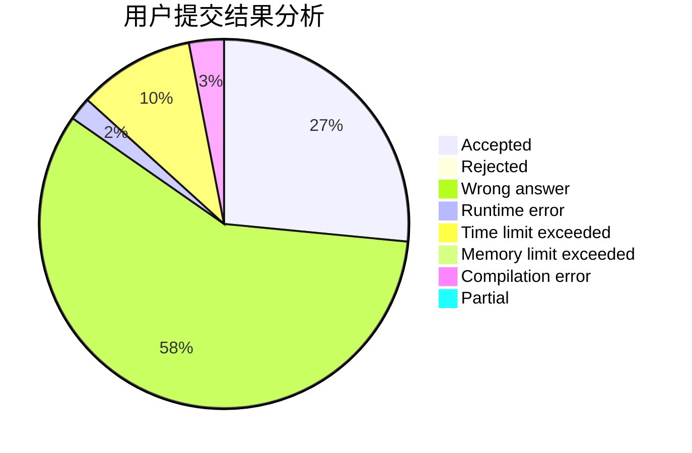
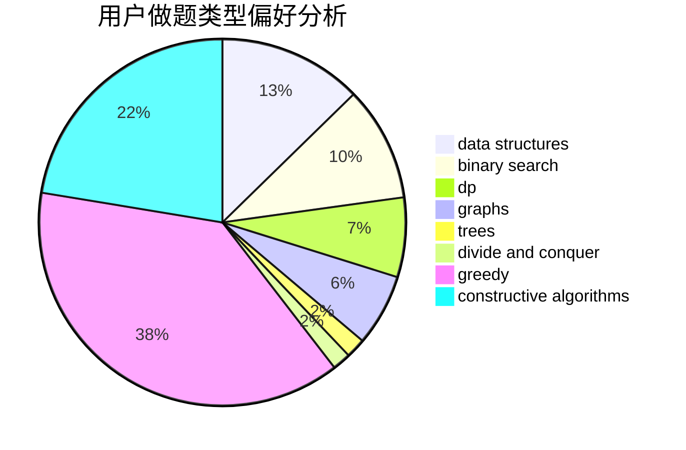
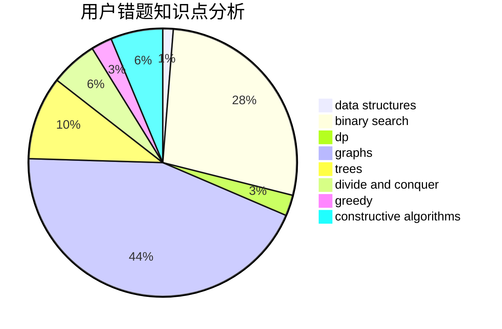

# Deep_Kevin
<!-- tabs:start -->
#### **用户提交结果分析**

#### **用户做题类型偏好分析**

#### **用户错题知识点分析**

<!-- tabs:end -->
# 推荐题目
[DIY Garland](http://codeforces.com/problemset/problem/1283/F)		constructive algorithms,
                        greedy,
                        trees		  
[Choosing Two Paths](http://codeforces.com/problemset/problem/1073/F)		dfs and similar,
                        dp,
                        greedy,
                        trees		  
[Vus the Cossack and Strings](http://codeforces.com/problemset/problem/1186/C)		implementation,
                        math		  
[Even Odds](http://codeforces.com/problemset/problem/318/A)		math		  
[Task On The Board](http://codeforces.com/problemset/problem/1367/D)		constructive algorithms,
                        greedy,
                        implementation,
                        sortings		  
[A Piece of Cake](http://codeforces.com/problemset/problem/171/C)		*special problem,
                        implementation		  
[Biridian Forest](http://codeforces.com/problemset/problem/329/B)		dfs and similar,
                        shortest paths		  
[Monsters and Diamonds](http://codeforces.com/problemset/problem/325/C)		dfs and similar,
                        graphs,
                        shortest paths		  
[The Meeting Place Cannot Be Changed](http://codeforces.com/problemset/problem/780/B)		binary search		  
[Choosing Subtree is Fun](http://codeforces.com/problemset/problem/372/D)		binary search,
                        data structures,
                        dfs and similar,
                        trees,
                        two pointers		  
<!-- tabs:start -->
#### **data structures**
[DIY Garland](http://codeforces.com/problemset/problem/372/D)		binary search,
                        data structures,
                        dfs and similar,
                        trees,
                        two pointers		  
[Choosing Two Paths](http://codeforces.com/problemset/problem/356/A)		data structures,
                        dsu		  
[Vus the Cossack and Strings](http://codeforces.com/problemset/problem/1236/E)		binary search,
                        data structures,
                        dp,
                        dsu		  
[Even Odds](http://codeforces.com/problemset/problem/343/D)		data structures,
                        dfs and similar,
                        graphs,
                        trees		  
[Task On The Board](http://codeforces.com/problemset/problem/1367/F2)		binary search,
                        data structures,
                        dp,
                        greedy,
                        sortings,
                        two pointers		  
[A Piece of Cake](http://codeforces.com/problemset/problem/1060/G)		data structures		  
[Biridian Forest](http://codeforces.com/problemset/problem/1446/D2)		data structures,
                        greedy,
                        two pointers		  
[Monsters and Diamonds](http://codeforces.com/problemset/problem/372/C)		data structures,
                        dp,
                        math		  
[The Meeting Place Cannot Be Changed](http://codeforces.com/problemset/problem/1320/D)		data structures,
                        hashing,
                        strings		  
[Choosing Subtree is Fun](http://codeforces.com/problemset/problem/1512/D)		constructive algorithms,
                        data structures,
                        greedy		  
#### **binary search**
[DIY Garland](http://codeforces.com/problemset/problem/780/B)		binary search		  
[Choosing Two Paths](http://codeforces.com/problemset/problem/372/D)		binary search,
                        data structures,
                        dfs and similar,
                        trees,
                        two pointers		  
[Vus the Cossack and Strings](https://codeforces.com/contest/1315/problem/F)		binary search,
                        dp,
                        strings		  
[Even Odds](http://codeforces.com/problemset/problem/1236/E)		binary search,
                        data structures,
                        dp,
                        dsu		  
[Task On The Board](http://codeforces.com/problemset/problem/1183/C)		binary search,
                        math		  
[A Piece of Cake](http://codeforces.com/problemset/problem/1367/F2)		binary search,
                        data structures,
                        dp,
                        greedy,
                        sortings,
                        two pointers		  
[Biridian Forest](http://codeforces.com/problemset/problem/1370/D)		binary search,
                        dp,
                        dsu,
                        greedy,
                        implementation		  
[Monsters and Diamonds](http://codeforces.com/problemset/problem/1158/A)		binary search,
                        constructive algorithms,
                        greedy,
                        implementation,
                        math,
                        sortings,
                        two pointers		  
[The Meeting Place Cannot Be Changed](http://codeforces.com/problemset/problem/1492/C)		binary search,
                        data structures,
                        dp,
                        greedy,
                        two pointers		  
[Choosing Subtree is Fun](http://codeforces.com/problemset/problem/1463/D)		binary search,
                        constructive algorithms,
                        greedy,
                        two pointers		  
#### **dp**
[DIY Garland](http://codeforces.com/problemset/problem/1073/F)		dfs and similar,
                        dp,
                        greedy,
                        trees		  
[Choosing Two Paths](https://codeforces.com/contest/1315/problem/F)		binary search,
                        dp,
                        strings		  
[Vus the Cossack and Strings](http://codeforces.com/problemset/problem/1236/E)		binary search,
                        data structures,
                        dp,
                        dsu		  
[Even Odds](http://codeforces.com/problemset/problem/1367/F2)		binary search,
                        data structures,
                        dp,
                        greedy,
                        sortings,
                        two pointers		  
[Task On The Board](http://codeforces.com/problemset/problem/364/B)		dp,
                        greedy		  
[A Piece of Cake](http://codeforces.com/problemset/problem/1370/D)		binary search,
                        dp,
                        dsu,
                        greedy,
                        implementation		  
[Biridian Forest](http://codeforces.com/problemset/problem/372/C)		data structures,
                        dp,
                        math		  
[Monsters and Diamonds](http://codeforces.com/problemset/problem/1444/E)		brute force,
                        dfs and similar,
                        dp,
                        interactive,
                        trees		  
[The Meeting Place Cannot Be Changed](http://codeforces.com/problemset/problem/283/C)		dp		  
[Choosing Subtree is Fun](https://codeforces.com/contest/1484/problem/E)		data structures,
                        divide and conquer,
                        dp		  
#### **graph**
[DIY Garland](http://codeforces.com/problemset/problem/325/C)		dfs and similar,
                        graphs,
                        shortest paths		  
[Choosing Two Paths](http://codeforces.com/problemset/problem/343/D)		data structures,
                        dfs and similar,
                        graphs,
                        trees		  
[Vus the Cossack and Strings](http://codeforces.com/problemset/problem/1487/C)		brute force,
                        constructive algorithms,
                        dfs and similar,
                        graphs,
                        greedy,
                        implementation,
                        math		  
[Even Odds](http://codeforces.com/problemset/problem/1437/C)		dp,
                        flows,
                        graph matchings,
                        greedy,
                        math,
                        sortings		  
[Task On The Board](http://codeforces.com/problemset/problem/1470/D)		constructive algorithms,
                        dfs and similar,
                        graph matchings,
                        graphs,
                        greedy		  
[A Piece of Cake](http://codeforces.com/problemset/problem/1476/C)		dp,
                        graphs,
                        greedy		  
[Biridian Forest](http://codeforces.com/problemset/problem/1304/D)		constructive algorithms,
                        graphs,
                        greedy,
                        two pointers		  
[Monsters and Diamonds](http://codeforces.com/problemset/problem/1475/C)		combinatorics,
                        graphs,
                        math		  
[The Meeting Place Cannot Be Changed](http://codeforces.com/problemset/problem/553/E)		dp,
                        fft,
                        graphs,
                        math,
                        probabilities		  
[Choosing Subtree is Fun](http://codeforces.com/problemset/problem/1495/C)		constructive algorithms,
                        graphs		  
#### **trees**
[DIY Garland](http://codeforces.com/problemset/problem/1283/F)		constructive algorithms,
                        greedy,
                        trees		  
[Choosing Two Paths](http://codeforces.com/problemset/problem/1073/F)		dfs and similar,
                        dp,
                        greedy,
                        trees		  
[Vus the Cossack and Strings](http://codeforces.com/problemset/problem/372/D)		binary search,
                        data structures,
                        dfs and similar,
                        trees,
                        two pointers		  
[Even Odds](http://codeforces.com/problemset/problem/343/D)		data structures,
                        dfs and similar,
                        graphs,
                        trees		  
[Task On The Board](http://codeforces.com/problemset/problem/1444/E)		brute force,
                        dfs and similar,
                        dp,
                        interactive,
                        trees		  
[A Piece of Cake](http://codeforces.com/problemset/problem/375/D)		data structures,
                        dfs and similar,
                        trees		  
[Biridian Forest](http://codeforces.com/problemset/problem/1479/D)		binary search,
                        bitmasks,
                        brute force,
                        data structures,
                        probabilities,
                        trees		  
[Monsters and Diamonds](http://codeforces.com/problemset/problem/1511/C)		brute force,
                        data structures,
                        implementation,
                        trees		  
[The Meeting Place Cannot Be Changed](http://codeforces.com/problemset/problem/1499/F)		combinatorics,
                        dfs and similar,
                        dp,
                        trees		  
[Choosing Subtree is Fun](http://codeforces.com/problemset/problem/1491/E)		brute force,
                        dfs and similar,
                        divide and conquer,
                        number theory,
                        trees		  
#### **divide and conquer**
[DIY Garland](https://codeforces.com/contest/1484/problem/E)		data structures,
                        divide and conquer,
                        dp		  
[Choosing Two Paths](http://codeforces.com/problemset/problem/1461/D)		binary search,
                        brute force,
                        data structures,
                        divide and conquer,
                        implementation,
                        sortings		  
[Vus the Cossack and Strings](http://codeforces.com/problemset/problem/1466/G)		combinatorics,
                        divide and conquer,
                        hashing,
                        math,
                        string suffix structures,
                        strings		  
[Even Odds](http://codeforces.com/problemset/problem/1490/D)		dfs and similar,
                        divide and conquer,
                        implementation		  
[Task On The Board](https://codeforces.com/contest/1483/problem/C)		data structures,
                        divide and conquer,
                        dp		  
[A Piece of Cake](http://codeforces.com/problemset/problem/1491/E)		brute force,
                        dfs and similar,
                        divide and conquer,
                        number theory,
                        trees		  
[Biridian Forest](http://codeforces.com/problemset/problem/1303/G)		data structures,
                        divide and conquer,
                        geometry,
                        trees		  
[Monsters and Diamonds](http://codeforces.com/problemset/problem/1494/D)		constructive algorithms,
                        data structures,
                        dfs and similar,
                        divide and conquer,
                        dsu,
                        greedy,
                        sortings,
                        trees		  
[The Meeting Place Cannot Be Changed](http://codeforces.com/problemset/problem/1482/E)		data structures,
                        divide and conquer,
                        dp		  
[Choosing Subtree is Fun](http://codeforces.com/problemset/problem/566/C)		dfs and similar,
                        divide and conquer,
                        trees		  
#### **greedy**
[DIY Garland](http://codeforces.com/problemset/problem/1283/F)		constructive algorithms,
                        greedy,
                        trees		  
[Choosing Two Paths](http://codeforces.com/problemset/problem/1073/F)		dfs and similar,
                        dp,
                        greedy,
                        trees		  
[Vus the Cossack and Strings](http://codeforces.com/problemset/problem/1367/D)		constructive algorithms,
                        greedy,
                        implementation,
                        sortings		  
[Even Odds](http://codeforces.com/problemset/problem/762/B)		greedy,
                        implementation,
                        sortings,
                        two pointers		  
[Task On The Board](http://codeforces.com/problemset/problem/1287/A)		greedy,
                        implementation		  
[A Piece of Cake](http://codeforces.com/problemset/problem/1051/A)		greedy,
                        implementation,
                        strings		  
[Biridian Forest](https://codeforces.com/contest/1229/problem/A)		brute force,
                        greedy		  
[Monsters and Diamonds](http://codeforces.com/problemset/problem/1367/F2)		binary search,
                        data structures,
                        dp,
                        greedy,
                        sortings,
                        two pointers		  
[The Meeting Place Cannot Be Changed](http://codeforces.com/problemset/problem/364/B)		dp,
                        greedy		  
[Choosing Subtree is Fun](http://codeforces.com/problemset/problem/1446/D2)		data structures,
                        greedy,
                        two pointers		  
#### **constructive algorithms**
[DIY Garland](http://codeforces.com/problemset/problem/1283/F)		constructive algorithms,
                        greedy,
                        trees		  
[Choosing Two Paths](http://codeforces.com/problemset/problem/1367/D)		constructive algorithms,
                        greedy,
                        implementation,
                        sortings		  
[Vus the Cossack and Strings](https://codeforces.com/contest/497/problem/A)		brute force,
                        constructive algorithms,
                        implementation		  
[Even Odds](http://codeforces.com/problemset/problem/1438/A)		constructive algorithms,
                        implementation		  
[Task On The Board](http://codeforces.com/problemset/problem/1512/D)		constructive algorithms,
                        data structures,
                        greedy		  
[A Piece of Cake](http://codeforces.com/problemset/problem/1158/A)		binary search,
                        constructive algorithms,
                        greedy,
                        implementation,
                        math,
                        sortings,
                        two pointers		  
[Biridian Forest](http://codeforces.com/problemset/problem/1493/A)		constructive algorithms,
                        greedy		  
[Monsters and Diamonds](http://codeforces.com/problemset/problem/1463/D)		binary search,
                        constructive algorithms,
                        greedy,
                        two pointers		  
[The Meeting Place Cannot Be Changed](https://codeforces.com/contest/1456/problem/B)		bitmasks,
                        brute force,
                        constructive algorithms		  
[Choosing Subtree is Fun](http://codeforces.com/problemset/problem/1492/D)		bitmasks,
                        constructive algorithms,
                        greedy,
                        math		  
#### **sortings**
[DIY Garland](http://codeforces.com/problemset/problem/1367/D)		constructive algorithms,
                        greedy,
                        implementation,
                        sortings		  
[Choosing Two Paths](http://codeforces.com/problemset/problem/762/B)		greedy,
                        implementation,
                        sortings,
                        two pointers		  
[Vus the Cossack and Strings](http://codeforces.com/problemset/problem/1367/F2)		binary search,
                        data structures,
                        dp,
                        greedy,
                        sortings,
                        two pointers		  
[Even Odds](http://codeforces.com/problemset/problem/670/C)		implementation,
                        sortings		  
[Task On The Board](http://codeforces.com/problemset/problem/1158/A)		binary search,
                        constructive algorithms,
                        greedy,
                        implementation,
                        math,
                        sortings,
                        two pointers		  
[A Piece of Cake](http://codeforces.com/problemset/problem/1501/B)		dp,
                        implementation,
                        sortings		  
[Biridian Forest](https://codeforces.com/contest/1496/problem/C)		geometry,
                        greedy,
                        math,
                        sortings		  
[Monsters and Diamonds](http://codeforces.com/problemset/problem/1495/A)		geometry,
                        greedy,
                        math,
                        sortings		  
[The Meeting Place Cannot Be Changed](http://codeforces.com/problemset/problem/1497/A)		brute force,
                        data structures,
                        greedy,
                        sortings		  
[Choosing Subtree is Fun](http://codeforces.com/problemset/problem/1427/A)		math,
                        sortings		  
<!-- tabs:end -->
