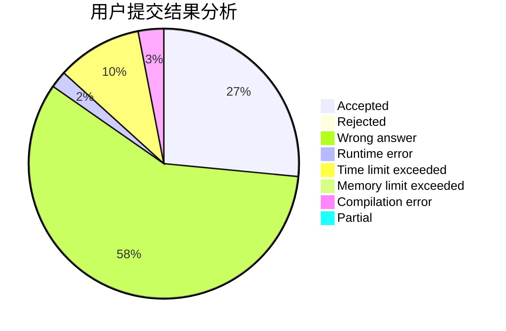
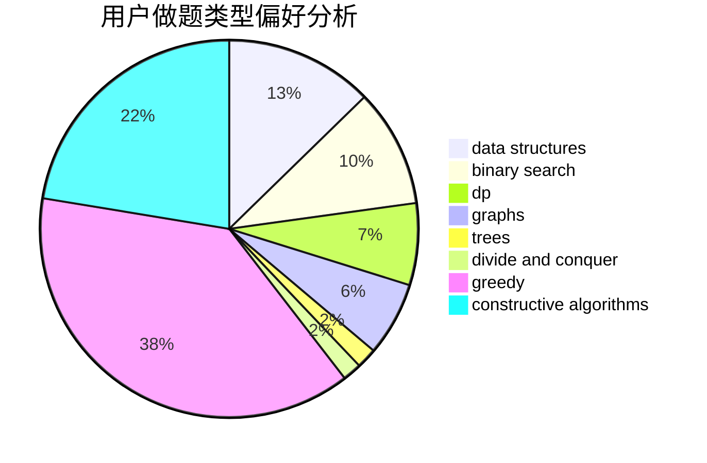
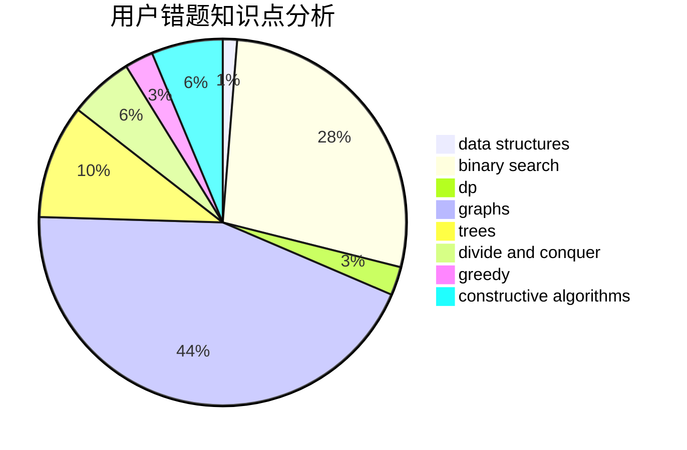

# Deep_Kevin

<!-- tabs:start -->

#### **用户提交结果分析**

#### **用户做题类型偏好分析**

#### **用户错题知识点分析**

<!-- tabs:end -->
# 推荐题目
[318A](https://codeforces.com/contest/318/problem/A)		math		  
[1103E](https://codeforces.com/contest/1103/problem/E)		fft,
                        math,
                        number theory		  
[1283F](https://codeforces.com/contest/1283/problem/F)		constructive algorithms,
                        greedy,
                        trees		  
[171C](https://codeforces.com/contest/171/problem/C)		*special problem,
                        implementation		  
[1186C](https://codeforces.com/contest/1186/problem/C)		implementation,
                        math		  
[493E](https://codeforces.com/contest/493/problem/E)		math		  
[780B](https://codeforces.com/contest/780/problem/B)		binary search		  
[1073F](https://codeforces.com/contest/1073/problem/F)		dfs and similar,
                        dp,
                        greedy,
                        trees		  
[1051A](https://codeforces.com/contest/1051/problem/A)		greedy,
                        implementation,
                        strings		  
[325C](https://codeforces.com/contest/325/problem/C)		dfs and similar,
                        graphs,
                        shortest paths		  
