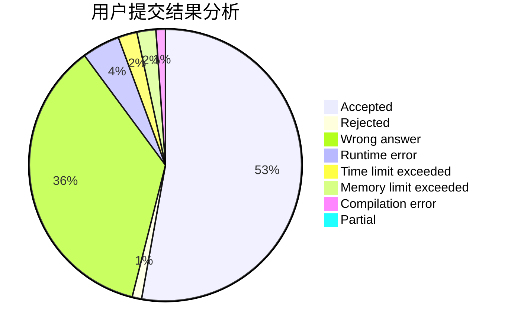
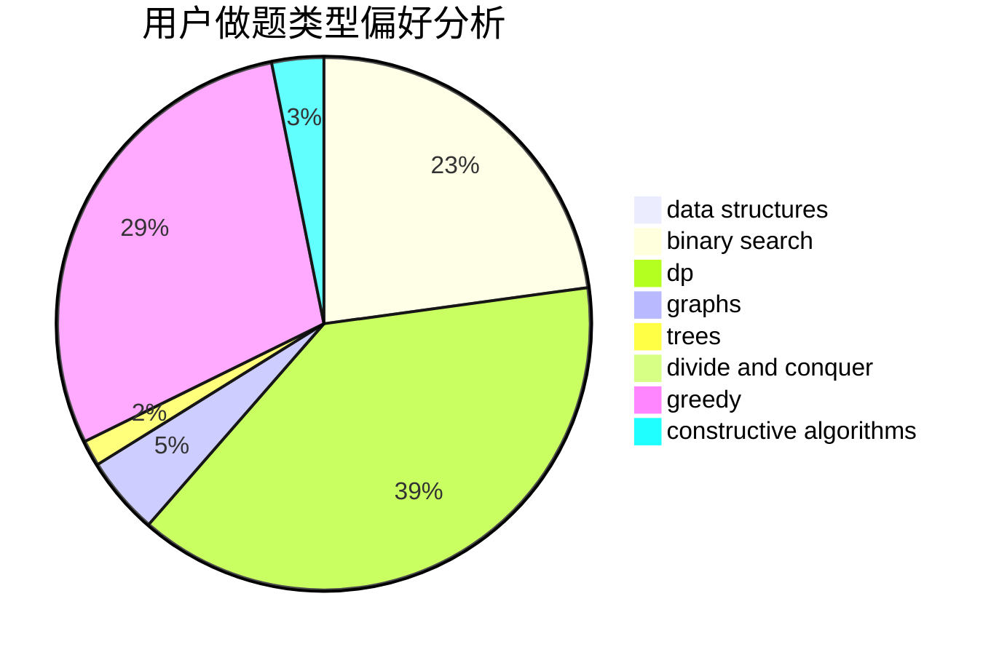

# Dejave

<!-- tabs:start -->

#### **用户提交结果分析**

#### **用户做题类型偏好分析**

#### **用户错题知识点分析**

<!-- tabs:end -->
# 推荐题目
[701F](https://codeforces.com/contest/701/problem/F)		dsu,graphs,sortings,trees		  
[1012D](https://codeforces.com/contest/1012/problem/D)		constructive algorithms,
                        strings		  
[1444E](https://codeforces.com/contest/1444/problem/E)		brute force,
                        dfs and similar,
                        dp,
                        interactive,
                        trees		  
[1142B](https://codeforces.com/contest/1142/problem/B)		data structures,
                        dfs and similar,
                        dp,
                        math,
                        trees		  
[1071B](https://codeforces.com/contest/1071/problem/B)		dsu,graphs,sortings,trees		  
[611D](https://codeforces.com/contest/611/problem/D)		dp,
                        hashing,
                        strings		  
[799A](https://codeforces.com/contest/799/problem/A)		brute force,
                        implementation		  
[487C](https://codeforces.com/contest/487/problem/C)		constructive algorithms,
                        math,
                        number theory		  
[1365F](https://codeforces.com/contest/1365/problem/F)		constructive algorithms,
                        implementation,
                        sortings		  
[1405A](https://codeforces.com/contest/1405/problem/A)		constructive algorithms		  
