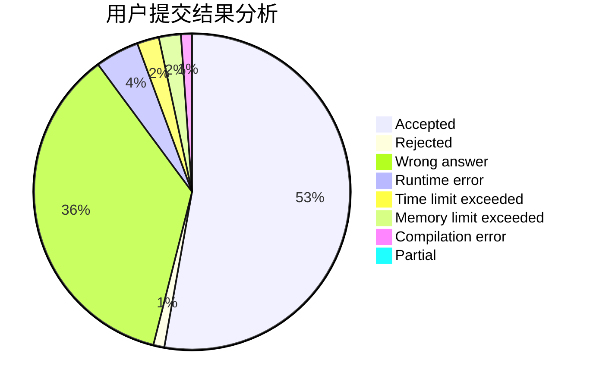
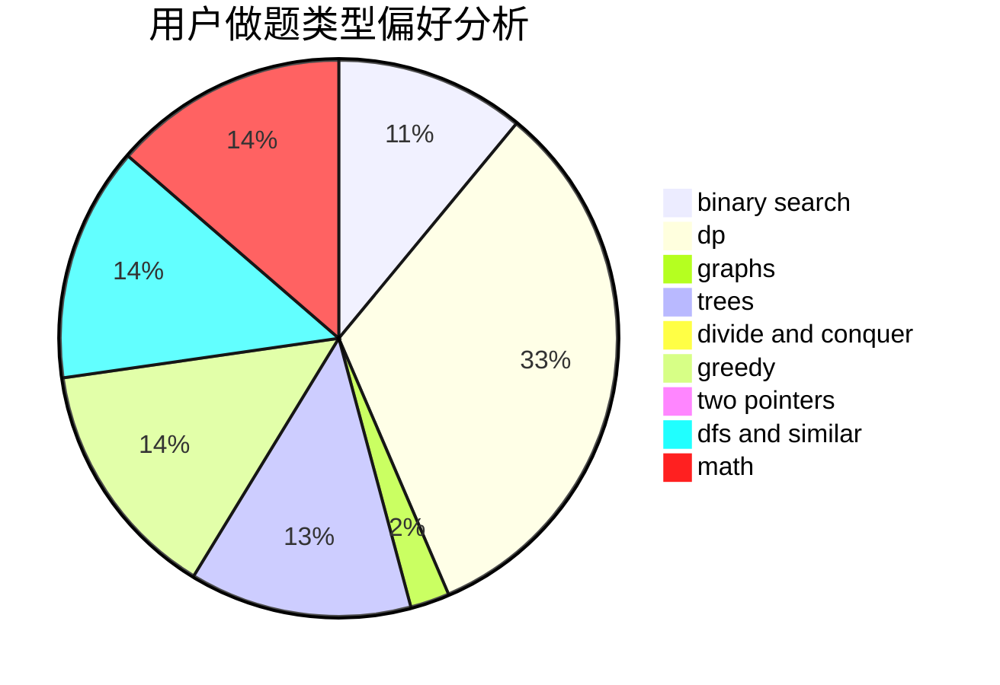

# Dejave

<!-- tabs:start -->

#### **用户提交结果分析**

#### **用户做题类型偏好分析**

<!-- tabs:end -->
# 推荐题目
[701F](https://codeforces.com/contest/701/problem/F)
[1012D](https://codeforces.com/contest/1012/problem/D)
[1444E](https://codeforces.com/contest/1444/problem/E)
[1142B](https://codeforces.com/contest/1142/problem/B)
[1071B](https://codeforces.com/contest/1071/problem/B)
[611D](https://codeforces.com/contest/611/problem/D)
[799A](https://codeforces.com/contest/799/problem/A)
[487C](https://codeforces.com/contest/487/problem/C)
[1365F](https://codeforces.com/contest/1365/problem/F)
[1405A](https://codeforces.com/contest/1405/problem/A)
