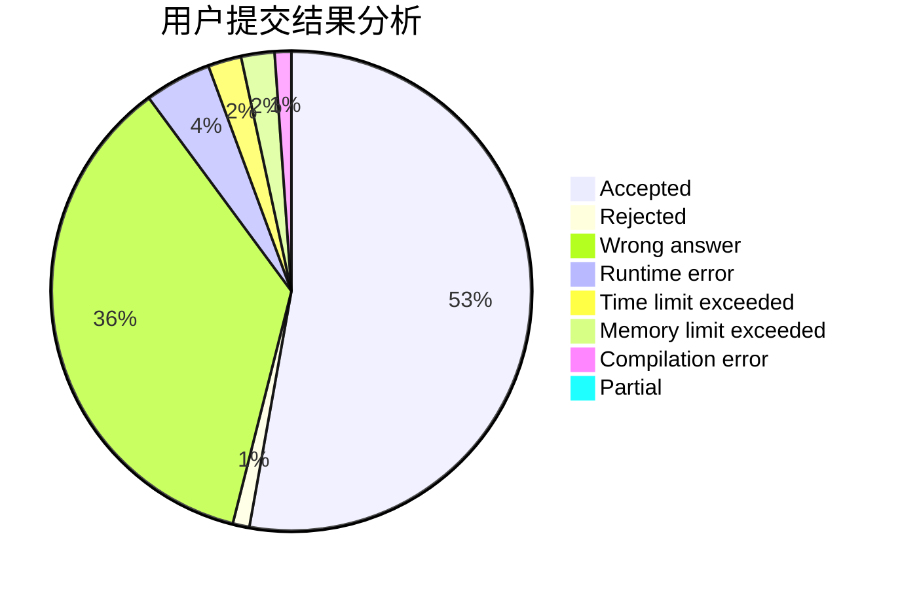
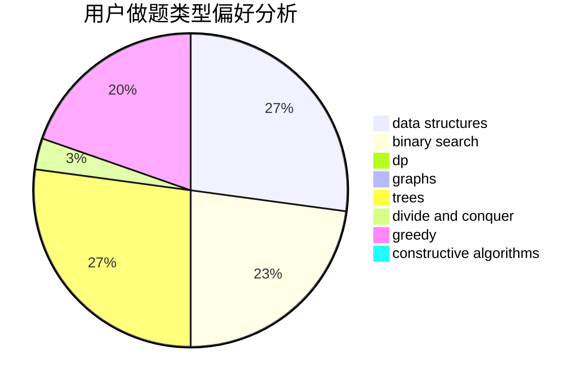
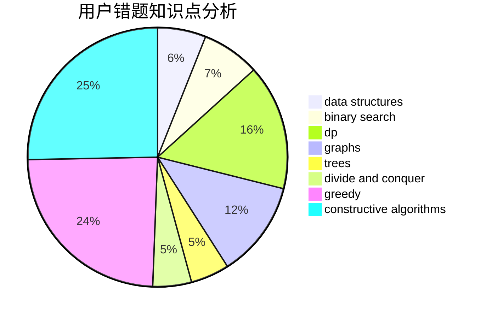

# Dejave

<!-- tabs:start -->

#### **用户提交结果分析**

#### **用户做题类型偏好分析**

#### **用户错题知识点分析**

<!-- tabs:end -->
# 推荐题目
[678B](https://codeforces.com/contest/678/problem/B)		implementation		  
[1012A](https://codeforces.com/contest/1012/problem/A)		brute force,
                        implementation,
                        math,
                        sortings		  
[1434E](https://codeforces.com/contest/1434/problem/E)		dsu,
                        games		  
[1140D](https://codeforces.com/contest/1140/problem/D)		dp,
                        greedy,
                        math		  
[1070L](https://codeforces.com/contest/1070/problem/L)		constructive algorithms		  
[592B](https://codeforces.com/contest/592/problem/B)		math		  
[780C](https://codeforces.com/contest/780/problem/C)		dfs and similar,
                        graphs,
                        greedy,
                        trees		  
[468B](https://codeforces.com/contest/468/problem/B)		2-sat,
                        dfs and similar,
                        dsu,
                        graph matchings,
                        greedy		  
[1357D4](https://codeforces.com/contest/1357D/problem/4)		nan		  
[1396B](https://codeforces.com/contest/1396/problem/B)		brute force,
                        constructive algorithms,
                        games,
                        greedy		  
