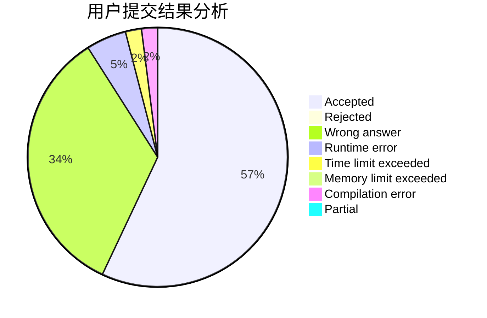
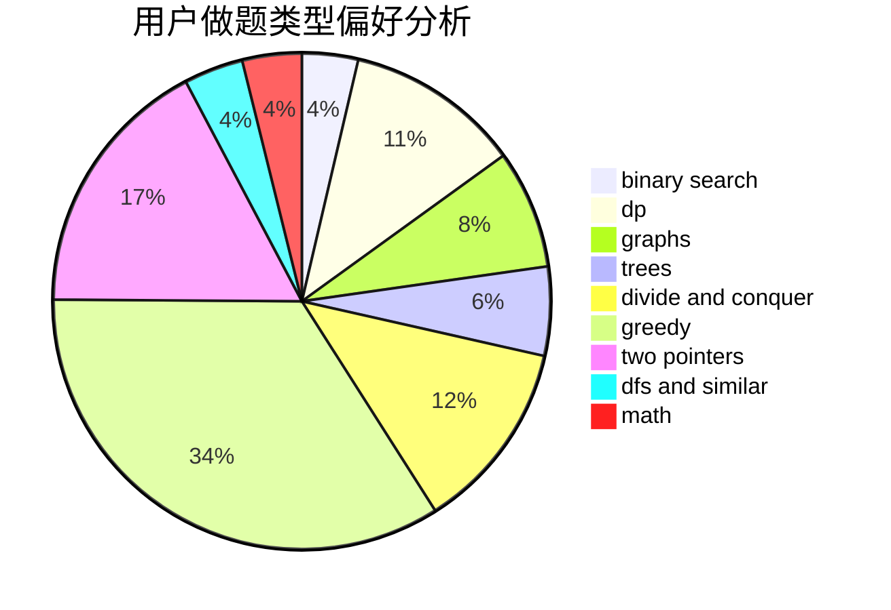

# DerekFeng

<!-- tabs:start -->

#### **用户提交结果分析**

#### **用户做题类型偏好分析**

<!-- tabs:end -->
# 推荐题目
[1295C](https://codeforces.com/contest/1295/problem/C)
[309D](https://codeforces.com/contest/309/problem/D)
[407E](https://codeforces.com/contest/407/problem/E)
[1213G](https://codeforces.com/contest/1213/problem/G)
[1166B](https://codeforces.com/contest/1166/problem/B)
[725D](https://codeforces.com/contest/725/problem/D)
[127A](https://codeforces.com/contest/127/problem/A)
[781F](https://codeforces.com/contest/781/problem/F)
[625B](https://codeforces.com/contest/625/problem/B)
[1312G](https://codeforces.com/contest/1312/problem/G)
