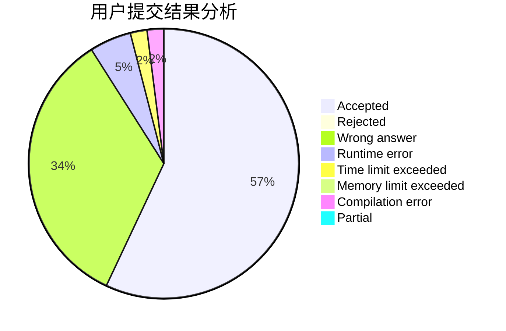
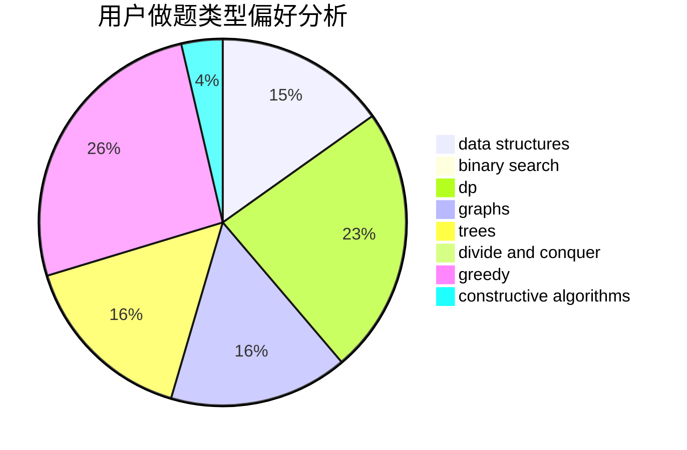
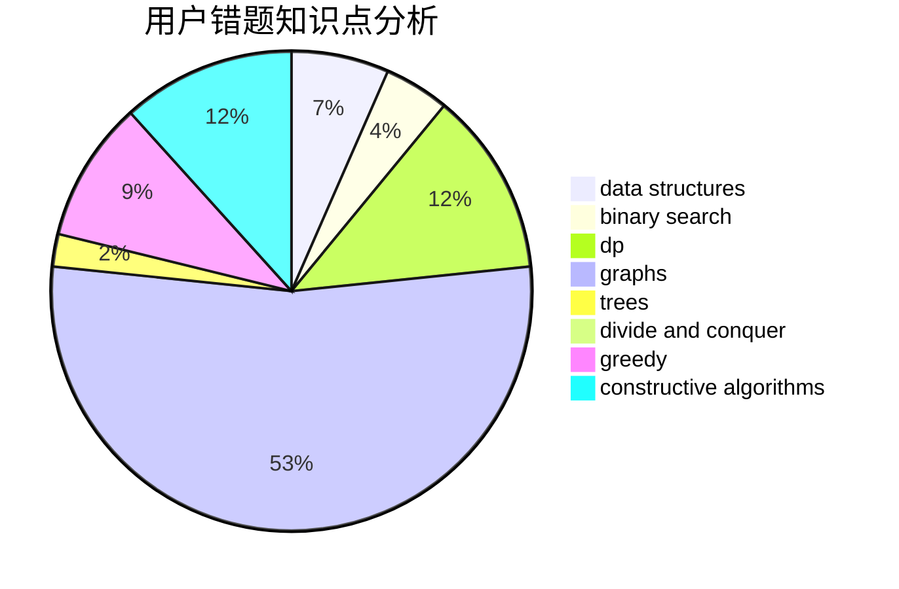

# DerekFeng

<!-- tabs:start -->

#### **用户提交结果分析**

#### **用户做题类型偏好分析**

#### **用户错题知识点分析**

<!-- tabs:end -->
# 推荐题目
[1288A](https://codeforces.com/contest/1288/problem/A)		binary search,
                        brute force,
                        math,
                        ternary search		  
[293B](https://codeforces.com/contest/293/problem/B)		brute force,
                        combinatorics		  
[379C](https://codeforces.com/contest/379/problem/C)		greedy,
                        sortings		  
[1208C](https://codeforces.com/contest/1208/problem/C)		constructive algorithms		  
[1164J](https://codeforces.com/contest/1164/problem/J)		dsu,graphs,sortings,trees		  
[707B](https://codeforces.com/contest/707/problem/B)		graphs		  
[1270G](https://codeforces.com/contest/1270/problem/G)		constructive algorithms,
                        dfs and similar,
                        graphs,
                        math		  
[763B](https://codeforces.com/contest/763/problem/B)		constructive algorithms,
                        geometry		  
[606C](https://codeforces.com/contest/606/problem/C)		dsu,graphs,sortings,trees		  
[1304B](https://codeforces.com/contest/1304/problem/B)		brute force,
                        constructive algorithms,
                        greedy,
                        implementation,
                        strings		  
