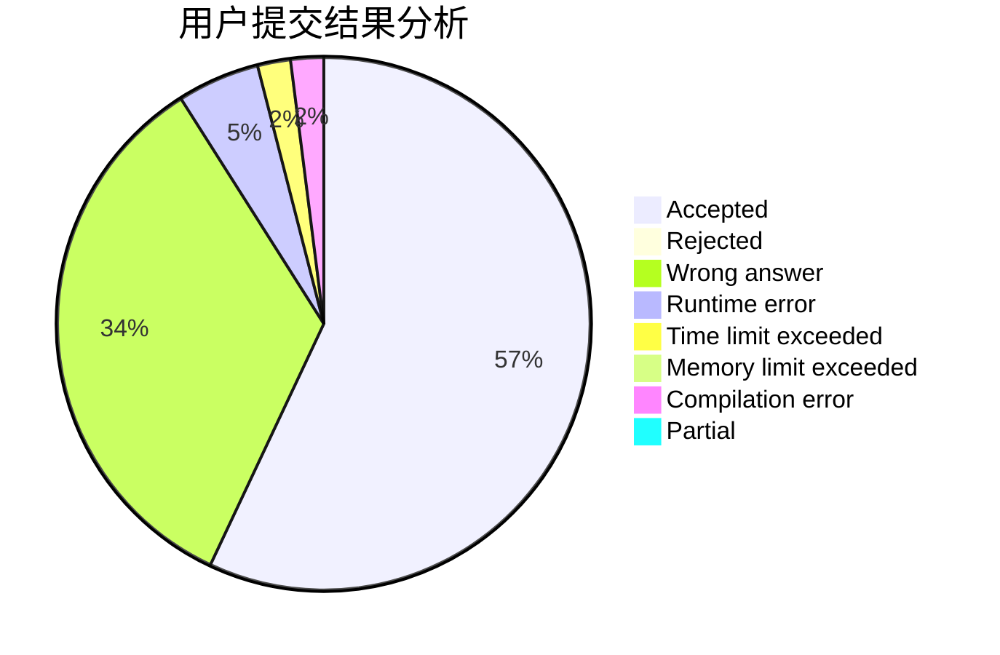
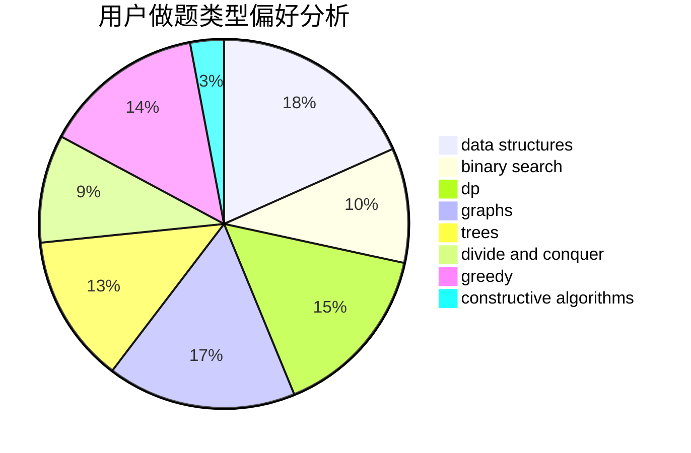
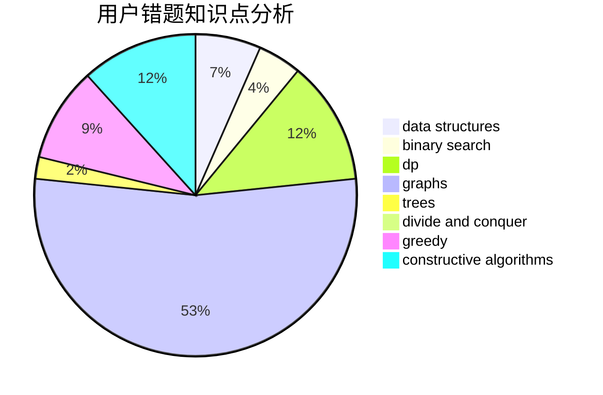

# DerekFeng

<!-- tabs:start -->

#### **用户提交结果分析**

#### **用户做题类型偏好分析**

#### **用户错题知识点分析**

<!-- tabs:end -->
# 推荐题目
[1295C](https://codeforces.com/contest/1295/problem/C)		dp,
                        greedy,
                        strings		  
[309D](https://codeforces.com/contest/309/problem/D)		brute force,
                        geometry		  
[407E](https://codeforces.com/contest/407/problem/E)		data structures		  
[1213G](https://codeforces.com/contest/1213/problem/G)		divide and conquer,
                        dsu,
                        graphs,
                        sortings,
                        trees		  
[1166B](https://codeforces.com/contest/1166/problem/B)		constructive algorithms,
                        math,
                        number theory		  
[725D](https://codeforces.com/contest/725/problem/D)		data structures,
                        greedy		  
[127A](https://codeforces.com/contest/127/problem/A)		geometry		  
[781F](https://codeforces.com/contest/781/problem/F)		dsu,graphs,sortings,trees		  
[625B](https://codeforces.com/contest/625/problem/B)		constructive algorithms,
                        greedy,
                        strings		  
[1312G](https://codeforces.com/contest/1312/problem/G)		data structures,
                        dfs and similar,
                        dp		  
