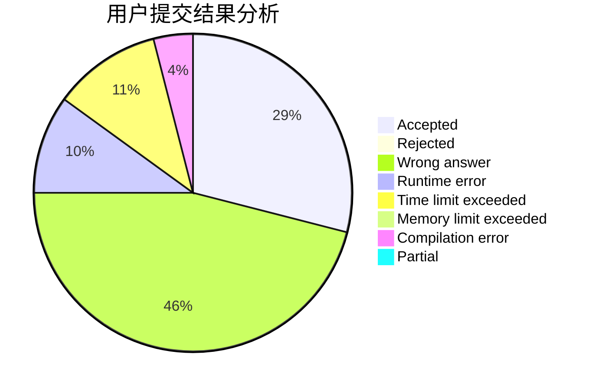
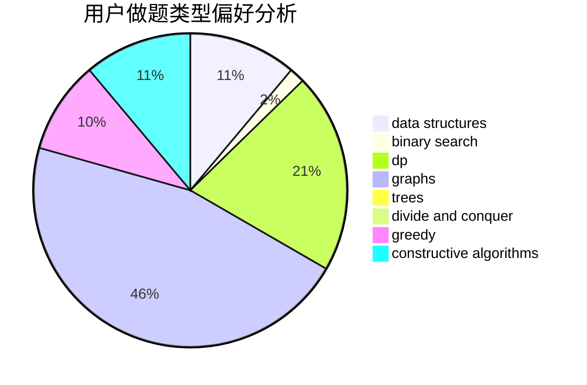
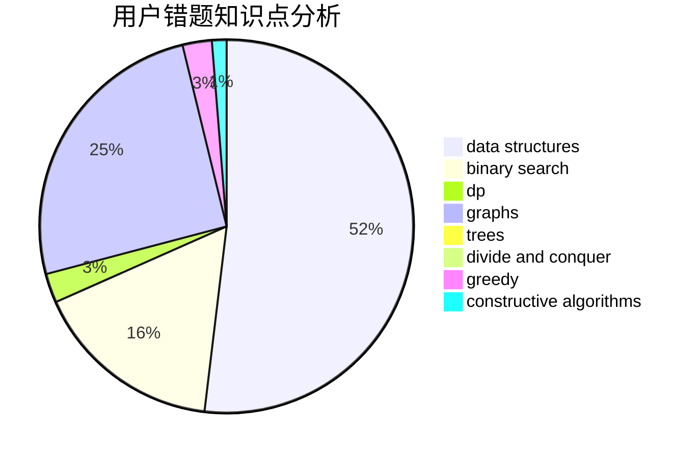

# 201465

<!-- tabs:start -->

#### **用户提交结果分析**

#### **用户做题类型偏好分析**

#### **用户错题知识点分析**

<!-- tabs:end -->
# 推荐题目
[1228B](https://codeforces.com/contest/1228/problem/B)		implementation,
                        math		  
[1228C](https://codeforces.com/contest/1228/problem/C)		math,
                        number theory		  
[1229F](https://codeforces.com/contest/1229/problem/F)		dsu,graphs,sortings,trees		  
[1065B](https://codeforces.com/contest/1065/problem/B)		constructive algorithms,
                        graphs		  
[1227B](https://codeforces.com/contest/1227/problem/B)		constructive algorithms		  
[1010F](https://codeforces.com/contest/1010/problem/F)		fft,
                        graphs,
                        trees		  
[1227A](https://codeforces.com/contest/1227/problem/A)		math		  
[1228D](https://codeforces.com/contest/1228/problem/D)		brute force,
                        constructive algorithms,
                        graphs,
                        hashing,
                        implementation		  
[12272](https://codeforces.com/contest/1227/problem/2)		dsu,graphs,sortings,trees		  
[1227G](https://codeforces.com/contest/1227/problem/G)		constructive algorithms		  
