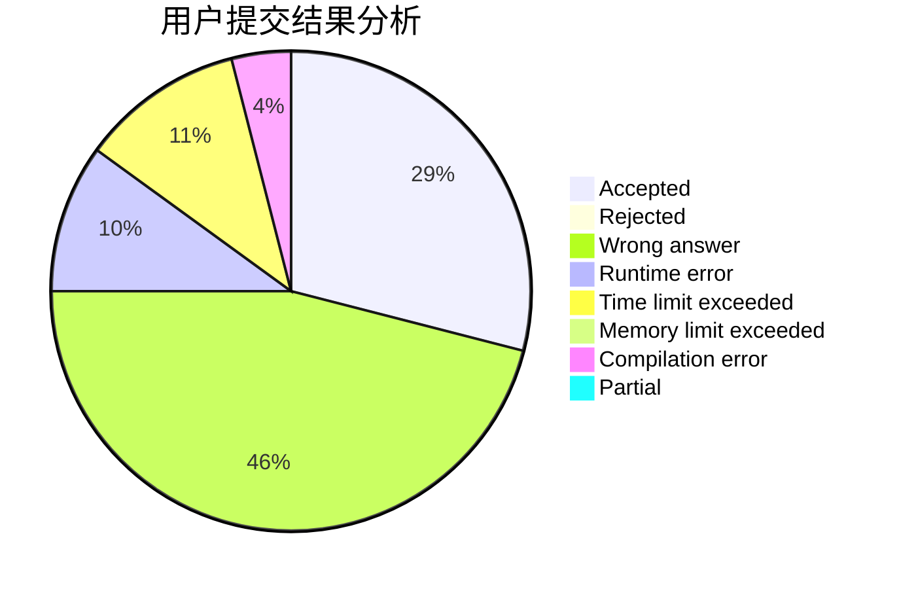
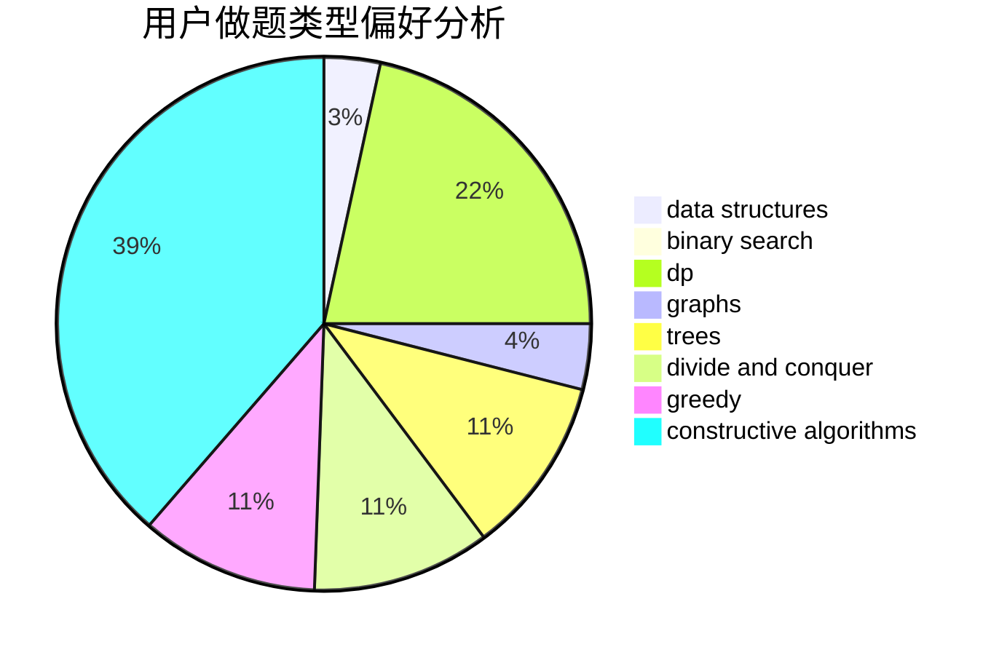
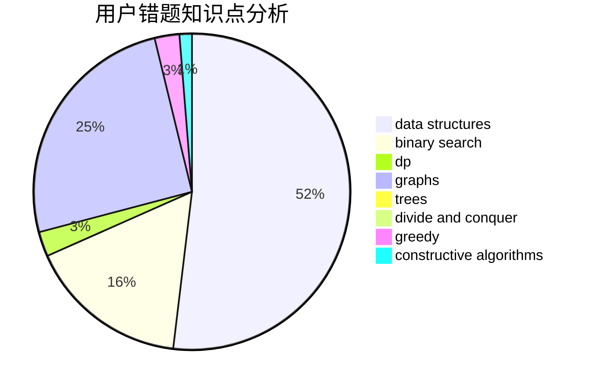

# 201465

<!-- tabs:start -->

#### **用户提交结果分析**

#### **用户做题类型偏好分析**

#### **用户错题知识点分析**

<!-- tabs:end -->
# 推荐题目
[1220B](https://codeforces.com/contest/1220/problem/B)		math,
                        number theory		  
[1220C](https://codeforces.com/contest/1220/problem/C)		games,
                        greedy,
                        strings		  
[1221D](https://codeforces.com/contest/1221/problem/D)		dp		  
[1064E](https://codeforces.com/contest/1064/problem/E)		dsu,graphs,sortings,trees		  
[121D](https://codeforces.com/contest/121/problem/D)		binary search,
                        implementation,
                        two pointers		  
[1010C](https://codeforces.com/contest/1010/problem/C)		number theory		  
[121C](https://codeforces.com/contest/121/problem/C)		brute force,
                        combinatorics,
                        number theory		  
[1220D](https://codeforces.com/contest/1220/problem/D)		bitmasks,
                        math,
                        number theory		  
[1219C](https://codeforces.com/contest/1219/problem/C)		implementation,
                        strings		  
[121E](https://codeforces.com/contest/121/problem/E)		data structures		  
