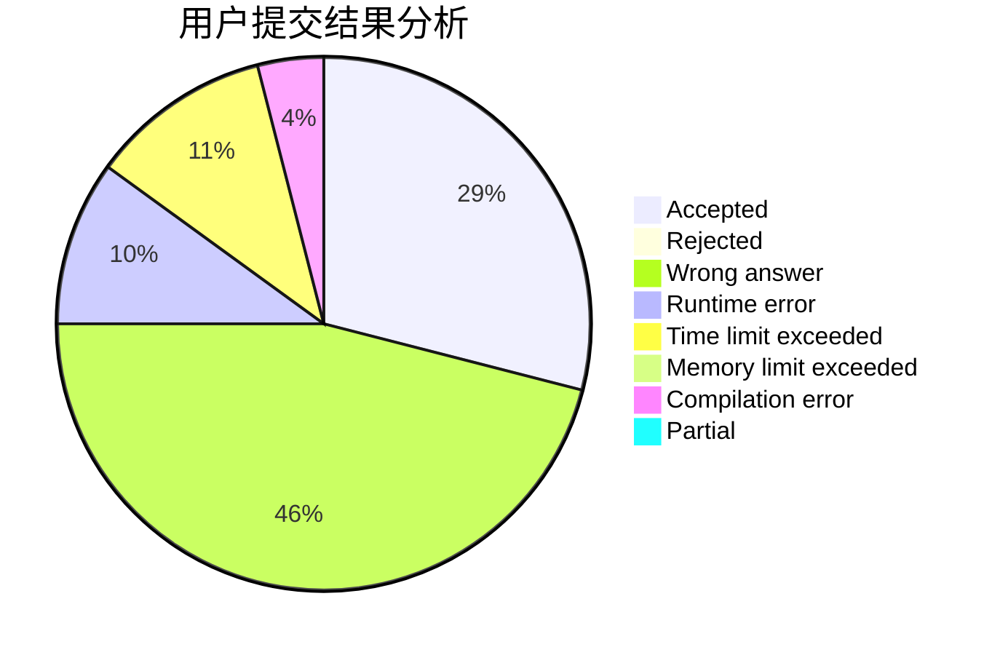
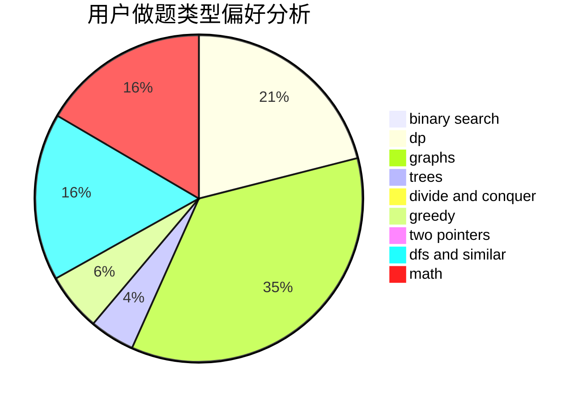

# 201465

<!-- tabs:start -->

#### **用户提交结果分析**

#### **用户做题类型偏好分析**

<!-- tabs:end -->
# 推荐题目
[1228B](https://codeforces.com/contest/1228/problem/B)
[1228C](https://codeforces.com/contest/1228/problem/C)
[1229F](https://codeforces.com/contest/1229/problem/F)
[1065B](https://codeforces.com/contest/1065/problem/B)
[1227B](https://codeforces.com/contest/1227/problem/B)
[1010F](https://codeforces.com/contest/1010/problem/F)
[1227A](https://codeforces.com/contest/1227/problem/A)
[1228D](https://codeforces.com/contest/1228/problem/D)
[12272](https://codeforces.com/contest/1227/problem/2)
[1227G](https://codeforces.com/contest/1227/problem/G)
